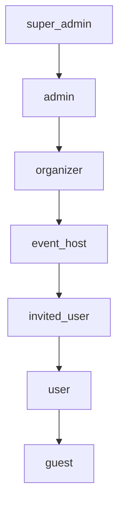

# Role-Based Access Control (RBAC)

## Overview
Cloud Burst implements a comprehensive role-based access control system that manages permissions across different user types, from system administrators to event attendees. The system is designed to be flexible, secure, and scalable, supporting both paid and free tiers of the platform.

Last Updated: March 18, 2025
Version: 1.1.0

## Role Hierarchy

## Roles and Tiers

| Role | Tier | Description |
|------|------|-------------|
| super_admin | Internal | Full system access with all capabilities - internal use only |
| admin | Internal | Administrative access for platform management - internal use only |
| organizer | Paid | Event management access - paid tier only, can create and manage multiple events |
| event_host | Free/Paid | Can create and manage their own events (cannot delete events) |
| invited_user | Free | Invited attendee with QR code access - event-specific permissions and media upload capabilities |
| user | Free | Standard user with basic platform access |
| guest | Free | Public access - can view public events and upload event photos |

## Core Capabilities

### Profile Management
- `manage:own_profile`: Manage personal profile settings
- `manage:all_profiles`: Manage any user's profile (admin only)
- `manage:preferences`: Manage notification and email preferences
- `manage:email_settings`: Control email template preferences

### Event Management
- `manage:events`: Create and manage multiple events
- `manage:own_events`: Manage events created by the user
- `view:events`: View event details and galleries
- `manage:invitations`: Create and manage event invitations
- `track:attendance`: Monitor event attendance and engagement

### Media Management
- `upload:event_photos`: Upload photos to event galleries
- `upload:event_videos`: Upload videos to event galleries
- `manage:own_media`: Manage own uploaded media
- `manage:all_media`: Moderate and manage all media
- `view:event_photos`: View event photo galleries
- `view:event_videos`: View event video galleries
- `moderate:content`: Review and approve uploaded content

### System Management
- `manage:roles`: Manage role assignments and capabilities
- `manage:templates`: Manage email and system templates
- `view:analytics`: Access system analytics and metrics
- `manage:security`: Configure security settings
- `manage:email_delivery`: Monitor and manage email delivery

## Feature Access by Role

| Feature | super_admin | admin | organizer | event_host | invited_user | user | guest |
|---------|-------------|-------|-----------|------------|--------------|------|-------|
| Manage All Profiles | ✅ | ✅ | ❌ | ❌ | ❌ | ❌ | ❌ |
| Manage Own Profile | ✅ | ✅ | ✅ | ✅ | ✅ | ✅ | ❌ |
| Create Events | ✅ | ✅ | ✅ | ✅ | ❌ | ❌ | ❌ |
| Manage All Events | ✅ | ✅ | ❌ | ❌ | ❌ | ❌ | ❌ |
| Manage Own Events | ✅ | ✅ | ✅ | ✅ | ❌ | ❌ | ❌ |
| Upload Photos | ✅ | ✅ | ✅ | ✅ | ✅ | ✅ | ✅ |
| Upload Videos | ✅ | ✅ | ✅ | ✅ | ✅ | ❌ | ❌ |
| Moderate Media | ✅ | ✅ | ✅ | ✅ | ❌ | ❌ | ❌ |
| View Analytics | ✅ | ✅ | ✅ | ❌ | ❌ | ❌ | ❌ |
| Manage Templates | ✅ | ✅ | ❌ | ❌ | ❌ | ❌ | ❌ |
| Manage Roles | ✅ | ❌ | ❌ | ❌ | ❌ | ❌ | ❌ |
| Manage Email Settings | ✅ | ✅ | ✅ | ✅ | ❌ | ❌ | ❌ |
| Track Attendance | ✅ | ✅ | ✅ | ✅ | ❌ | ❌ | ❌ |

## Implementation Details

### Database Schema
The RBAC system is implemented using the following tables:
- `roles`: Defines available roles
- `role_capabilities`: Maps capabilities to roles
- `profiles`: User profiles with assigned roles
- `event_attendees`: Links users to events with specific permissions
- `email_preferences`: User email template preferences
- `notification_settings`: User notification preferences

### Event Attendee Integration
The `event_attendees` table serves as a bridge between users and events, handling:
- Invitation-based access control
- Event-specific permissions
- Media contribution tracking
- Attendance verification
- Email preference management
- Notification delivery settings

### Security Policies
Row Level Security (RLS) policies ensure:
- Users can only access authorized resources
- Event-specific permissions are enforced
- Media ownership is properly tracked
- Role-based access is maintained
- Email template access is controlled
- Invitation token validation

### Capability Format
Capabilities follow the format: `action:resource`
- Actions: manage, view, upload, moderate, track
- Resources: events, profiles, media, templates, email, analytics
- Scope modifiers: own_, all_

## Usage Examples

### Invited User Flow
1. Receives event invitation with QR code
2. Scans QR code to access event
3. Creates/uses existing profile
4. Gains event-specific permissions
5. Can upload and manage media
6. Access persists for event duration
7. Receives event-specific notifications
8. Can manage email preferences

### Event Host Flow
1. Creates event (free/paid tier)
2. Manages event details
3. Sends invitations with templates
4. Moderates event media
5. Views event analytics
6. Tracks attendance
7. Manages email communications

## Security Considerations

1. Role elevation requires admin approval
2. Capability checks on all protected routes
3. Regular security audit logging
4. Rate limiting on sensitive operations
5. Session management and timeout
6. Secure invitation token handling
7. Email template access control
8. Media upload verification
9. QR code validation
10. Notification delivery security

## Monitoring and Maintenance

1. Regular capability audit
2. Role usage analytics
3. Permission conflict detection
4. Security policy updates
5. Performance monitoring
6. Email delivery tracking
7. Template sync monitoring
8. Access pattern analysis

## Recent Updates
- Added email template management capabilities
- Enhanced invitation system security
- Improved notification delivery controls
- Added attendance tracking features
- Updated media moderation workflow
- Enhanced security policy documentation
- Added email preference management
- Updated role-specific analytics access

---

Last Updated: March 17, 2025
Version: 1.0.0 