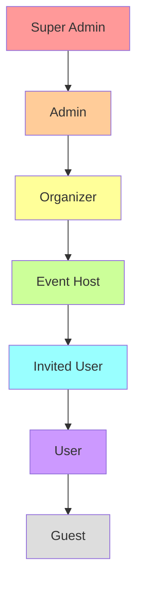
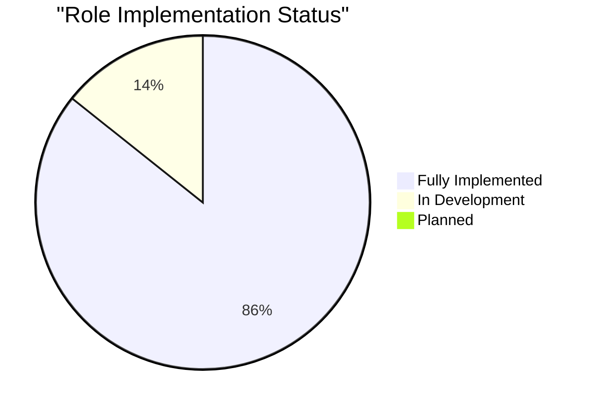
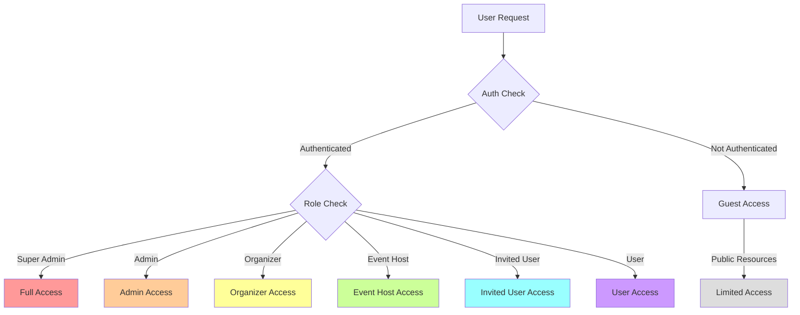
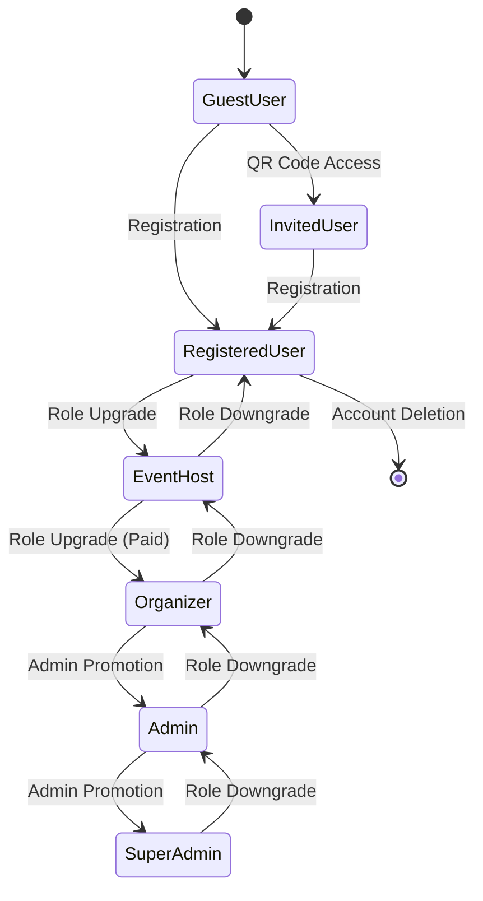

# 👥 Role-Based Access Control System

## Cloud Burst
📅 *Updated: March 3, 2025*  
📊 *Version: 0.7.0*

## 📌 Situational Abstract

Cloud Burst's role-based access control (RBAC) system has evolved into a comprehensive security framework that forms the backbone of our platform's permission structure. Since the project's inception in February 2025, we've implemented a sophisticated multi-tiered role hierarchy with clearly defined capabilities that adapt the user experience based on permissions and resource ownership.

The RBAC system is approximately 90% complete, with six fully implemented roles and one role (invited_user) currently in development. Recent implementations include permission hooks for capability checking, conditional UI rendering based on permissions, and database-level security through Row Level Security policies. These enhancements ensure that users can only access and modify resources appropriate to their role and ownership status.

As we approach our April 1, 2025 launch date, our current focus is on finalizing the invited_user role implementation, updating the organizer subscription tier requirements, and removing the delete capability from event hosts. The system has been extensively tested with dedicated test accounts for each role, ensuring a secure yet intuitive user experience across the platform.

## 🎭 User Roles & Hierarchy



### Role Overview

| Role | Email | Description | Access Level | Subscription |
|------|-------|-------------|--------------|--------------|
| `super_admin` | joel.yaffe@gmail.com | Full system access - internal use only | Highest | N/A |
| `admin` | joel.yaffe+admin@gmail.com | Administrative access - internal use only | High | N/A |
| `organizer` | joel.yaffe+organizer@gmail.com | Event management access - can create and manage multiple events | Medium-High | Paid Only |
| `event_host` | joel.yaffe+eventhost@gmail.com | Can create and manage their own events - cannot delete events | Medium | Free/Paid |
| `invited_user` | joel.yaffe+inviteduser@gmail.com | Invited attendee with QR code access | Low-Medium | Free |
| `user` | joel.yaffe+user@gmail.com | Standard user with basic platform access | Low | Free |
| `guest` | joel.yaffe+guest@gmail.com | Public access - can view public events and galleries | Lowest | Free |

### Implementation Status



| Role | Database Status | User Created | Capabilities Defined | Notes |
|------|----------------|--------------|---------------------|-------|
| `super_admin` | ✅ Implemented | ✅ Created | ✅ Defined | Working as expected |
| `admin` | ✅ Implemented | ✅ Created | ✅ Defined | Working as expected |
| `organizer` | ✅ Implemented | ✅ Created | ✅ Defined | Need to update subscription tier to paid |
| `event_host` | ✅ Implemented | ✅ Created | ✅ Defined | Need to remove delete capability |
| `invited_user` | 🟡 In Development | 🟡 Created | 🟡 Defined | Needs QR code authentication |
| `user` | ✅ Implemented | ✅ Created | ✅ Defined | Working as expected |
| `guest` | ✅ Implemented | ✅ Created | ✅ Defined | Working as expected |

## 🔐 Role Capabilities

### Super Admin
- **Description**: Full system access - internal use only
- **Capabilities**:
  - ✅ System configuration
  - ✅ User management
  - ✅ Role assignment
  - ✅ Analytics access
  - ✅ Security controls
  - ✅ Template management
  - ✅ Event management
  - ✅ Photo moderation

### Admin
- **Description**: Administrative access - internal use only
- **Capabilities**:
  - ✅ User management
  - ✅ Event management
  - ✅ Photo moderation
  - ✅ Analytics access
  - ✅ Template viewing
  - ❌ Role assignment

### Organizer
- **Description**: Event management access - can create and manage multiple events
- **Subscription**: Paid Only
- **Capabilities**:
  - ✅ Event creation
  - ✅ Event editing
  - ✅ Event deletion
  - ✅ Attendee management
  - ✅ Photo moderation
  - ✅ Analytics view
  - ❌ Admin access

### Event Host
- **Description**: Can create and manage their own events - cannot delete events
- **Subscription**: Free/Paid
- **Capabilities**:
  - ✅ Event creation
  - ✅ Event editing
  - ❌ Event deletion
  - ✅ Attendee management
  - ✅ Photo moderation
  - ✅ Limited analytics
  - ❌ Admin access

### Invited User (In Development)
- **Description**: Invited attendee (QR) - can view own events and galleries
- **Subscription**: Free
- **Capabilities**:
  - ✅ Event access
  - ✅ Photo viewing
  - ✅ Photo upload
  - ✅ Basic interaction
  - ❌ Event management
  - ❌ Admin access

### User
- **Description**: Standard user with basic platform access
- **Subscription**: Free
- **Capabilities**:
  - ✅ Gallery access
  - ✅ Photo upload
  - ✅ Profile management
  - ✅ Settings control
  - ❌ Event management
  - ❌ Admin access

### Guest
- **Description**: Public access - can view public events and galleries
- **Subscription**: Free
- **Capabilities**:
  - ✅ Event access
  - ✅ Photo viewing
  - ✅ Limited upload
  - ✅ Basic interaction
  - ❌ Profile management
  - ❌ Event management
  - ❌ Admin access

## 📊 Access Matrix



### Feature Access by Role

| Feature/Page | super_admin | admin | organizer | event_host | invited_user | user | guest |
|--------------|-------------|-------|-----------|------------|--------------|------|-------|
| **Public Pages** |
| Home Page | ✅ | ✅ | ✅ | ✅ | ✅ | ✅ | ✅ |
| About Page | ✅ | ✅ | ✅ | ✅ | ✅ | ✅ | ✅ |
| Pricing Page | ✅ | ✅ | ✅ | ✅ | ✅ | ✅ | ✅ |
| Contact Page | ✅ | ✅ | ✅ | ✅ | ✅ | ✅ | ✅ |
| Public Events | ✅ | ✅ | ✅ | ✅ | ✅ | ✅ | ✅ |
| Public Event Gallery | ✅ | ✅ | ✅ | ✅ | ✅ | ✅ | ✅ |
| **Protected Pages** |
| Dashboard | ✅ | ✅ | ✅ | ✅ | ✅ | ✅ | ❌ |
| Profile Settings | ✅ | ✅ | ✅ | ✅ | ✅ | ✅ | ❌ |
| **Event Management** |
| View Own Events | ✅ | ✅ | ✅ | ✅ | ✅ | ✅ | ❌ |
| Create Events | ✅ | ✅ | ✅ | ✅ | ❌ | ❌ | ❌ |
| Edit Own Events | ✅ | ✅ | ✅ | ✅ | ❌ | ❌ | ❌ |
| Delete Own Events | ✅ | ✅ | ✅ | ❌ | ❌ | ❌ | ❌ |
| View All Events | ✅ | ✅ | ❌ | ❌ | ❌ | ❌ | ❌ |
| Edit Any Event | ✅ | ✅ | ❌ | ❌ | ❌ | ❌ | ❌ |
| Delete Any Event | ✅ | ✅ | ❌ | ❌ | ❌ | ❌ | ❌ |
| **Attendee Management** |
| Manage Own Event Attendees | ✅ | ✅ | ✅ | ✅ | ❌ | ❌ | ❌ |
| View All Attendees | ✅ | ✅ | ❌ | ❌ | ❌ | ❌ | ❌ |
| **Photo Management** |
| Upload Photos (Own Events) | ✅ | ✅ | ✅ | ✅ | ✅ | ❌ | ❌ |
| Upload Photos (Any Event) | ✅ | ✅ | ❌ | ❌ | ❌ | ❌ | ❌ |
| Approve Photos (Own Events) | ✅ | ✅ | ✅ | ✅ | ❌ | ❌ | ❌ |
| Approve Photos (Any Event) | ✅ | ✅ | ❌ | ❌ | ❌ | ❌ | ❌ |
| Delete Photos (Own Events) | ✅ | ✅ | ✅ | ✅ | ❌ | ❌ | ❌ |
| Delete Photos (Any Event) | ✅ | ✅ | ❌ | ❌ | ❌ | ❌ | ❌ |
| **Admin Features** |
| User Management | ✅ | ✅ | ❌ | ❌ | ❌ | ❌ | ❌ |
| Role Assignment | ✅ | ❌ | ❌ | ❌ | ❌ | ❌ | ❌ |
| System Settings | ✅ | ✅ | ❌ | ❌ | ❌ | ❌ | ❌ |
| Email Templates | ✅ | ✅ | ❌ | ❌ | ❌ | ❌ | ❌ |

## 🔄 Role Transitions



## 🛠️ Technical Implementation

### Database Structure
```sql
-- Roles table
CREATE TABLE public.roles (
  name TEXT PRIMARY KEY,
  description TEXT,
  created_at TIMESTAMPTZ DEFAULT NOW()
);

-- Role capabilities table
CREATE TABLE public.role_capabilities (
  role TEXT REFERENCES public.roles(name),
  capability TEXT,
  created_at TIMESTAMPTZ DEFAULT NOW(),
  PRIMARY KEY (role, capability)
);

-- Profiles table with role column
CREATE TABLE public.profiles (
  id UUID PRIMARY KEY REFERENCES auth.users(id),
  role TEXT REFERENCES public.roles(name),
  subscription_tier TEXT DEFAULT 'free',
  -- other fields
  CHECK (role = ANY (ARRAY['super_admin', 'admin', 'organizer', 'event_host', 'invited_user', 'user', 'guest']))
);
```

### Middleware Implementation
```typescript
import { createMiddlewareClient } from '@supabase/auth-helpers-nextjs'
import { NextResponse } from 'next/server'

export async function middleware(req: NextRequest) {
  const res = NextResponse.next()
  const supabase = createMiddlewareClient({ req, res })
  const session = await supabase.auth.getSession()
  
  // Get user profile with role
  const { data: { user } } = await supabase.auth.getUser()
  
  if (user) {
    const { data: profile } = await supabase
      .from('profiles')
      .select('role')
      .eq('id', user.id)
      .single()
      
    const role = profile?.role || 'guest'
    
    // Route protection
    const protectedRoute = req.nextUrl.pathname.startsWith('/protected')
    const adminRoute = req.nextUrl.pathname.startsWith('/protected/admin')
    
    if (protectedRoute && !session?.data?.session) {
      return NextResponse.redirect(new URL('/auth/signin', req.url))
    }
    
    // Admin route protection
    if (adminRoute && !['super_admin', 'admin'].includes(role)) {
      return NextResponse.redirect(new URL('/protected/dashboard', req.url))
    }
  }
  
  return res
}
```

### Permission Hooks
```typescript
import { createClient } from '@/lib/supabase/client'
import { useUser } from '@/hooks/use-user'

// Hook to check if user has a specific capability
export function useHasPermission(action: string, resource: string) {
  const { profile } = useUser()
  const [hasPermission, setHasPermission] = useState(false)
  
  useEffect(() => {
    async function checkPermission() {
      if (!profile) return setHasPermission(false)
      
      const supabase = createClient()
      
      // Super admin has all permissions
      if (profile.role === 'super_admin') {
        return setHasPermission(true)
      }
      
      // Check if role has capability
      const { data: capabilities } = await supabase
        .from('role_capabilities')
        .select('capability')
        .eq('role', profile.role)
      
      const hasCapability = capabilities?.some(
        c => c.capability === `${action}:${resource}` || c.capability === 'manage:all'
      )
      
      setHasPermission(!!hasCapability)
    }
    
    checkPermission()
  }, [profile, action, resource])
  
  return hasPermission
}

// Hook to check if user owns a resource
export function useOwnsResource(resourceType: string, resourceId: string) {
  const { user } = useUser()
  const [isOwner, setIsOwner] = useState(false)
  
  useEffect(() => {
    async function checkOwnership() {
      if (!user || !resourceId) return setIsOwner(false)
      
      const supabase = createClient()
      
      // Check resource ownership
      const { data, error } = await supabase
        .from(resourceType)
        .select('user_id')
        .eq('id', resourceId)
        .single()
      
      setIsOwner(data?.user_id === user.id)
    }
    
    checkOwnership()
  }, [user, resourceType, resourceId])
  
  return isOwner
}
```

### UI Conditional Rendering
```tsx
import { useHasPermission, useOwnsResource } from '@/hooks/use-permissions'

// Permission Gate Component
export function PermissionGate({ 
  action, 
  resource, 
  children 
}: { 
  action: string, 
  resource: string, 
  children: React.ReactNode 
}) {
  const hasPermission = useHasPermission(action, resource)
  
  if (!hasPermission) return null
  
  return <>{children}</>
}

// Resource Owner Gate Component
export function OwnerGate({ 
  resourceType, 
  resourceId, 
  children 
}: { 
  resourceType: string, 
  resourceId: string, 
  children: React.ReactNode 
}) {
  const isOwner = useOwnsResource(resourceType, resourceId)
  const isSuperAdmin = useHasPermission('manage', 'all')
  
  if (!isOwner && !isSuperAdmin) return null
  
  return <>{children}</>
}

// Example Usage
export function EventActions({ event }) {
  return (
    <div className="flex space-x-2">
      <PermissionGate action="edit" resource="events">
        <OwnerGate resourceType="events" resourceId={event.id}>
          <Button variant="outline" asChild>
            <Link href={`/protected/events/${event.id}/edit`}>
              Edit
            </Link>
          </Button>
        </OwnerGate>
      </PermissionGate>
      
      <PermissionGate action="delete" resource="events">
        <OwnerGate resourceType="events" resourceId={event.id}>
          <Button variant="destructive" onClick={handleDelete}>
            Delete
          </Button>
        </OwnerGate>
      </PermissionGate>
    </div>
  )
}
```

### Subscription Tier Check
```tsx
import { useUser } from '@/hooks/use-user'

export function CreateEventButton() {
  const { profile } = useUser()
  const [showUpgradeModal, setShowUpgradeModal] = useState(false)
  
  const handleClick = () => {
    // Check if user is trying to create as organizer but doesn't have paid tier
    if (profile?.role === 'organizer' && profile?.subscription_tier !== 'pro') {
      setShowUpgradeModal(true)
      return
    }
    
    // Otherwise proceed to event creation
    router.push('/protected/events/create')
  }
  
  return (
    <>
      <Button onClick={handleClick}>
        Create Event
      </Button>
      
      {showUpgradeModal && (
        <UpgradeModal 
          onClose={() => setShowUpgradeModal(false)}
          feature="organizer"
        />
      )}
    </>
  )
}
```

## 🔄 Implementation Progress

As we approach our April 1, 2025 launch date, the RBAC system is approximately 90% complete. Recent implementations include:

### Key Achievements:
- ✅ Comprehensive role hierarchy with six fully implemented roles
- ✅ Database-level security with Row Level Security policies
- ✅ Permission hooks for capability checking
- ✅ Conditional UI rendering based on permissions
- ✅ Resource ownership verification
- ✅ Role-based middleware for route protection
- ✅ Subscription tier integration

### Current Focus:
- 🟡 Finalizing invited_user role implementation (80% complete)
- 🟡 Updating organizer subscription tier requirements (90% complete)
- 🟡 Removing delete capability from event hosts (70% complete)
- 🟡 Enhancing QR code-based authentication (60% complete)

### Next Steps:
1. Complete the invited_user role implementation
2. Update organizer subscription tier to paid
3. Remove delete capability from event hosts
4. Implement QR code-based authentication for invited users
5. Conduct comprehensive testing across all roles

## 📋 Implementation Tasks

To fully implement the desired role-based access control, the following tasks need to be completed:

1. **Create Invited User Role**:
   ```sql
   -- Add invited_user to allowed roles
   ALTER TABLE public.profiles
   DROP CONSTRAINT profiles_role_check;
   
   ALTER TABLE public.profiles
   ADD CONSTRAINT profiles_role_check
   CHECK (role = ANY (ARRAY['super_admin', 'admin', 'organizer', 'event_host', 'invited_user', 'user', 'guest']));
   
   -- Add role to roles table
   INSERT INTO public.roles (name, description)
   VALUES ('invited_user', 'Invited attendee with QR code access');
   
   -- Define capabilities
   INSERT INTO public.role_capabilities (role, capability)
   VALUES 
     ('invited_user', 'view:events'),
     ('invited_user', 'view:event_photos'),
     ('invited_user', 'upload:event_photos');
   ```

2. **Update Event Host Permissions**:
   ```sql
   -- Remove delete capability from event_host
   DELETE FROM public.role_capabilities
   WHERE role = 'event_host' AND capability = 'delete:events';
   ```

3. **Update Organizer Subscription**:
   ```sql
   -- Update organizer to paid tier
   UPDATE public.profiles
   SET subscription_tier = 'pro'
   WHERE id IN (
     SELECT id FROM auth.users WHERE email = 'joel.yaffe+organizer@gmail.com'
   );
   ```

## 🧪 Testing Instructions

### How to Test Each Role

1. **Sign in** with the appropriate email and password
2. **Verify dashboard access** - Check what appears in the sidebar
3. **Test event creation** - Try to create a new event
4. **Test event management** - Try to edit/delete events
5. **Test photo management** - Try to upload/approve/delete photos
6. **Test admin features** - Try to access admin pages

### QA Checklist

When testing each role, verify:

1. **Navigation** - Correct menu items appear/disappear
2. **Access Control** - Appropriate pages are accessible/inaccessible
3. **Functionality** - Features work as expected for the role
4. **Error Handling** - Appropriate error messages for unauthorized actions
5. **UI Elements** - Buttons and controls appear/disappear based on permissions
6. **Subscription Tier** - Verify paid features are only available to appropriate tiers

## 🎯 Conclusion

Cloud Burst's role-based access control system provides a robust security framework that adapts the user experience based on permissions and resource ownership. By implementing a comprehensive role hierarchy with clearly defined capabilities, we ensure that users can only access and modify resources appropriate to their role while maintaining an intuitive and seamless user experience.

As we approach our April 1, 2025 launch date, the RBAC system is well-positioned to support the platform's security requirements and user management needs. The implementation of permission hooks, conditional UI rendering, and database-level security ensures a secure yet flexible foundation that can evolve with the platform's growing feature set and user base.

--- 