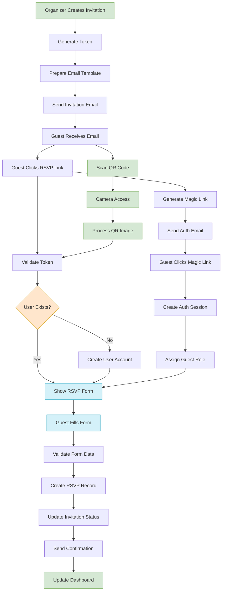

# Cloud Burst: Invitation & RSVP System Flow

## System Flow Diagram

## Invitation Creation

1. Event Organizer creates invitation
2. Cloud Burst Platform generates invitation record in database
3. Invitation record contains unique invitation token
4. Cloud Burst Platform prepares email using SendGrid Template
5. SendGrid Email Service sends invitation email to guest's inbox

## Invitation Delivery

1. Guest receives invitation email
2. Guest clicks RSVP link/button
3. Cloud Burst Platform validates invitation token
4. Cloud Burst Platform creates user account if not already present
5. Cloud Burst Platform redirects guest to RSVP form

## RSVP Verification Flow

1. Guest clicks RSVP link/button
2. Cloud Burst Platform validates invitation token
3. Cloud Burst Platform creates user account if not already present
4. Cloud Burst Platform redirects guest to RSVP form

## QR Code Scanning Flow

1. Guest navigates to scan page
2. Cloud Burst requests camera permission
3. Guest grants permission and scanner activates
4. Guest points camera at QR code invitation
5. System processes QR image with optimized algorithms
6. System extracts token from QR code
7. Validation service verifies token authenticity
8. System redirects to appropriate RSVP form

## RSVP Submission Flow

1. Guest fills out RSVP form
2. Cloud Burst Platform validates form data
3. Cloud Burst Platform creates RSVP record in database
4. Cloud Burst Platform updates invitation status

## QR Scanner Implementation Details

Our QR scanner implementation has been optimized for reliable performance:

1. **Self-Contained Component**
   - Single, comprehensive scanner component
   - Direct camera access and management
   - Clear state management
   - Proper error handling and recovery

2. **Performance Optimizations**
   - Image downsampling for efficient processing
   - Reduced scanning frequency 
   - Optimized requestAnimationFrame scheduling
   - Canvas optimization for frequent pixel reads

3. **Enhanced User Experience**
   - Clear visual scanning indicators
   - Proper error states with recovery options
   - Success animations on QR detection
   - Smooth transitions between scanning states

4. **Resource Management**
   - Proper cleanup of camera resources
   - Efficient video element lifecycle handling
   - Prevention of memory leaks
   - Proper animation frame cancellation

## How Our Two Email Systems Work Together

| System | Purpose | When Used | Email Content | User State |
|--------|---------|-----------|--------------|------------|
| **SendGrid** | Marketing & Invitations | Initial invitation | Event details, RSVP button, branding | No user account yet |
| **Supabase Auth** | Authentication | After RSVP link click | Magic Link for secure access | Creates/updates user account |

## Key Points About This Flow

1. **Two-Step Authentication**:
   - First step: Verify invitation token (proves they were invited)
   - Second step: Magic Link authentication (provides secure access)

2. **User Creation Timing**:
   - User profile is created only after Magic Link is clicked
   - Not when invitation is sent or RSVP button is clicked

3. **Role Assignment**:
   - The role "guest" is assigned during Magic Link authentication
   - Stored in Supabase user metadata

4. **RSVP Status Updates**:
   - Invitation status → "opened" when RSVP link is clicked
   - Invitation RSVP status → "accepted/declined" when form is submitted
   - Separate RSVP record created in database with details

5. **Multiple Access Paths**:
   - Email link for direct access
   - QR code scanning for mobile-friendly access
   - Manual invitation code entry as fallback option
