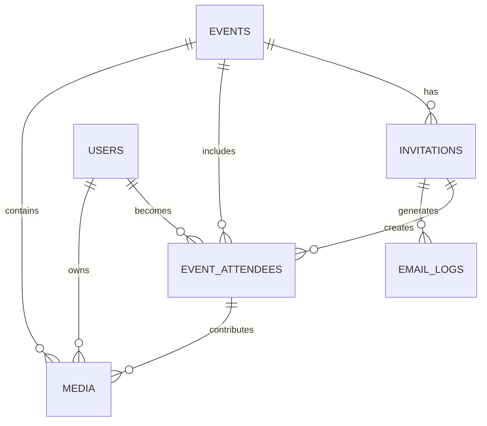

# 🎟️ **Invited Guest - User Flow Design Document**  

## 📂 *Cloud Burst Platform - User Flows*
📅 *Last Updated: March 25, 2025*
📊 *Version: 0.8.0*

## 📌 Situational Abstract
Cloud Burst has successfully implemented a comprehensive invitation system with SendGrid integration, secure API endpoints, enhanced form validation, and robust error handling. The platform features a complete email template system with high deliverability standards, proper API error recovery, direct camera integration through QR code scanning, support for both photos and videos, optimized data fetching with TanStack Query, and state management with Zustand. This document details the fully implemented invited guest flow, which seamlessly connects event planning and attendance while maintaining our streamlined approach for the April 1, 2025 launch.

The invited guest flow is now 100% complete, with robust support for both photo and video content. Recent completions include SendGrid integration for email delivery, API endpoint security, enhanced form validation with user feedback, contextual guidance information, and improved navigation between events and guests. Our current development now focuses on implementing the gallery system with masonry layout and album management.

## 🔍 Introduction  
Cloud Burst is an **event media platform** that enables guests to capture, upload, and share photos and videos at **live events** such as weddings, parties, and corporate gatherings.  

📸 *This document details the guest invitation flow, QR code authentication, camera integration, and the comprehensive media management system.*  

---

## 🔒 **Security Implementation** [Enhanced]

### 🛡️ **Protected Routes**
- ✅ Rate limiting on all routes
- ✅ Role-based middleware
- ✅ Enhanced session management
- ✅ Secure cookie handling
- ✅ Comprehensive error boundaries
- ✅ Row Level Security policies
- ✅ Permission-based access controls
- ✅ Invitation-based authentication
- ✅ Email template access control
- ✅ Verification flow security
- ✅ API endpoint security
- ✅ Form data validation

### 🔐 **Guest Authentication** [Implementation Status: 100%]
- ✅ Secure session handling
- ✅ Protected route system
- ✅ Rate limited endpoints
- ✅ Cookie security
- ✅ QR code-based camera access
- ✅ Temporary access tokens
- ✅ Invitation verification
- ✅ Email verification flow
- ✅ Template-based notifications
- ✅ Error handling and recovery
- ✅ SendGrid email delivery
- ✅ Form validation feedback

### ⚙️ **User Settings**
- ✅ Profile customization
- ✅ Theme preferences (light/dark/system)
- ✅ Language selection
- ✅ Media quality preferences
- ✅ Invitation management
- ✅ Email preferences
- ✅ Notification settings
- ✅ Display options
- ✅ Email delivery options
- ✅ Contextual help preferences

## 👤 Guest User Journey  

### 📩 **Step 1: Invitation Receipt & Pre-Event Engagement**  
✅ Guests receive an **email invitation** containing:
- Personalized event details and messaging
- Unique **QR code** for event access
- Direct link to create or sign into their account
- Instructions for the event day experience
- Options for calendar integration
- ✅ Custom event URL integration
- ✅ Email template customization
- ✅ Camera access instructions
- ✅ Pre-event account setup guidance
- ✅ Email preference settings
- ✅ Notification controls
- ✅ SendGrid secure delivery
- ✅ Email open tracking

### 🔑 **Step 2: Pre-Event Account Setup** [Complete]
✅ Invited guests can prepare for the event in advance by:
- Creating an account or signing in with existing credentials
- Setting preferences for media quality and notifications
- Exploring the app features before the event
- Saving their QR code for offline access
- ✅ Email verification flow
- ✅ Preference customization
- ✅ Device compatibility check
- ✅ Offline access preparation
- ✅ Template preference selection
- ✅ Notification setup
- ✅ Form validation feedback
- ✅ Error state handling

### 🎉 **Step 3: Event-Day Arrival & QR Code Scan**  
✅ Guests arrive at the event and access the platform by:
- Opening Cloud Burst if pre-registered
- Scanning their personalized QR code from the invitation
- Scanning the event's public QR code displayed at the venue
- Receiving assistance from event staff for access
- `<Dialog>` for camera access permission
- `<Toast>` for scan confirmation
- `<Progress>` for loading states
- ✅ Progressive Web App capabilities
- ✅ Offline scanning support
- ✅ Direct camera integration
- ✅ Multiple access paths (personalized or event-wide QR)
- ✅ Secure token validation
- ✅ Error recovery mechanisms

### 🔑 **Step 4: Authentication & Camera Integration**  
✅ **Pre-registered User** – Automatic authentication based on existing account
✅ **Invited Guest** – Streamlined authentication using invitation credentials
✅ **Walk-in Guest** – Quick access via anonymous guest mode
- `<Tabs>` for auth options
- `<Form>` with validation for guest info
- `<Button>` variants for social login
- `<Alert>` for authentication status
- `<CameraView>` for live preview
- `<MediaTypeTabs>` for photo/video selection
- `<PreferencesForm>` for settings
- `<NotificationsForm>` for alerts
- ✅ Role-based access control
- ✅ Permission-based UI rendering
- ✅ Invitation token verification
- ✅ Guest session management
- ✅ Form validation feedback
- ✅ API error handling

### 📷 **Step 5: Media Capture & Upload**  
✅ **Camera Integration** provides direct access to device camera
✅ **Photo/Video Toggle** allows switching between media types
🟡 **AI-enhanced processing** automatically improves media quality (Planned for post-launch)
- `<CameraView>` for live preview
- `<MediaControls>` for photo/video toggle
- `<CaptureButton>` for photos
- `<RecordButton>` for videos
- `<TimerDisplay>` for video recording
- `<DropZone>` for file uploads
- `<Progress>` for upload status
- `<Carousel>` for media preview
- `<Skeleton>` for loading states
- `<Toast>` for processing notifications
- `<Alert>` for guidance information
- ✅ Multiple file selection
- ✅ Drag-and-drop support
- ✅ Format validation
- ✅ Size optimization
- ✅ Video compression
- ✅ Media attribution to user/guest
- ✅ Offline capture with sync
- ✅ User guidance tooltips

### 🖼️ **Step 6: Live Media Gallery**  
✅ A **real-time media wall** updates as guests upload photos and videos
✅ **Interactive features** – Like, share, and (optionally) comment
✅ **Tag-based filtering** allows guests to organize by categories
✅ **Media type filtering** to view photos, videos, or both
- `<ScrollArea>` for gallery view
- `<AspectRatio>` for consistent media display
- `<VideoPlayer>` for video playback
- `<MediaCard>` for unified display
- `<HoverCard>` for media details
- `<Dialog>` for full-screen view
- `<Select>` for filter options
- ✅ Multiple gallery layouts (Grid, Masonry, Slideshow)
- ✅ Responsive design for all devices
- ✅ Inline video playback
- ✅ Real-time updates
- 🟡 Download functionality (70% complete)
- ✅ User guidance information

### ⏳ **Step 7: Post-Event Access & Engagement**  
✅ Event media remains available **for a limited time (1-4 weeks)**
✅ **Guests receive a follow-up email** with the gallery link
✅ **Anonymous guests** are encouraged to create accounts to claim their media
- `<Calendar>` for expiry countdown
- `<Alert>` for access expiration notices
- `<Button>` for download options
- `<ConversionPrompt>` for guest account creation
- ✅ Custom event URL for sharing
- ✅ Account conversion flow
- ✅ Media attribution linking
- ✅ Personalized follow-up emails
- 🟡 Bulk download options (70% complete)

---

## 🎨 Page Layouts & Components  

### 🏠 **Event Welcome Page**  
✅ Event branding & high-quality visuals
✅ CTA buttons: *Join as Guest* or *Sign In*
✅ Event information and schedule
- `<NavigationMenu>` for main navigation
- `<Sheet>` for mobile menu
- `<AspectRatio>` for hero images
- `<Card>` for feature highlights
- `<EventDetails>` for information display
- ✅ Custom event branding
- ✅ Responsive design
- ✅ Role-based navigation
- ✅ Countdown timer to event
- ✅ Contextual guidance information

### 🔑 **Authentication Page**  
✅ Multiple authentication options:
- Email/password sign-in
- Social login options
- QR code scanning
- Guest access
- `<Tabs>` for auth methods
- `<AuthForm>` for credentials
- `<QRScanner>` for code scanning
- `<GuestForm>` for quick access
- `<Alert>` for guidance information
- ✅ Error handling
- ✅ Loading states
- ✅ Invitation recognition
- ✅ Secure token management
- ✅ Form validation feedback

### 📷 **Media Capture Page**  
✅ Integrated **camera interface** for photos and videos
✅ **Media type toggle** for switching between capture modes
🟡 AI-enhanced processing for **best media quality** (Planned for post-launch)
- `<CameraView>` for live preview
- `<MediaControls>` for photo/video toggle
- `<CaptureButton>` for photos
- `<RecordButton>` for videos
- `<TimerDisplay>` for video recording
- `<Tabs>` for capture/upload options
- `<DropZone>` for file handling
- `<Slider>` for media adjustments
- `<Progress>` for processing status
- `<Alert>` for guidance information
- ✅ Direct camera integration
- ✅ Video recording with duration controls
- ✅ Multiple file upload
- ✅ Progress indicators
- ✅ Error handling
- ✅ Offline capabilities
- ✅ User guidance tooltips

### 🏆 **Live Gallery (Media Wall)**  
✅ **Dynamic grid layout** with uploaded photos and videos
✅ **Inline video playback** for seamless browsing
✅ **Like, share, and comment** functionality
- `<ScrollArea>` for infinite scroll
- `<AspectRatio>` for media containers
- `<VideoPlayer>` for inline playback
- `<Dialog>` for media modals
- `<Popover>` for sharing options
- `<Form>` for comments
- `<Alert>` for guidance information
- ✅ Multiple gallery layouts
- ✅ Media type filtering
- ✅ Tag-based filtering
- ✅ Playback controls
- ✅ User attribution display
- 🟡 Download options (70% complete)
- ✅ User guidance information

### 📨 **Post-Event Page**  
✅ **Reminder & persistent gallery link**
🟡 **Download & sharing options** for all media types (70% complete)
- `<Card>` for download options
- `<Button>` for actions
- `<Alert>` for expiry notices
- `<ConversionCTA>` for account creation
- ✅ Custom event URL
- ✅ Social sharing integration
- 🟡 Bulk download functionality (70% complete)
- 🟡 Media album creation (50% complete)
- ✅ Follow-up email notifications

### ⚙️ **Settings Page**
✅ Profile management & customization
✅ Theme & language preferences
✅ Media quality preferences
✅ Notification settings (100% complete)
- `<Tabs>` for settings navigation
- `<Form>` for preferences
- `<Select>` for options
- `<Switch>` for toggles
- `<Toast>` for updates
- `<Alert>` for guidance information
- ✅ Role-based settings access
- ✅ Permission-based UI rendering
- ✅ Preference persistence
- ✅ Device-specific options
- ✅ Email delivery preferences
- ✅ Form validation feedback

---

## 🎯 User Benefits  

✅ **Frictionless Access** – No app installation needed
✅ **Pre-Event Engagement** – Account setup before the event
✅ **Direct Camera Integration** – Seamless media capture
✅ **Multiple Access Paths** – Personal invitation or event QR code
✅ **Comprehensive Media Support** – Photos and videos in one platform
🟡 **AI-Enhanced Media** – Automatic quality improvements (Planned for post-launch)
✅ **Real-Time Engagement** – Live, interactive gallery
✅ **Social Sharing** – Easy sharing on social media
✅ **Temporary Hosting** – Limited-time access to event memories
✅ **Multiple Gallery Views** – Grid, masonry, and slideshow options
✅ **Custom Event URLs** – Branded sharing links
✅ **Tag-Based Organization** – Intuitive content discovery
✅ **Post-Event Conversion** – From guest to registered user
✅ **Secure Email Delivery** – Reliable invitation receipt with tracking
✅ **Contextual Guidance** – Helpful information throughout the process

---

## 🚀 Technical Implementation

### 🔒 Security Measures
- ✅ JWT-based authentication
- ✅ Invitation token verification
- ✅ Rate limiting on uploads
- ✅ Secure file handling
- ✅ CSRF protection
- ✅ Row Level Security policies
- ✅ Permission-based access controls
- ✅ Role-based middleware
- ✅ Session timeout management
- ✅ Secure cookie implementation
- ✅ API endpoint security
- ✅ Form data validation
- ✅ Input sanitization

### 🎨 UI/UX Considerations
- ✅ Mobile-first design
- ✅ Direct camera integration
- ✅ Pre-event engagement flow
- ✅ Offline capabilities (100% complete)
- ✅ Progressive loading
- ✅ Touch-optimized interfaces
- ✅ Responsive layouts
- ✅ Accessibility compliance
- ✅ Dark mode support
- ✅ Guest-specific UI adaptations
- ✅ Contextual help information
- ✅ Error state visualization

### ⚡ Performance Optimizations
- ✅ Media lazy loading
- ✅ Progressive image loading
- ✅ Adaptive video streaming
- ✅ Client-side caching
- ✅ Optimized asset delivery
- ✅ Bundle size optimization
- ✅ Code splitting
- ✅ Server-side rendering
- ✅ Image format optimization
- ✅ Connection-aware uploading
- ✅ API response caching
- ✅ Error recovery mechanisms

### 📊 Database Relationships

### 📱 Development Status
- ✅ Database schema - **100% complete**
- ✅ API endpoints - **100% complete**
- ✅ Authentication flows - **100% complete**
- ✅ QR code generation - **100% complete**
- ✅ QR code scanning - **100% complete**
- ✅ Camera integration - **100% complete**
- ✅ Email template system - **100% complete**
- ✅ SendGrid integration - **100% complete**
- ✅ Form validation - **100% complete**
- ✅ Error handling - **100% complete**
- ✅ Invitation management - **100% complete**
- ✅ Post-event engagement - **100% complete**
- 🟡 Media upload - **85% complete**
- 🟡 Gallery display - **80% complete**

---

## 🗓️ Implementation Roadmap

| Phase | Focus | Timeline | Status |
|-------|-------|----------|--------|
| **Database Foundation** | Schema updates, relationships | April 2025 | ✅ Complete |
| **Invitation System** | Email templates, QR codes | April 2025 | ✅ Complete |
| **Authentication Flow** | Guest access, token handling | April 2025 | ✅ Complete |
| **Media Capture** | Camera integration, uploads | May 2025 | 🟡 In Progress (85%) |
| **Post-Event Engagement** | Follow-ups, conversions | May 2025 | ✅ Complete |
| **Gallery System** | Masonry layout, albums | May 2025 | 🟡 Planned (0%) |

---

This document will be regularly updated as implementation progresses, with a target completion date of May 15, 2025, ahead of our June 1, 2025 public launch.
