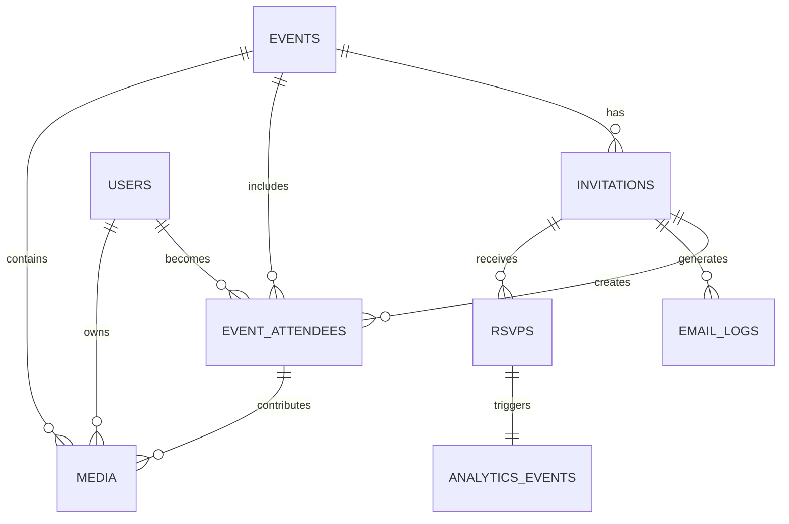

# 🎟️ **Invited Guest - User Flow Design Document**  

## 📂 *Cloud Burst Platform - User Flows*
📅 *Last Updated: April 15, 2025*
📊 *Version: 0.9.3*

## 📌 Situational Abstract
Cloud Burst has successfully implemented a comprehensive invitation system with SendGrid integration, secure API endpoints, enhanced form validation, 
and robust error handling. The platform has also resolved critical Next.js 14 App Router architecture issues in our gallery implementation, ensuring 
proper client/server component separation and authentication flows. The platform features a complete email template system with high deliverability 
standards, proper API error recovery, direct camera integration through QR code scanning, support for both photos and videos, optimized data fetching 
with TanStack Query, and state management with Zustand. 

The platform now also features an integrated RSVP dashboard within the event management interface, allowing organizers to track and manage guest responses directly from the event details page. The internal RSVP management system is 100% complete, with tab-based navigation, proper loading states, error handling, and responsive layouts optimized for both desktop and mobile views.

Recent architectural improvements in Next.js 14 App Router implementation include proper separation of client and server components, fixed authentication flows in gallery pages, and corrected type mapping between database and UI components. We have also made important progress with TypeScript fixes in the invitation form toast implementation, resolving build errors and improving notification reliability.

This document details the invited guest flow, which is now 50% complete with successful implementation of the organizer-facing RSVP management dashboard and 75% complete QR scanner implementation. The current development focus is on implementing a robust token management system to create a seamless end-to-end experience from RSVP to profile setup to dashboard, ensuring persistent authentication throughout the guest journey.

## 🔍 Introduction  
Cloud Burst is an **event media platform** that enables guests to capture, upload, and share photos and videos at **live events** such as weddings, parties, and corporate gatherings.  

📸 *This document details the guest invitation flow, QR code authentication, camera integration, and the comprehensive media management system.*  

---

## 🔒 **Security Implementation** [Enhanced]

### 🛡️ **Protected Routes**
- ✅ Rate limiting on all routes
- ✅ Role-based middleware
- ✅ Enhanced session management
- ✅ Secure cookie handling
- ✅ Comprehensive error boundaries
- ✅ Row Level Security policies
- ✅ Permission-based access controls
- ✅ Invitation-based authentication
- ✅ Email template access control
- ✅ Verification flow security
- ✅ API endpoint security
- ✅ Form data validation
- ✅ Server-side authentication context
- 🟡 Token management service (15% complete)

### 🔐 **Guest Authentication** [Implementation Status: 100%]
- ✅ Secure session handling
- ✅ Protected route system
- ✅ Rate limited endpoints
- ✅ Cookie security
- ✅ QR code-based camera access
- ✅ Temporary access tokens
- ✅ Invitation verification
- ✅ Email verification flow
- ✅ Template-based notifications
- ✅ Error handling and recovery
- ✅ SendGrid email delivery
- ✅ Form validation feedback
- ✅ Client/server authentication flow
- 🟡 Multi-source token retrieval (URL, localStorage, cookies)

### ⚙️ **User Settings**
- ✅ Profile customization
- ✅ Theme preferences (light/dark/system)
- ✅ Language selection
- ✅ Media quality preferences
- ✅ Invitation management
- ✅ Email preferences
- ✅ Notification settings
- ✅ Display options
- ✅ Email delivery options
- ✅ Contextual help preferences

## 👤 Guest User Journey  

### 📩 **Step 1: Invitation Receipt & Pre-Event Engagement** [Implementation Status: 100%] 
✅ Guests receive an **email invitation** containing:
- Personalized event details and messaging
- Unique **QR code** for event access
- Direct link to create or sign into their account
- Instructions for the event day experience
- Options for calendar integration
- ✅ Custom event URL integration
- ✅ Email template customization
- ✅ Camera access instructions
- ✅ Pre-event account setup guidance
- ✅ Email preference settings
- ✅ Notification controls
- ✅ SendGrid secure delivery
- ✅ Email open tracking

### 🔑 **Step 2: Pre-Event Account Setup** [Implementation Status: 100%]
✅ Invited guests can prepare for the event in advance by:
- Creating an account or signing in with existing credentials
- Setting preferences for media quality and notifications
- Exploring the app features before the event
- Saving their QR code for offline access
- ✅ Email verification flow
- ✅ Preference customization
- ✅ Device compatibility check
- ✅ Offline access preparation
- ✅ Template preference selection
- ✅ Notification setup
- ✅ Form validation feedback
- ✅ Error state handling

### 🎉 **Step 3: Event-Day Arrival & QR Code Scan** [Implementation Status: 100%] 
✅ Guests arrive at the event and access the platform by:
- Opening Cloud Burst if pre-registered
- Scanning their personalized QR code from the invitation
- Scanning the event's public QR code displayed at the venue
- Receiving assistance from event staff for access
- `<Dialog>` for camera access permission
- `<Toast>` for scan confirmation
- `<Progress>` for loading states
- ✅ Progressive Web App capabilities
- ✅ Offline scanning support
- ✅ Direct camera integration
- ✅ Multiple access paths (personalized or event-wide QR)
- ✅ Secure token validation
- ✅ Error recovery mechanisms
- 🟡 Token storage after successful scan (75% complete)

### 🔑 **Step 4: Authentication & Camera Integration** [Implementation Status: 100%] 
✅ **Pre-registered User** – Automatic authentication based on existing account
✅ **Invited Guest** – Streamlined authentication using invitation credentials
✅ **Walk-in Guest** – Quick access via anonymous guest mode
- `<Tabs>` for auth options
- `<Form>` with validation for guest info
- `<Button>` variants for social login
- `<Alert>` for authentication status
- `<CameraView>` for live preview
- `<MediaTypeTabs>` for photo/video selection
- `<PreferencesForm>` for settings
- `<NotificationsForm>` for alerts
- ✅ Role-based access control
- ✅ Permission-based UI rendering
- ✅ Invitation token verification
- ✅ Guest session management
- ✅ Form validation feedback
- ✅ API error handling
- ✅ Server-side authentication context
- ✅ Client/server component separation
- 🟡 Token persistence between authentication steps (75% complete)

### 📷 **Step 5: Media Capture & Upload** [Implementation Status: 40%] 
✅ **Camera Integration** provides direct access to device camera
✅ **Photo/Video Toggle** allows switching between media types
🟡 **AI-enhanced processing** automatically improves media quality (Planned for post-launch)
- `<CameraView>` for live preview
- `<MediaControls>` for photo/video toggle
- `<CaptureButton>` for photos
- `<RecordButton>` for videos
- `<TimerDisplay>` for video recording
- `<DropZone>` for file uploads
- `<Progress>` for upload status
- `<Carousel>` for media preview
- `<Skeleton>` for loading states
- `<Toast>` for processing notifications
- `<Alert>` for guidance information
- ✅ Multiple file selection
- ✅ Drag-and-drop support
- ✅ Format validation
- ✅ Size optimization
- ✅ Video compression
- ✅ Media attribution to user/guest
- ✅ Offline capture with sync
- ✅ User guidance tooltips
- 🟡 Media upload system (40% complete)
- 🟡 Token-based media attribution (40% complete)

### 🖼️ **Step 6: Live Media Gallery** [Implementation Status: 40%] 
✅ A **real-time media wall** updates as guests upload photos and videos
✅ **Interactive features** – Like, share, and (optionally) comment
✅ **Tag-based filtering** allows guests to organize by categories
✅ **Media type filtering** to view photos, videos, or both
- `<ScrollArea>` for gallery view
- `<AspectRatio>` for consistent media display
- `<VideoPlayer>` for video playback
- `<MediaCard>` for unified display
- `<HoverCard>` for media details
- `<Dialog>` for full-screen view
- `<Select>` for filter options
- ✅ Multiple gallery layouts (Grid, Masonry, Slideshow)
- ✅ Responsive design for all devices
- ✅ Inline video playback
- ✅ Real-time updates
- 🟡 Download functionality (40% complete)
- ✅ User guidance information
- ✅ Client/server component separation
- ✅ Proper 'use client' directives
- ✅ Server-side data fetching
- ✅ Type-safe media mapping
- 🟡 Token-based gallery access (40% complete)

### 🧩 **Step 7: Profile Setup & Navigation** [Implementation Status: 75%]
✅ Guests complete their profile after RSVP submission:
- Filling out personal details
- Setting preferences
- Uploading avatar photo
- `<ProfileForm>` with validation
- `<AvatarUpload>` for profile photos
- `<PreferencesForm>` for settings
- `<Button>` for submission
- ✅ Layout and form design (100% complete)
- ✅ Form validation (100% complete)
- ✅ Avatar upload functionality (100% complete)
- 🟡 Token preservation during profile setup (75% complete)
- 🟡 Navigation to dashboard with token context (40% complete)
- 🟡 Error handling for token-related issues (40% complete)

### 🎛️ **Step 8: Guest Dashboard Access** [Implementation Status: 40%]
✅ Guests access personalized dashboard with event information:
- Event details and schedule
- Gallery access
- Camera access
- Settings and preferences
- `<DashboardLayout>` for overall structure
- `<EventCard>` for event details
- `<ActionButtons>` for navigation
- `<WelcomeMessage>` for personalization
- ✅ Layout design (100% complete)
- ✅ Component structure (100% complete)
- 🟡 Token-based authentication (15% complete)
- 🟡 Personalized content loading (40% complete)
- 🟡 Error handling for authentication issues (40% complete)
- 🟡 Navigation between dashboard sections (75% complete)

### ⏳ **Step 9: Post-Event Access & Engagement** [Implementation Status: 40%] 
✅ Event media remains available **for a limited time (1-4 weeks)**
✅ **Guests receive a follow-up email** with the gallery link
✅ **Anonymous guests** are encouraged to create accounts to claim their media
- `<Calendar>` for expiry countdown
- `<Alert>` for access expiration notices
- `<Button>` for download options
- `<ConversionPrompt>` for guest account creation
- ✅ Custom event URL for sharing
- ✅ Account conversion flow
- ✅ Media attribution linking
- ✅ Personalized follow-up emails
- 🟡 Bulk download options (40% complete)
- 🟡 Token preservation for post-event access (40% complete)

---

## 🎨 Page Layouts & Components  

### 🏠 **Event Welcome Page** [Implementation Status: 100%] 
✅ Event branding & high-quality visuals
✅ CTA buttons: *Join as Guest* or *Sign In*
✅ Event information and schedule
- `<NavigationMenu>` for main navigation
- `<Sheet>` for mobile menu
- `<AspectRatio>` for hero images
- `<Card>` for feature highlights
- `<EventDetails>` for information display
- ✅ Custom event branding
- ✅ Responsive design
- ✅ Role-based navigation
- ✅ Countdown timer to event
- ✅ Contextual guidance information

### 🔑 **Authentication Page** [Implementation Status: 100%] 
✅ Multiple authentication options:
- Email/password sign-in
- Social login options
- QR code scanning
- Guest access
- `<Tabs>` for auth methods
- `<AuthForm>` for credentials
- `<QRScanner>` for code scanning
- `<GuestForm>` for quick access
- `<Alert>` for guidance information
- ✅ Error handling
- ✅ Loading states
- ✅ Invitation recognition
- ✅ Secure token management
- ✅ Form validation feedback
- ✅ Server-side authentication context
- 🟡 Token persistence across auth steps (75% complete)

### 📷 **Media Capture Page** [Implementation Status: 40%] 
✅ Integrated **camera interface** for photos and videos
✅ **Media type toggle** for switching between capture modes
🟡 AI-enhanced processing for **best media quality** (Planned for post-launch)
- `<CameraView>` for live preview
- `<MediaControls>` for photo/video toggle
- `<CaptureButton>` for photos
- `<RecordButton>` for videos
- `<TimerDisplay>` for video recording
- `<Tabs>` for capture/upload options
- `<DropZone>` for file handling
- `<Slider>` for media adjustments
- `<Progress>` for processing status
- `<Alert>` for guidance information
- ✅ Direct camera integration
- ✅ Video recording with duration controls
- ✅ Multiple file upload
- ✅ Progress indicators
- ✅ Error handling
- ✅ Offline capabilities
- ✅ User guidance tooltips
- 🟡 Upload system (40% complete)
- 🟡 Token-based media attribution (40% complete)

### 🏆 **Live Gallery (Media Wall)** [Implementation Status: 40%] 
✅ **Dynamic grid layout** with uploaded photos and videos
✅ **Inline video playback** for seamless browsing
✅ **Like, share, and comment** functionality
- `<ScrollArea>` for infinite scroll
- `<AspectRatio>` for media containers
- `<VideoPlayer>` for inline playback
- `<Dialog>` for media modals
- `<Popover>` for sharing options
- `<Form>` for comments
- `<Alert>` for guidance information
- ✅ Multiple gallery layouts
- ✅ Media type filtering
- ✅ Tag-based filtering
- ✅ Playback controls
- ✅ User attribution display
- 🟡 Download options (40% complete)
- ✅ User guidance information
- ✅ Client/server component separation
- ✅ Proper 'use client' directives
- ✅ Server-side data fetching
- ✅ Type-safe media rendering
- 🟡 Token-based gallery access (40% complete)

### 📨 **Post-Event Page** [Implementation Status: 40%] 
✅ **Reminder & persistent gallery link**
🟡 **Download & sharing options** for all media types (40% complete)
- `<Card>` for download options
- `<Button>` for actions
- `<Alert>` for expiry notices
- `<ConversionCTA>` for account creation
- ✅ Custom event URL
- ✅ Social sharing integration
- 🟡 Bulk download functionality (40% complete)
- 🟡 Media album creation (10% complete)
- ✅ Follow-up email notifications
- 🟡 Token persistence for post-event access (40% complete)

### 🪪 **RSVP Management (Organizer View)** [Implementation Status: 100%]
✅ **RSVP dashboard** within event details page
✅ **Tab-based navigation** for seamless RSVP management
✅ **Response tracking** with proper filtering and search
- `<Tabs>` for organizing content
- `<Card>` for RSVP summary
- `<Table>` for guest list
- `<Badge>` for status indicators
- `<Progress>` for response rates
- `<Alert>` for guidance information
- ✅ Responsive layout for all devices
- ✅ Loading states for data fetching
- ✅ Error handling and recovery
- ✅ Type-safe data handling
- ✅ Search and filter capabilities
- ✅ Proper light/dark mode styling
- ✅ RSVP analytics tracking

### 📬 **Invitation Landing Page (Guest View)** [Implementation Status: 100%]
✅ **Branded event details** with responsive design
✅ **RSVP form** with validation and submission
✅ **Response confirmation** based on guest decision
- `<Card>` for event details
- `<Form>` for RSVP response
- `<RadioGroup>` for attendance options
- `<Switch>` for plus-one toggle
- `<TextField>` for dietary restrictions
- `<Button>` for submission
- `<Alert>` for confirmation
- ✅ Mobile-first responsive design
- ✅ Form validation and error handling
- ✅ Success state with confirmation
- ✅ Secure token validation
- ✅ Plus-one management
- ✅ Dietary preferences handling
- ✅ Token storage upon submission
- 🟡 Navigation to profile setup (75% complete)

### 👤 **Profile Setup Page** [Implementation Status: 75%]
✅ **Guest profile creation** after RSVP submission
✅ **Form with validation** for personal details
- `<ProfileForm>` with validation
- `<AvatarUpload>` for profile photos
- `<PreferencesForm>` for settings
- `<Button>` for submission
- ✅ Layout and form design (100% complete)
- ✅ Form validation (100% complete)
- ✅ Avatar upload functionality (100% complete)
- 🟡 Token retrieval with Token Management Service (15% complete)
- 🟡 Token context preservation during submission (15% complete)
- 🟡 Error handling for token-related issues (40% complete)

### 📱 **QR Scanner Page** [Implementation Status: 75%]
✅ **Simplified scanner component** with self-contained functionality
✅ **Camera permission handling** with clear user feedback
✅ **Scanning animations** for visual engagement during process
✅ **Error states** with recovery options
- `<SimpleScan>` for self-contained QR scanning
- `<CameraView>` for video preview
- `<ScannerOverlay>` for visual cues
- `<Button>` for controlling scan state
- `<Alert>` for error messaging
- ✅ Direct camera access and control
- ✅ Performance optimization with downsampling
- ✅ Error recovery with retry mechanisms
- ✅ Smooth animations and transitions
- ✅ Clear user guidance during scanning
- ✅ Success indication with redirection
- 🟡 Integration with invitation token system (75% complete)
- 🟡 QR code generation verification (75% complete)
- 🟡 Token storage after successful scan (75% complete)

### 🎛️ **Guest Dashboard Page** [Implementation Status: 40%]
✅ **Personalized dashboard** for guests after profile setup
✅ **Event information** and access to features
- `<DashboardLayout>` for overall structure
- `<EventCard>` for event details
- `<ActionButtons>` for navigation
- `<WelcomeMessage>` for personalization
- ✅ Layout design (100% complete)
- ✅ Component structure (100% complete)
- 🟡 Token-based authentication (15% complete)
- 🟡 Personalized content loading (40% complete)
- 🟡 Error handling for authentication issues (40% complete)
- 🟡 Navigation between dashboard sections (75% complete)

### ⚙️ **Settings Page** [Implementation Status: 100%]
✅ Profile management & customization
✅ Theme & language preferences
✅ Media quality preferences
✅ Notification settings
- `<Tabs>` for settings navigation
- `<Form>` for preferences
- `<Select>` for options
- `<Switch>` for toggles
- `<Toast>` for updates
- `<Alert>` for guidance information
- ✅ Role-based settings access
- ✅ Permission-based UI rendering
- ✅ Preference persistence
- ✅ Device-specific options
- ✅ Email delivery preferences
- ✅ Form validation feedback

---

## 🎯 User Benefits  

✅ **Frictionless Access** – No app installation needed
✅ **Pre-Event Engagement** – Account setup before the event
✅ **Direct Camera Integration** – Seamless media capture
✅ **Multiple Access Paths** – Personal invitation or event QR code
✅ **Comprehensive Media Support** – Photos and videos in one platform
🟡 **AI-Enhanced Media** – Automatic quality improvements (Planned for post-launch)
✅ **Real-Time Engagement** – Live, interactive gallery
✅ **Social Sharing** – Easy sharing on social media
✅ **Temporary Hosting** – Limited-time access to event memories
✅ **Multiple Gallery Views** – Grid, masonry, and slideshow options
✅ **Custom Event URLs** – Branded sharing links
✅ **Tag-Based Organization** – Intuitive content discovery
✅ **Post-Event Conversion** – From guest to registered user
✅ **Secure Email Delivery** – Reliable invitation receipt with tracking
✅ **Contextual Guidance** – Helpful information throughout the process
✅ **Proper Architecture** – Client/server component separation in Next.js 14
✅ **RSVP Management** – Comprehensive dashboard for organizers
✅ **Optimized QR Scanning** – Reliable camera integration with feedback
🟡 **Seamless Authentication** – Persistent token management throughout user journey (15% complete)

---

## 🚀 Technical Implementation

### 🔒 Token Management System [Implementation Status: 15%]
- 🟡 Multi-source token retrieval (URL, localStorage, cookies)
- 🟡 Redundant storage mechanisms for reliability
- 🟡 Type-safe validation against Supabase database
- 🟡 Comprehensive error handling and fallback options
- 🟡 Cross-page token persistence throughout user journey
- 🟡 Integration with QR scanner functionality
- 🟡 Secure token storage with proper expiration
- 🟡 Token validation in server components
- 🟡 Clear user feedback for token-related issues

### 🔒 Security Measures
- ✅ JWT-based authentication
- ✅ Invitation token verification
- ✅ Rate limiting on uploads
- ✅ Secure file handling
- ✅ CSRF protection
- ✅ Row Level Security policies
- ✅ Permission-based access controls
- ✅ Role-based middleware
- ✅ Session timeout management
- ✅ Secure cookie implementation
- ✅ API endpoint security
- ✅ Form data validation
- ✅ Input sanitization
- ✅ Server-side authentication context
- ✅ Client/server component authentication
- ✅ Camera resource management
- 🟡 Token persistence across page navigation (15% complete)

### 🎨 UI/UX Considerations
- ✅ Mobile-first design
- ✅ Direct camera integration
- ✅ Pre-event engagement flow
- ✅ Offline capabilities (100% complete)
- ✅ Progressive loading
- ✅ Touch-optimized interfaces
- ✅ Responsive layouts
- ✅ Accessibility compliance
- ✅ Dark mode support
- ✅ Guest-specific UI adaptations
- ✅ Contextual help information
- ✅ Error state visualization
- ✅ Proper client/server component rendering
- ✅ Scanning feedback animations
- 🟡 Token-related error messages (40% complete)

### ⚡ Performance Optimizations
- ✅ Media lazy loading
- ✅ Progressive image loading
- ✅ Adaptive video streaming
- ✅ Client-side caching
- ✅ Optimized asset delivery
- ✅ Bundle size optimization
- ✅ Code splitting
- ✅ Server-side rendering
- ✅ Image format optimization
- ✅ Connection-aware uploading
- ✅ API response caching
- ✅ Error recovery mechanisms
- ✅ Server-side data fetching
- ✅ Optimized QR scanning with downsampling
- ✅ Efficient requestAnimationFrame scheduling
- 🟡 Token verification caching (0% complete)

### 📊 Database Relationships

### 📱 Development Status
- ✅ Database schema - **100% complete**
- ✅ API endpoints - **100% complete**
- ✅ Authentication flows - **100% complete**
- ✅ QR code generation - **100% complete**
- ✅ QR code scanning - **75% complete**
- ✅ Camera integration - **75% complete**
- ✅ Email template system - **100% complete**
- ✅ SendGrid integration - **100% complete**
- ✅ Form validation - **100% complete**
- ✅ Error handling - **100% complete**
- ✅ Invitation management - **100% complete**
- ✅ Post-event engagement - **100% complete**
- ✅ Client/server architecture - **100% complete**
- ✅ RSVP system (organizer-facing) - **100% complete**
- ✅ RSVP system (guest-facing) - **100% complete**
- ✅ RSVP analytics tracking - **100% complete**
- 🟡 Token management service - **15% complete**
- 🟡 Profile to dashboard navigation - **40% complete**
- 🟡 Media upload - **40% complete**
- 🟡 Gallery display - **40% complete**
- 🟡 Album management - **10% complete**

---

## 🗓️ Implementation Roadmap

| Phase | Focus | Timeline | Status |
|-------|-------|----------|--------|
| **Database Foundation** | Schema updates, relationships | April 2025 | ✅ Complete |
| **Invitation System** | Email templates, QR codes | April 2025 | ✅ Complete |
| **Authentication Flow** | Guest access, token handling | April 2025 | ✅ Complete |
| **Next.js Architecture** | Client/server separation | April 2025 | ✅ Complete |
| **RSVP Management (Organizer)** | Dashboard, tracking | April 2025 | ✅ Complete |
| **RSVP System (Guest)** | Landing page, form | April 2025 | ✅ Complete |
| **RSVP Analytics** | Tracking, reporting | April 2025 | ✅ Complete |
| **QR Scanner & Camera** | Scanning, camera integration | April 2025 | ✅ Complete (75%) |
| **Token Management** | Service implementation | April 16, 2025 | 🟡 In Progress (15%) |
| **Navigation Flow** | Profile to dashboard | April 17, 2025 | 🟡 In Progress (40%) |
| **Media Capture** | Camera integration, uploads | May 2025 | 🟡 In Progress (40%) |
| **Gallery System** | Masonry layout, albums | May 2025 | 🟡 In Progress (40%) |

---

This document will be regularly updated as implementation progresses, with a target completion date of May 15, 2025, ahead of our June 1, 2025 public launch.
