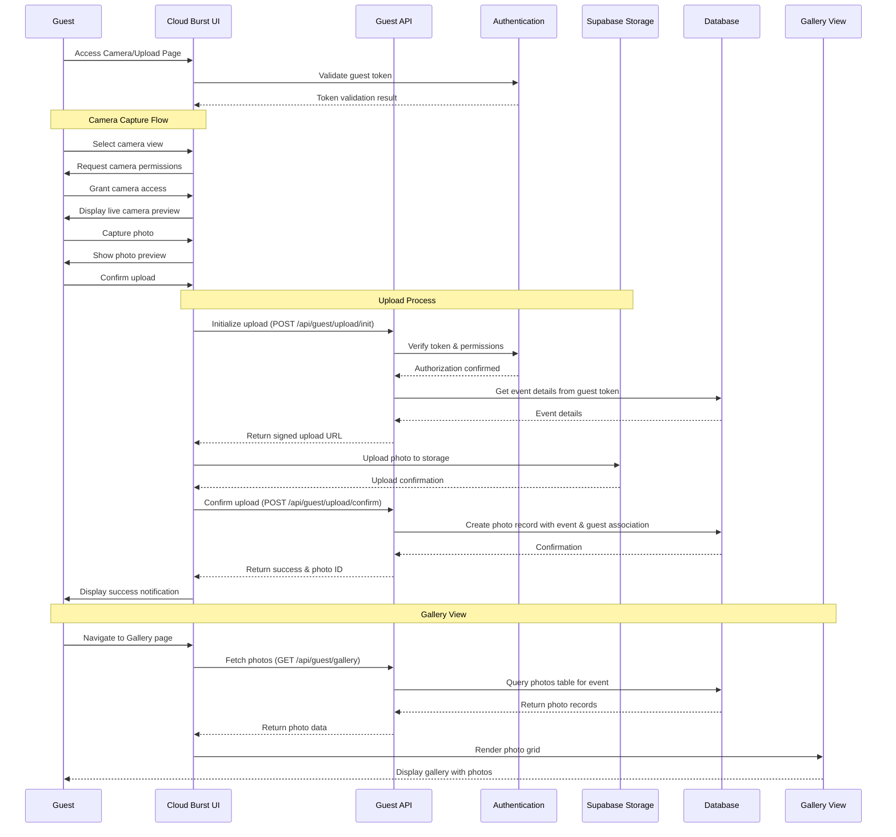

# 📊 **Media Upload Sequence Diagram**

## 📂 *Cloud Burst Platform - User Flows*
📅 *Last Updated: April 17, 2025*
📊 *Version: 0.9.5*

## 📌 Situational Abstract
Cloud Burst has completed a major milestone in version 0.9.5 with the implementation of a full end-to-end guest journey that includes photo upload functionality directly integrated with event galleries. Guests can now seamlessly move from RSVP to profile creation to actively contributing photos to event galleries. The platform supports both direct camera capture and file uploads, storing images securely in Supabase Storage with proper attribution to guests and events.

Recent improvements include fixing critical issues with profile creation constraints, implementing middleware checks for guest dashboard access, creating an intuitive bottom navigation for the guest area, and resolving table name inconsistencies in gallery queries. While the core upload functionality is working, we're currently troubleshooting some inconsistencies with uploads not always appearing in galleries and potential attribution issues. Session 42-B will focus on QA testing and resolving these remaining issues to ensure a seamless photo upload experience before the beta release.

## 🔄 **Sequence Diagram**



## 🔐 **Authentication & Guest Attribution**

Guest authentication and attribution has been significantly improved in v0.9.5:

1. **Token Validation System**:
   - **Middleware Integration**: Server-side validation of invitation tokens
   - **Profile Check**: Verification of complete guest profiles before dashboard access
   - **Secure Token Pass-Through**: Token is securely passed to upload endpoints
   - **Event Association**: Photos are automatically associated with the correct event

2. **Guest Attribution Flow**:
   - **Profile Requirement**: Guests must complete profiles before uploading
   - **Automatic Attribution**: Photos are linked to guest ID from profile
   - **Event Context**: Event association is derived from invitation token
   - **Permission Verification**: RLS policies ensure proper access controls
   - **Gallery Filtering**: Photos are filtered by event ID for gallery display

3. **Security Model**:
   - **Row Level Security**: Comprehensive RLS policies for photo access
   - **Storage Security**: Secure bucket configuration with proper CORS setup
   - **Permission Granularity**: Separate policies for viewing vs. uploading
   - **Audit Trail**: Complete tracking of uploads by guest

## 📤 **Media Upload Components**

### 🎬 Camera Capture Components [Implementation Status: 90%]
- ✅ `<CameraPage>` - Dedicated camera page with bottom navigation
- ✅ `<CameraCapture>` - Camera interface with preview
- ✅ `<CaptureButton>` - Photo capture functionality
- ✅ `<PreviewScreen>` - Photo preview before upload
- ✅ `<UploadConfirmation>` - Confirmation before upload
- ✅ Error handling for camera permissions
- ✅ Integration with guest token context
- 🟡 Progress indicators during upload (80% complete)
- 🟡 Enhanced error handling for failed uploads (60% complete)
- 🟡 Camera controls for flash/switching cameras (40% complete)

### 📁 File Upload Components [Implementation Status: 90%]
- ✅ `<UploadPage>` - Dedicated upload page with navigation
- ✅ `<FileUploader>` - File selection and upload component
- ✅ `<DropZone>` - Drag-and-drop file upload area
- ✅ `<FilePreview>` - Preview selected files before upload
- ✅ `<UploadButton>` - Trigger upload process
- ✅ File validation (size, type, count)
- ✅ Integration with guest token context
- 🟡 Progress indicators during upload (80% complete)
- 🟡 Enhanced error handling for failed uploads (60% complete)
- 🟡 Multi-file upload capabilities (40% complete)

### 🖼️ Gallery Components [Implementation Status: 85%]
- ✅ `<GalleryPage>` - Dedicated gallery page with navigation
- ✅ `<PhotoGrid>` - Gallery grid layout for photos
- ✅ `<PhotoCard>` - Individual photo display component
- ✅ `<LoadingGallery>` - Loading state for gallery
- ✅ `<EmptyGallery>` - Display when no photos exist
- ✅ Integration with guest token context
- ✅ Proper table name references in queries
- 🟡 Real-time updates for new uploads (70% complete)
- 🟡 Infinite scroll/pagination (50% complete)
- 🟡 Photo interaction features (40% complete)

## 🔄 **API Endpoints**

### Upload Initialization
```typescript
// POST /api/guest/upload/init
interface UploadInitRequest {
  fileName: string;
  fileType: string;
  fileSize: number;
}

interface UploadInitResponse {
  uploadUrl: string;
  photoId: string;
  fields: Record<string, string>;
}
```

### Upload Confirmation
```typescript
// POST /api/guest/upload/confirm
interface UploadConfirmRequest {
  photoId: string;
}

interface UploadConfirmResponse {
  success: boolean;
  photoUrl: string;
}
```

### Gallery Fetch
```typescript
// GET /api/guest/gallery
// Query params: ?limit=20&cursor=<cursor>

interface GalleryResponse {
  photos: {
    id: string;
    url: string;
    createdAt: string;
    guest: {
      name: string;
      avatar?: string;
    } | null;
  }[];
  nextCursor: string | null;
}
```

## 📱 **Mobile Implementation**

The guest photo upload experience has been designed with mobile-first principles:

- ✅ **Responsive Camera Interface**: Adapts to device orientation and screen size
- ✅ **Touch-Optimized Controls**: Large, accessible capture buttons and controls
- ✅ **Bottom Navigation**: Intuitive navigation between dashboard, camera, gallery, and upload
- ✅ **Adaptive Layout**: Proper spacing and component sizing across devices
- ✅ **Permission Handling**: Clear guidance for camera and storage permissions
- ✅ **Network Awareness**: Basic handling of connectivity issues
- 🟡 **Progressive Enhancement**: Partial implementation of advanced features based on device capabilities
- 🟡 **Offline Support**: Basic implementation of queued uploads

## 🔁 **Current Implementation Status**

### Core Upload Flow [90% Complete]
- ✅ Camera access and photo capture
- ✅ File selection and validation
- ✅ Upload to Supabase Storage
- ✅ Database record creation
- ✅ Association with guest and event
- 🟡 Progress tracking during upload (80% complete)
- 🟡 Enhanced error handling (60% complete)

### Gallery Integration [85% Complete]
- ✅ Gallery page layout and design
- ✅ Photo grid component
- ✅ Database queries for photos
- ✅ Loading states and empty states
- 🟡 Real-time updates (70% complete)
- 🟡 Infinite scroll/pagination (50% complete)
- 🟡 Photo interactions (40% complete)

### User Experience [80% Complete]
- ✅ Bottom navigation implementation
- ✅ Basic success indicators
- ✅ Basic error handling
- 🟡 Enhanced progress indicators (80% complete)
- 🟡 Comprehensive error messaging (60% complete)
- 🟡 Loading optimizations (50% complete)

### Performance & Reliability [75% Complete]
- ✅ Basic image optimization
- ✅ Query optimization for gallery loads
- 🟡 Lazy loading implementation (70% complete)
- 🟡 Connection resilience (60% complete)
- 🟡 Background uploads (40% complete)
- 🟡 Retry mechanisms (30% complete)

## 🚀 **Next Steps for Session 42-B**

1. **Resolve Gallery Integration Issues**
   - Fix inconsistent photo appearance in gallery
   - Ensure proper event and guest attribution
   - Implement real-time updates for new uploads
   - Add proper loading and error states

2. **Enhance Upload Experience**
   - Add detailed progress indicators
   - Implement comprehensive error handling
   - Add upload success confirmations
   - Ensure token persistence during upload

3. **Optimize Performance**
   - Implement lazy loading for gallery images
   - Add proper caching mechanisms
   - Optimize image loading in gallery view
   - Implement virtualized scrolling for large galleries

4. **Improve Reliability**
   - Add retry mechanisms for failed uploads
   - Implement offline queue capability
   - Enhance error recovery
   - Add detailed logging for troubleshooting

## 🧪 **Upcoming Testing Focus**

- Cross-device testing (iOS/Android)
- Performance testing with large galleries
- Network resilience testing
- Error recovery testing
- Edge case handling (very large files, unsupported formats)
- Token persistence across page navigation
- Permission boundary testing

---

This document will continue to be updated as we resolve the remaining issues and enhance the guest photo upload experience. Our target is to have a fully functional, reliable photo upload and gallery system ready for the Beta 1.0 Release Candidate by April 30, 2025. 