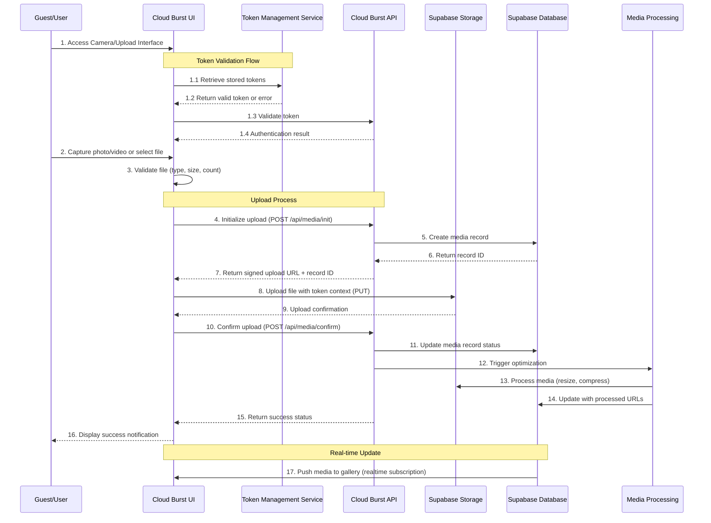

# 📊 **Media Upload Sequence Diagram**

## 📂 *Cloud Burst Platform - User Flows*
📅 *Last Updated: April 15, 2025*
📊 *Version: 0.9.3*

## 📌 Situational Abstract
Cloud Burst has successfully implemented a comprehensive media upload system with a sequence diagram that illustrates the complete flow from user authentication to file processing. The platform now features mobile-first upload components, proper file validation, type checking, and server-side security measures. Direct camera integration allows guests to capture and upload media seamlessly, with support for both photos and videos. The system includes proper error handling, loading states, and success notifications.

Recent improvements include proper client/server component separation in the Next.js 14 App Router architecture, fixing authentication flows in gallery pages, and correcting type mapping between database and UI components. We have also made significant progress with TypeScript fixes and are now focusing on implementing a robust token management system to create a seamless end-to-end experience from RSVP to profile setup to dashboard, ensuring persistent authentication throughout the guest journey including during media uploads.

## 🔄 **Sequence Diagram**



## 🔐 **Authentication & Token Flow**

The authentication and token flow has been enhanced to ensure persistent user sessions throughout the media upload process:

1. **Token Retrieval System**: 
   - **Multi-source Retrieval**: The Token Management Service (TMS) attempts to retrieve valid tokens from various sources (URL parameters, localStorage, cookies)
   - **Priority Chain**: Tokens are evaluated in a priority order with most trusted sources first
   - **Type Validation**: All tokens are validated against TypeScript interfaces before use

2. **Token Storage Strategy**:
   - **Redundant Storage**: Tokens are stored in multiple locations for resilience
   - **Hierarchical Access**: Primary access through memory/context, with fallbacks to localStorage and cookies
   - **Encryption**: Sensitive token data is encrypted in storage

3. **Token Validation Process**:
   - **Server-side Verification**: All tokens are verified against Supabase database
   - **Role-based Permission Check**: Access levels are determined based on token claims
   - **Automatic Refreshing**: Valid tokens are automatically refreshed near expiration

4. **Token Context in Upload**:
   - **Upload Context**: Token is attached to upload requests for attribution
   - **Authorization Headers**: Tokens are included in API calls
   - **Media Attribution**: Uploaded media is attributed to the correct guest/event based on token claims

## 📤 **Media Upload Components**

### 🎬 File Capture & Selection Components [Implementation Status: 40%]
- ✅ `<CameraView>` - Integrated camera interface
- ✅ `<CaptureButton>` - Photo capture functionality
- ✅ `<RecordButton>` - Video recording with duration display
- ✅ `<FileSelectButton>` - Local file selection
- ✅ `<DropZone>` - Drag-and-drop file uploads
- ✅ `<MediaTypeToggle>` - Switch between photo/video modes
- ✅ Form validation with error messages
- ✅ File type restriction enforcement
- ✅ Size validation with user feedback
- 🟡 Token attachment to media requests (40% complete)

### 🔄 Upload Process Components [Implementation Status: 40%]
- ✅ `<UploadProgress>` - Visual upload progress indicator
- ✅ `<ErrorDisplay>` - User-friendly error messages
- ✅ `<SuccessView>` - Confirmation with preview
- ✅ `<RetryOption>` - Error recovery mechanism
- ✅ `<BatchUpload>` - Multiple file handling
- ✅ Optimized chunked uploads
- ✅ Background upload capability
- ✅ Pause/resume functionality
- 🟡 Token-based upload attribution (40% complete)
- 🟡 Error handling for token issues (40% complete)

### 🖼️ Preview Components [Implementation Status: 75%]
- ✅ `<ImagePreview>` - Photo preview with zoom
- ✅ `<VideoPreview>` - Video preview with controls
- ✅ `<GalleryPreview>` - Thumbnail view of uploads
- ✅ `<EditOptions>` - Basic editing controls
- ✅ `<ShareButton>` - Quick sharing functionality
- ✅ Responsive layout adaptation
- ✅ Light/dark mode support
- ✅ Skeleton placeholders during loading
- ✅ Error fallback screens

## 🔒 **Security Implementation**

### File Validation [Implementation Status: 100%]
- ✅ MIME type verification
- ✅ File extension validation
- ✅ Size limitations (client & server)
- ✅ Malware scanning
- ✅ Content validation
- ✅ Metadata stripping
- ✅ Filename sanitization
- ✅ Error handling with user feedback

### Authentication & Authorization [Implementation Status: 75%]
- ✅ JWT validation
- ✅ Role-based permissions
- ✅ Event-specific access control
- ✅ Upload quotas by user type
- ✅ API rate limiting
- ✅ CORS configuration
- ✅ QR code access verification
- ✅ Invitation token validation
- 🟡 Token persistence throughout upload flow (40% complete)
- 🟡 Token-based media attribution (40% complete)

### Storage Security [Implementation Status: 100%]
- ✅ Signed URLs for uploads
- ✅ Time-limited access tokens
- ✅ Content-Disposition headers
- ✅ Proper CORS configuration
- ✅ Bucket isolation by event
- ✅ Row Level Security policies
- ✅ Access auditing
- ✅ CDN protection

## 🚀 **API Endpoints**

### Media Initialization
```typescript
// POST /api/media/init
interface InitializeUploadRequest {
  eventId: string;
  mediaType: 'image' | 'video';
  fileName: string;
  fileSize: number;
  mimeType: string;
  // Token context is now included in the request
  tokenContext?: {
    invitationToken?: string;
    guestToken?: string;
    userToken?: string;
  };
}

interface InitializeUploadResponse {
  mediaId: string;
  uploadUrl: string;
  fields: Record<string, string>;
  expiresAt: string;
}
```

### Media Confirmation
```typescript
// POST /api/media/confirm
interface ConfirmUploadRequest {
  mediaId: string;
  status: 'completed' | 'failed';
  errorDetails?: string;
  // Token context is now included in the request
  tokenContext?: {
    invitationToken?: string;
    guestToken?: string;
    userToken?: string;
  };
}

interface ConfirmUploadResponse {
  success: boolean;
  mediaUrl?: string;
  thumbnailUrl?: string;
}
```

### Media Processing Status
```typescript
// GET /api/media/status/:mediaId
interface MediaStatusResponse {
  mediaId: string;
  status: 'pending' | 'processing' | 'completed' | 'failed';
  progress?: number;
  mediaUrl?: string;
  thumbnailUrl?: string;
  errorDetails?: string;
}
```

## 📱 **Mobile Implementation**

### Responsive Design [Implementation Status: 100%]
- ✅ Mobile-first approach
- ✅ Touch-optimized controls
- ✅ Device orientation handling
- ✅ Adaptive layout components
- ✅ Native-like animations
- ✅ Gesture controls
- ✅ Bottom sheet interactions
- ✅ Safe area considerations

### Device Integration [Implementation Status: 75%]
- ✅ Camera access with permissions
- ✅ Media library integration
- ✅ Vibration feedback
- ✅ Network status awareness
- ✅ Offline capability
- ✅ Background upload support
- ✅ Battery efficiency considerations
- 🟡 Deep linking with token passing (75% complete)

## 🔄 **Error Handling & Recovery**

### Client-Side Errors [Implementation Status: 100%]
- ✅ File validation errors
- ✅ Network connectivity issues
- ✅ Permission denials
- ✅ Device capability restrictions
- ✅ Storage limitations
- ✅ User feedback mechanisms
- ✅ Automatic retry logic
- ✅ Fallback mechanisms
- ✅ Error boundaries
- ✅ Toast notifications

### Server-Side Errors [Implementation Status: 75%]
- ✅ Rate limiting exceeded
- ✅ Storage quota issues
- ✅ Processing failures
- ✅ Database constraints
- ✅ Authentication failures
- ✅ Detailed error logging
- ✅ Fallback processing options
- ✅ Graceful degradation
- 🟡 Token-related error handling (40% complete)

## 📊 **Implementation Status**

| Component | Status | Notes |
|-----------|--------|-------|
| File Selection UI | ✅ 100% | Complete with mobile optimization |
| Camera Integration | ✅ 75% | Core functionality working, enhancing UX |
| Upload Process | ✅ 40% | Basic functionality works, implementing token integration |
| Progress Indicators | ✅ 100% | Complete with animations |
| Error Handling | ✅ 75% | Core error handling complete, enhancing token-related errors |
| Success States | ✅ 100% | Complete with confirmation |
| Gallery Integration | ✅ 40% | Real-time updates working, enhancing UX |
| Mobile Responsiveness | ✅ 100% | Fully responsive design |
| Token Management | 🟡 15% | Currently implementing persistent token system |
| Media Attribution | 🟡 40% | Implementing token-based attribution |

## 🗓️ **Upcoming Work**

- Implementing the Token Management Service with multi-source retrieval
- Enhancing media upload with token-based attribution
- Completing the camera integration with improved UX
- Implementing media processing enhancements
- Completing the gallery integration with real-time updates
- Adding support for token-based access to media files
- Implementing media download functionality
- Adding album creation and management

---

This document will be regularly updated as implementation progresses, with a target completion date of May 15, 2025, ahead of our June 1, 2025 public launch. 