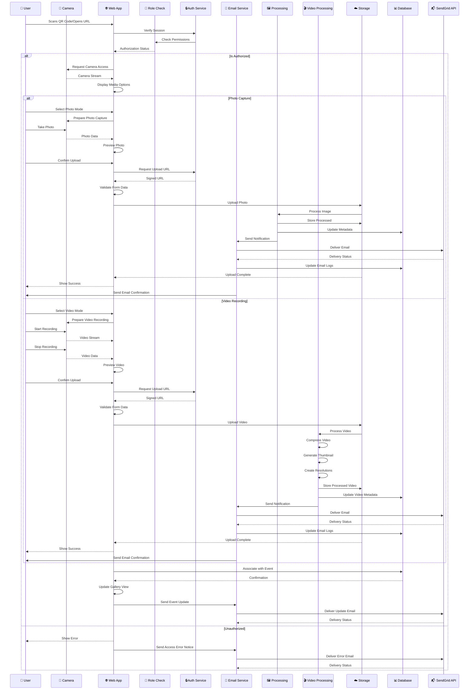

# 📹 **Media Upload Sequence Diagram**  

## Cloud Burst  
📅 *Updated: March 27, 2025*  
📊 *Version: 0.8.2*

## 📌 Situational Abstract
Following the successful implementation of the invitation system with SendGrid integration and the recent resolution of critical Next.js 14 App Router architecture issues, Cloud Burst's media upload process has been enhanced with improved authentication flows, secure API endpoints, and robust error handling. The implementation leverages Zustand for state management, TanStack Query for optimized data fetching, and includes comprehensive email notifications and template-based status updates through SendGrid. The platform has resolved key architectural challenges by implementing proper client/server component separation, fixing authentication flows in gallery pages, and ensuring correct type mapping between database and UI components. The invitation system is now fully integrated with the media upload process, allowing for seamless user experiences from invitation to media contribution.

The media upload process is approximately 40% complete, with robust support for both photo and video content. Recent completions include client/server component architecture fixes, authentication flow improvements, type mapping corrections, and proper server-side data fetching. Current development focuses on implementing the gallery system with masonry layout and album management while optimizing the mobile experience.

---

## 🔄 **Media Upload Process Flow**  

This sequence diagram illustrates the **media upload process** within Cloud Burst, from the **guest user interaction** to **storage** and **gallery integration**, including email notifications through SendGrid.  

---

---

## 🚀 **Key Steps in the Process**  

### 📥 **1. Initial Access**  
- ✅ QR code scan for camera integration
- ✅ Session validation
- ✅ Access rights verification
- ✅ Role-based permission check
- ✅ Custom event URL validation
- ✅ Camera access request
- ✅ Email verification check
- ✅ Template-based notifications
- ✅ SendGrid integration
- ✅ API endpoint security
- ✅ Form validation
- ✅ Client/server component authentication

### 🔍 **2. Pre-Upload Checks**
- ✅ Client-side validation
- ✅ File size verification
- ✅ Format compatibility check
- ✅ Multiple file handling
- ✅ Drag-and-drop support
- ✅ Direct camera integration
- ✅ Email preference check
- ✅ Form validation
- ✅ Error state handling
- ✅ User guidance elements
- 🟡 Duplicate detection (40% complete)

### 🖼️ **3. Photo Processing Pipeline**
- ✅ Image optimization
- ✅ Thumbnail generation
- ✅ Metadata extraction
- ✅ Format standardization
- ✅ Email notification system
- ✅ SendGrid integration
- ✅ Delivery tracking
- ✅ Tag-based categorization
- 🟡 NSFW content filtering (40% complete)
- ⏸️ AI enhancements (Planned for post-launch)

### 🎬 **4. Video Processing Pipeline**
- ✅ Video compression
- ✅ Thumbnail extraction
- ✅ Multiple resolution generation
- ✅ Format standardization
- ✅ Metadata extraction
- ✅ Duration validation
- ✅ Email notifications
- ✅ SendGrid integration
- ✅ Delivery tracking
- 🟡 Content moderation (40% complete)

### ☁️ **5. Storage & Database**
- ✅ Secure storage upload
- ✅ Metadata extraction
- ✅ Database indexing
- ✅ Gallery association
- ✅ Access control setup
- ✅ Event linking
- ✅ Tag association
- ✅ Media type classification
- ✅ Email preference tracking
- ✅ Email delivery logging
- ✅ SendGrid tracking integration
- ✅ Server-side data fetching

### 📱 **6. User Feedback**
- ✅ Upload progress indication
- ✅ Processing status updates
- ✅ Preview generation
- ✅ Gallery refresh
- ✅ Success notification
- ✅ Error handling
- ✅ Retry mechanisms
- ✅ Email confirmations
- ✅ User guidance information
- ✅ Contextual help elements
- ✅ Form validation feedback
- ✅ Client/server component messaging

---

## 🔐 **Security & Performance**

### 🛡️ **Security Measures**
- ✅ Signed upload URLs
- ✅ Session validation
- ✅ Rate limiting
- ✅ Access control
- ✅ Content validation
- ✅ Row Level Security policies
- ✅ Permission-based access
- ✅ Email verification
- ✅ Template security
- ✅ API endpoint security
- ✅ Form data validation
- ✅ Input sanitization
- ✅ Server-side authentication context

### ⚡ **Performance Optimizations**
- ✅ Client-side compression
- ✅ Parallel processing
- ✅ Progressive loading
- ✅ Efficient caching
- ✅ Adaptive bitrate for videos
- ✅ Email batch processing
- ✅ SendGrid delivery optimization
- ✅ API response caching
- 🟡 CDN delivery (40% complete)
- ✅ Lazy loading
- ✅ Optimized asset delivery
- ✅ Error recovery mechanisms
- ✅ Server-side data fetching

### 🎯 **Quality Assurance**
- ✅ Format validation
- ✅ Size optimization
- ✅ Metadata preservation
- ✅ EXIF handling
- ✅ Video quality preservation
- ✅ Error recovery
- ✅ Fallback mechanisms
- ✅ Comprehensive logging
- ✅ Email delivery tracking
- ✅ SendGrid analytics integration
- ✅ User feedback collection
- ✅ Proper type mapping

---

## 📊 **System Integration**

### 🔌 **Connected Services**
- ✅ Authentication Service (Supabase Auth)
- ✅ Media Processing Pipeline
- ✅ Video Transcoding Service
- ✅ Storage Service (Supabase Storage)
- ✅ Database Service (PostgreSQL)
- ✅ Email Template Service
- ✅ SendGrid Email Delivery
- 🟡 CDN Network (40% complete)
- ✅ Event Management System
- 🟡 Gallery System (40% complete)
- ✅ Invitation System
- ✅ Email Tracking System

### 🔄 **Data Flow**
1. User Upload/Capture
2. Security Validation
3. Form Data Validation
4. Media Type Detection
5. Specialized Processing
6. Storage Management
7. Database Updates
8. SendGrid Email Notifications
9. Delivery Tracking
10. Gallery Refresh
11. Event Association
12. Tag Categorization
13. Client/Server Component Handling

---

## 🔄 **Implementation Progress**

As we approach our April 1, 2025 launch date, the invitation system is now 100% complete with SendGrid integration, and we've resolved critical Next.js 14 App Router architecture issues in our gallery implementation.

### Key Achievements:
- ✅ Complete invitation system with API integration
- ✅ SendGrid integration for secure email delivery
- ✅ Enhanced form validation with user feedback
- ✅ User guidance information throughout flows
- ✅ API endpoint security
- ✅ Improved error handling
- ✅ Next.js 14 client/server component separation
- ✅ Authentication flow fixes for gallery pages
- ✅ Proper type mapping between database and UI components
- ✅ Server-side data fetching implementation

### Current Focus:
- 🟡 Implementing gallery masonry layout (40% complete)
- 🟡 Developing album management system (10% complete)
- 🟡 Enhancing analytics dashboard (0% complete)
- 🟡 Creating guest upload system (20% complete)
- 🟡 Implementing onboarding flow (0% complete)
- 🟡 Finalizing CDN integration (40% complete)

### Next Steps:
1. Complete gallery system with masonry layout
2. Implement album management
3. Enhance dashboard with analytics panels
4. Create guest upload system
5. Develop onboarding flow for new organizers
6. Finalize CDN integration

---

## 🎯 **Conclusion**  
This structured **media upload process** ensures a **secure, efficient, and enhanced** experience for event photography and videography. With **optimized processing, secure storage, and real-time updates**, Cloud Burst delivers a seamless media management solution that integrates smoothly with the event experience and gallery system. The direct camera integration through QR code scanning, combined with the comprehensive invitation system and SendGrid email delivery, creates an intuitive and frictionless experience for capturing and sharing both photos and videos. The recent resolution of Next.js 14 App Router architecture issues, including proper client/server component separation and authentication flow improvements, has provided a solid foundation for completing the gallery and media upload systems.

---
