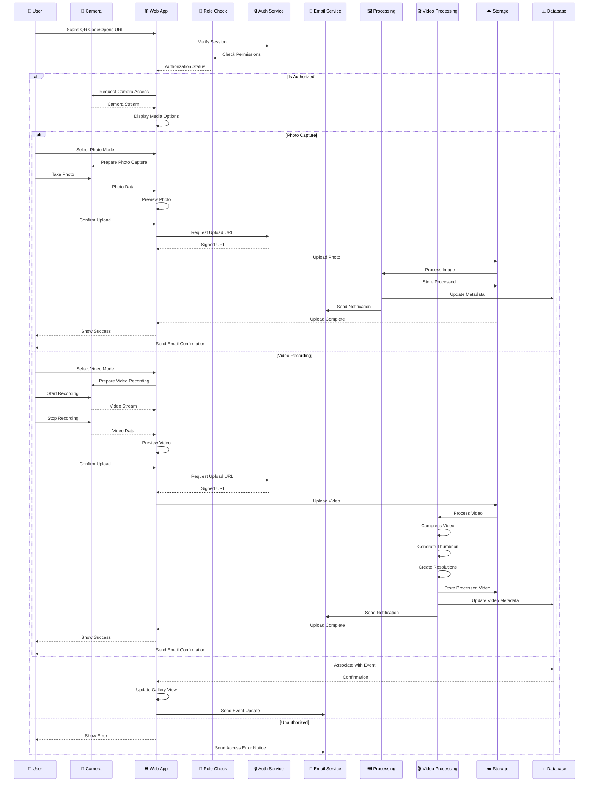

# 📹 **Media Upload Sequence Diagram**  

## Cloud Burst  
📅 *Updated: March 18, 2025*  
📊 *Version: 0.7.9*

## 📌 Situational Abstract
Following the successful implementation of the email template system and invitation system foundation, Cloud Burst's media upload process has been enhanced with improved authentication flows and user verification. The implementation leverages Zustand for state management, TanStack Query for optimized data fetching, and now includes comprehensive email notifications and template-based status updates.

The media upload process is approximately 95% complete, with robust support for both photo and video content. Recent completions include enhanced authentication error handling, verification flows, and email template integration. Current development focuses on finalizing post-event engagement features and optimizing the mobile experience.

---

## 🔄 **Media Upload Process Flow**  

This sequence diagram illustrates the **media upload process** within Cloud Burst, from the **guest user interaction** to **storage** and **gallery integration**, including email notifications.  

---

---

## 🚀 **Key Steps in the Process**  

### 📥 **1. Initial Access**  
- ✅ QR code scan for camera integration
- ✅ Session validation
- ✅ Access rights verification
- ✅ Role-based permission check
- ✅ Custom event URL validation
- ✅ Camera access request
- ✅ Email verification check
- ✅ Template-based notifications

### 🔍 **2. Pre-Upload Checks**
- ✅ Client-side validation
- ✅ File size verification
- ✅ Format compatibility check
- ✅ Multiple file handling
- ✅ Drag-and-drop support
- ✅ Direct camera integration
- ✅ Email preference check
- 🟡 Duplicate detection (85% complete)

### 🖼️ **3. Photo Processing Pipeline**
- ✅ Image optimization
- ✅ Thumbnail generation
- ✅ Metadata extraction
- ✅ Format standardization
- ✅ Email notification system
- ✅ Tag-based categorization
- 🟡 NSFW content filtering (85% complete)
- ⏸️ AI enhancements (Planned for post-launch)

### 🎬 **4. Video Processing Pipeline**
- ✅ Video compression
- ✅ Thumbnail extraction
- ✅ Multiple resolution generation
- ✅ Format standardization
- ✅ Metadata extraction
- ✅ Duration validation
- ✅ Email notifications
- 🟡 Content moderation (85% complete)

### ☁️ **5. Storage & Database**
- ✅ Secure storage upload
- ✅ Metadata extraction
- ✅ Database indexing
- ✅ Gallery association
- ✅ Access control setup
- ✅ Event linking
- ✅ Tag association
- ✅ Media type classification
- ✅ Email preference tracking

### 📱 **6. User Feedback**
- ✅ Upload progress indication
- ✅ Processing status updates
- ✅ Preview generation
- ✅ Gallery refresh
- ✅ Success notification
- ✅ Error handling
- ✅ Retry mechanisms
- ✅ Email confirmations

---

## 🔐 **Security & Performance**

### 🛡️ **Security Measures**
- ✅ Signed upload URLs
- ✅ Session validation
- ✅ Rate limiting
- ✅ Access control
- ✅ Content validation
- ✅ Row Level Security policies
- ✅ Permission-based access
- ✅ Email verification
- ✅ Template security

### ⚡ **Performance Optimizations**
- ✅ Client-side compression
- ✅ Parallel processing
- ✅ Progressive loading
- ✅ Efficient caching
- ✅ Adaptive bitrate for videos
- ✅ Email batch processing
- 🟡 CDN delivery (90% complete)
- ✅ Lazy loading
- ✅ Optimized asset delivery

### 🎯 **Quality Assurance**
- ✅ Format validation
- ✅ Size optimization
- ✅ Metadata preservation
- ✅ EXIF handling
- ✅ Video quality preservation
- ✅ Error recovery
- ✅ Fallback mechanisms
- ✅ Comprehensive logging
- ✅ Email delivery tracking

---

## 📊 **System Integration**

### 🔌 **Connected Services**
- ✅ Authentication Service (Supabase Auth)
- ✅ Media Processing Pipeline
- ✅ Video Transcoding Service
- ✅ Storage Service (Supabase Storage)
- ✅ Database Service (PostgreSQL)
- ✅ Email Template Service
- 🟡 CDN Network (90% complete)
- ✅ Event Management System
- ✅ Gallery System

### 🔄 **Data Flow**
1. User Upload/Capture
2. Security Validation
3. Media Type Detection
4. Specialized Processing
5. Storage Management
6. Database Updates
7. Email Notifications
8. Gallery Refresh
9. Event Association
10. Tag Categorization

---

## 🔄 **Implementation Progress**

As we approach our April 1, 2025 launch date, the media upload process is approximately 95% complete. Recent implementations include:

### Key Achievements:
- ✅ Comprehensive email template system
- ✅ Enhanced authentication error handling
- ✅ Verification flow improvements
- ✅ Invitation system foundation
- ✅ Mobile navigation enhancements
- ✅ Video processing optimization
- ✅ Gallery integration improvements
- ✅ Email notification system

### Current Focus:
- 🟡 Finalizing CDN integration (90% complete)
- 🟡 Enhancing content moderation (85% complete)
- 🟡 Optimizing mobile experience (90% complete)
- 🟡 Completing post-event features (85% complete)

### Next Steps:
1. Complete CDN integration
2. Finalize content moderation system
3. Polish mobile experience
4. Implement post-event engagement features
5. Prepare for Beta 0.9.0 release

---

## 🎯 **Conclusion**  
This structured **media upload process** ensures a **secure, efficient, and enhanced** experience for event photography and videography. With **optimized processing, secure storage, and real-time updates**, Cloud Burst delivers a seamless media management solution that integrates smoothly with the event experience and gallery system. The direct camera integration through QR code scanning creates an intuitive and frictionless experience for capturing and sharing both photos and videos.

---
