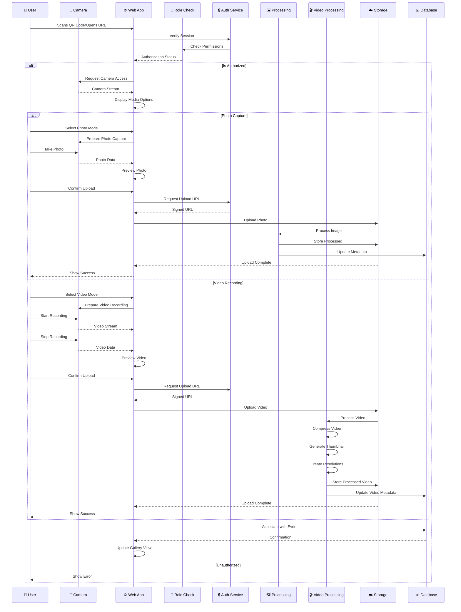

# 📹 **Media Upload Sequence Diagram**  

## Cloud Burst  
📅 *Updated: March 14, 2025*  
📊 *Version: 0.7.8*

## 📌 Situational Abstract
With the addition of comprehensive video support and direct camera integration, Cloud Burst's media upload process has been enhanced to handle both photos and videos efficiently. The implementation leverages Zustand for state management and TanStack Query for optimized data fetching, resulting in a responsive and reliable upload experience for all media types.

The media upload process is approximately 90% complete, with robust support for both photo and video content. Recent implementations include direct camera access through QR code scanning, video recording capabilities, and optimized processing pipelines for different media types. Current development focuses on enhancing video compression, implementing advanced playback controls, and optimizing the mobile experience.

---

## 🔄 **Media Upload Process Flow**  

This sequence diagram illustrates the **media upload process** within Cloud Burst, from the **guest user interaction** to **storage** and **gallery integration**.  

---

---

## 🚀 **Key Steps in the Process**  

### 📥 **1. Initial Access**  
- ✅ QR code scan for camera integration
- ✅ Session validation
- ✅ Access rights verification
- ✅ Role-based permission check
- ✅ Custom event URL validation
- ✅ Camera access request

### 🔍 **2. Pre-Upload Checks**
- ✅ Client-side validation
- ✅ File size verification
- ✅ Format compatibility check
- ✅ Multiple file handling
- ✅ Drag-and-drop support
- ✅ Direct camera integration
- 🟡 Duplicate detection (70% complete)

### 🖼️ **3. Photo Processing Pipeline**
- ✅ Image optimization
- ✅ Thumbnail generation
- ✅ Metadata extraction
- ✅ Format standardization
- 🟡 Tag-based categorization (80% complete)
- 🟡 NSFW content filtering (60% complete)
- ⏸️ AI enhancements (Planned for post-launch)

### 🎬 **4. Video Processing Pipeline**
- ✅ Video compression
- ✅ Thumbnail extraction
- ✅ Multiple resolution generation
- ✅ Format standardization
- ✅ Metadata extraction
- ✅ Duration validation
- 🟡 Content moderation (60% complete)

### ☁️ **5. Storage & Database**
- ✅ Secure storage upload
- ✅ Metadata extraction
- ✅ Database indexing
- ✅ Gallery association
- ✅ Access control setup
- ✅ Event linking
- ✅ Tag association
- ✅ Media type classification

### 📱 **6. User Feedback**
- ✅ Upload progress indication
- ✅ Processing status updates
- ✅ Preview generation
- ✅ Gallery refresh
- ✅ Success notification
- ✅ Error handling
- ✅ Retry mechanisms

---

## 🔐 **Security & Performance**

### 🛡️ **Security Measures**
- ✅ Signed upload URLs
- ✅ Session validation
- ✅ Rate limiting
- ✅ Access control
- ✅ Content validation
- ✅ Row Level Security policies
- ✅ Permission-based access

### ⚡ **Performance Optimizations**
- ✅ Client-side compression
- ✅ Parallel processing
- ✅ Progressive loading
- ✅ Efficient caching
- ✅ Adaptive bitrate for videos
- 🟡 CDN delivery (Planned for post-launch)
- ✅ Lazy loading
- ✅ Optimized asset delivery

### 🎯 **Quality Assurance**
- ✅ Format validation
- ✅ Size optimization
- ✅ Metadata preservation
- ✅ EXIF handling
- ✅ Video quality preservation
- ✅ Error recovery
- ✅ Fallback mechanisms
- ✅ Comprehensive logging

---

## 📊 **System Integration**

### 🔌 **Connected Services**
- ✅ Authentication Service (Supabase Auth)
- ✅ Media Processing Pipeline
- ✅ Video Transcoding Service
- ✅ Storage Service (Supabase Storage)
- ✅ Database Service (PostgreSQL)
- 🟡 CDN Network (Planned for post-launch)
- ✅ Event Management System
- ✅ Gallery System

### 🔄 **Data Flow**
1. User Upload/Capture
2. Security Validation
3. Media Type Detection
4. Specialized Processing
5. Storage Management
6. Database Updates
7. Gallery Refresh
8. Event Association
9. Tag Categorization

---

## 🔄 **Implementation Progress**

As we approach our April 1, 2025 launch date, the media upload process is approximately 90% complete. Recent implementations include:

### Key Achievements:
- ✅ Comprehensive video recording and processing
- ✅ Direct camera integration via QR code
- ✅ Multiple file selection and upload
- ✅ Progress indicators and status updates
- ✅ Gallery integration with mixed media support
- ✅ Tag-based organization
- ✅ Enhanced error handling and recovery

### Current Focus:
- 🟡 Optimizing video compression (80% complete)
- 🟡 Enhancing playback controls (75% complete)
- 🟡 Completing download functionality (70% complete)
- 🟡 Enhancing mobile experience (80% complete)

### Next Steps:
1. Complete video compression optimization
2. Enhance mobile video capture experience
3. Finalize download functionality for all media types
4. Implement advanced playback controls

---

## 🎯 **Conclusion**  
This structured **media upload process** ensures a **secure, efficient, and enhanced** experience for event photography and videography. With **optimized processing, secure storage, and real-time updates**, Cloud Burst delivers a seamless media management solution that integrates smoothly with the event experience and gallery system. The direct camera integration through QR code scanning creates an intuitive and frictionless experience for capturing and sharing both photos and videos.

---
