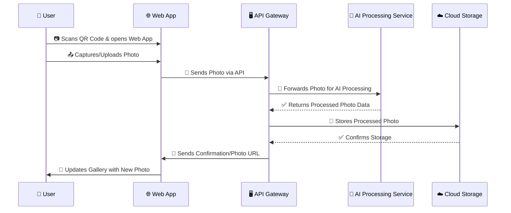

# 📸 **Photo Upload Sequence Diagram**  

## 📡 Cloud ☁️ Capture  
📅 *Feb 9, 2025*  

---

## 🔄 **Photo Upload Process Flow**  

This sequence diagram illustrates the **photo upload process** within Cloud Capture, from the **guest user interaction** to **AI processing** and **storage**.  

---

---

## 🚀 **Key Steps in the Process**  

### 📥 **1. User Uploads Photo**  
- Scans **QR Code** to access the Cloud Capture web app.  
- Uses **camera or file upload** to add a photo.  

### 🤖 **2. AI Processing**  
- AI applies **image enhancement, filtering, and duplication removal**.  
- Photo is categorized and tagged using **facial/object recognition**.  

### ☁️ **3. Secure Storage & Retrieval**  
- Processed photo is stored in **AWS S3 & Cloudflare CDN**.  
- User receives **real-time gallery update**.  

---

## 🔐 **Security & Performance Considerations**  
✔️ **End-to-End Encryption** – Secure photo transmission.  
✔️ **AI-Powered Moderation** – Ensures **high-quality uploads**.  
✔️ **Fast CDN Delivery** – Optimized **photo loading speeds**.  

---

## 🎯 **Conclusion**  
This structured **photo upload process** ensures a **seamless, real-time, AI-enhanced experience** for guests. With **secure storage, AI-powered enhancements, and a dynamic event gallery**, Cloud Capture **transforms event photography**.  

---
