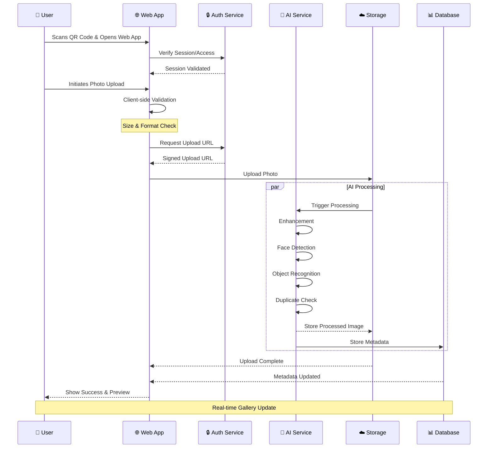

# 📸 **Photo Upload Sequence Diagram**  

## Cloud Burst  
📅 *Updated: Feb 27, 2025*  

---

## 🔄 **Photo Upload Process Flow**  

This sequence diagram illustrates the **photo upload process** within Cloud Burst, from the **guest user interaction** to **AI processing** and **storage**.  

---

---

## 🚀 **Key Steps in the Process**  

### 📥 **1. Initial Access**  
- QR code scan for gallery access
- Session validation
- Access rights verification

### 🔍 **2. Pre-Upload Checks**
- Client-side validation
- File size verification
- Format compatibility check
- Duplicate detection

### 🤖 **3. AI Processing Pipeline**
- Image enhancement
- Face detection
- Object recognition
- Smart tagging
- Duplicate removal
- NSFW content filtering

### ☁️ **4. Storage & Database**
- Secure storage upload
- Metadata extraction
- Database indexing
- Gallery association
- Access control setup

### 📱 **5. User Feedback**
- Upload progress indication
- Processing status updates
- Preview generation
- Gallery refresh
- Success notification

---

## 🔐 **Security & Performance**

### 🛡️ **Security Measures**
- Signed upload URLs
- Session validation
- Rate limiting
- Access control
- Content validation

### ⚡ **Performance Optimizations**
- Client-side compression
- Parallel processing
- Progressive loading
- Efficient caching
- CDN delivery

### 🎯 **Quality Assurance**
- Format validation
- Size optimization
- Metadata preservation
- EXIF handling
- Error recovery

---

## 📊 **System Integration**

### 🔌 **Connected Services**
- Authentication Service
- AI Processing Pipeline
- Storage Service
- Database Service
- CDN Network

### 🔄 **Data Flow**
1. User Upload
2. Security Validation
3. AI Processing
4. Storage Management
5. Database Updates
6. Gallery Refresh

---

## 🎯 **Conclusion**  
This structured **photo upload process** ensures a **secure, efficient, and enhanced** experience for event photography. With **AI-powered processing, secure storage, and real-time updates**, Cloud Burst delivers a seamless photo management solution.

---
