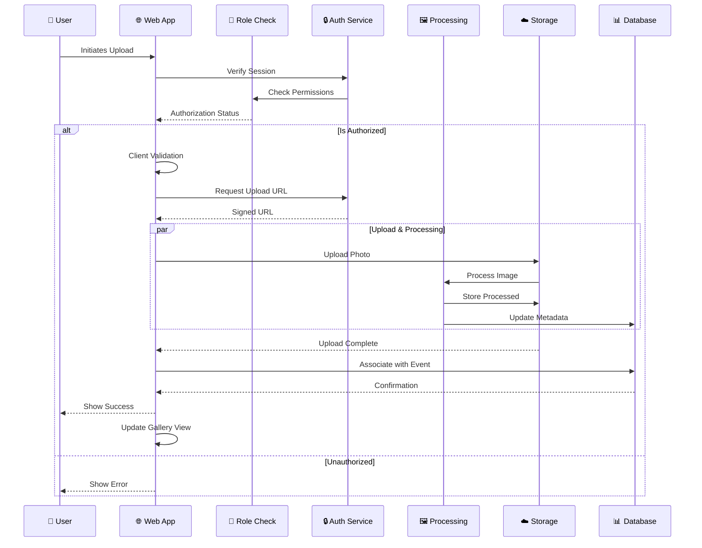

# 📸 **Photo Upload Sequence Diagram**  

## Cloud Burst  
📅 *Updated: March 3, 2025*  
📊 *Version: 0.7.0*

## 📌 Situational Abstract
With enhanced authentication, role-based access control, and custom event URLs in place, Cloud Burst's photo upload process has been refined to ensure secure and efficient handling of media assets. The implementation leverages Zustand for state management and TanStack Query for optimized data fetching, resulting in a more responsive and reliable upload experience.

The photo upload process is approximately 80% complete, with current development focused on enhancing the download functionality and optimizing the mobile experience. Recent implementations of multiple file selection, drag-and-drop support, and progress indicators have significantly improved the user experience, making the upload process more intuitive and efficient.

---

## 🔄 **Photo Upload Process Flow**  

This sequence diagram illustrates the **photo upload process** within Cloud Burst, from the **guest user interaction** to **storage** and **gallery integration**.  

---

```mermaid
sequenceDiagram
    participant U as 👤 User
    participant W as 🌐 Web App
    participant R as 🔐 Role Check
    participant A as 🔒 Auth Service
    participant P as 🖼️ Processing
    participant S as ☁️ Storage
    participant DB as 📊 Database

    U->>W: Initiates Upload
    W->>A: Verify Session
    A->>R: Check Permissions
    R-->>W: Authorization Status
    
    alt Is Authorized
        W->>W: Client Validation
        W->>A: Request Upload URL
        A-->>W: Signed URL
        
        par Upload & Processing
            W->>S: Upload Photo
            S->>P: Process Image
            P->>S: Store Processed
            P->>DB: Update Metadata
        end
        
        S-->>W: Upload Complete
        W->>DB: Associate with Event
        DB-->>W: Confirmation
        W-->>U: Show Success
        W->>W: Update Gallery View
    else Unauthorized
        W-->>U: Show Error
    end
```

---

## 🚀 **Key Steps in the Process**  

### 📥 **1. Initial Access**  
- ✅ QR code scan for gallery access
- ✅ Session validation
- ✅ Access rights verification
- ✅ Role-based permission check
- ✅ Custom event URL validation

### 🔍 **2. Pre-Upload Checks**
- ✅ Client-side validation
- ✅ File size verification
- ✅ Format compatibility check
- ✅ Multiple file handling
- ✅ Drag-and-drop support
- 🟡 Duplicate detection (70% complete)

### 🖼️ **3. Processing Pipeline**
- ✅ Image optimization
- ✅ Thumbnail generation
- ✅ Metadata extraction
- ✅ Format standardization
- 🟡 Tag-based categorization (80% complete)
- 🟡 NSFW content filtering (60% complete)
- ⏸️ AI enhancements (Planned for post-launch)

### ☁️ **4. Storage & Database**
- ✅ Secure storage upload
- ✅ Metadata extraction
- ✅ Database indexing
- ✅ Gallery association
- ✅ Access control setup
- ✅ Event linking
- ✅ Tag association

### 📱 **5. User Feedback**
- ✅ Upload progress indication
- ✅ Processing status updates
- ✅ Preview generation
- ✅ Gallery refresh
- ✅ Success notification
- ✅ Error handling
- ✅ Retry mechanisms

---

## 🔐 **Security & Performance**

### 🛡️ **Security Measures**
- ✅ Signed upload URLs
- ✅ Session validation
- ✅ Rate limiting
- ✅ Access control
- ✅ Content validation
- ✅ Row Level Security policies
- ✅ Permission-based access

### ⚡ **Performance Optimizations**
- ✅ Client-side compression
- ✅ Parallel processing
- ✅ Progressive loading
- ✅ Efficient caching
- 🟡 CDN delivery (Planned for post-launch)
- ✅ Lazy loading
- ✅ Optimized asset delivery

### 🎯 **Quality Assurance**
- ✅ Format validation
- ✅ Size optimization
- ✅ Metadata preservation
- ✅ EXIF handling
- ✅ Error recovery
- ✅ Fallback mechanisms
- ✅ Comprehensive logging

---

## 📊 **System Integration**

### 🔌 **Connected Services**
- ✅ Authentication Service (Supabase Auth)
- 🟡 Processing Pipeline (70% complete)
- ✅ Storage Service (Supabase Storage)
- ✅ Database Service (PostgreSQL)
- 🟡 CDN Network (Planned for post-launch)
- ✅ Event Management System
- ✅ Gallery System

### 🔄 **Data Flow**
1. User Upload
2. Security Validation
3. Processing
4. Storage Management
5. Database Updates
6. Gallery Refresh
7. Event Association
8. Tag Categorization

---

## 🔄 **Implementation Progress**

As we approach our April 1, 2025 launch date, the photo upload process is approximately 80% complete. Recent implementations include:

### Key Achievements:
- ✅ Multiple file selection and upload
- ✅ Drag-and-drop support
- ✅ Progress indicators and status updates
- ✅ Gallery integration with multiple layouts
- ✅ Tag-based organization
- ✅ Enhanced error handling and recovery

### Current Focus:
- 🟡 Completing download functionality (60% complete)
- 🟡 Enhancing mobile experience (70% complete)
- 🟡 Implementing content filtering (60% complete)
- 🟡 Optimizing performance for large uploads (75% complete)

### Next Steps:
1. Complete download functionality for gallery images
2. Enhance mobile responsiveness for upload components
3. Implement basic content filtering
4. Optimize performance for large batches of uploads

---

## 🎯 **Conclusion**  
This structured **photo upload process** ensures a **secure, efficient, and enhanced** experience for event photography. With **optimized processing, secure storage, and real-time updates**, Cloud Burst delivers a seamless photo management solution that integrates smoothly with the event experience and gallery system. The recent implementations of multiple file handling and tag-based organization have significantly improved the platform's utility and user experience.

---
