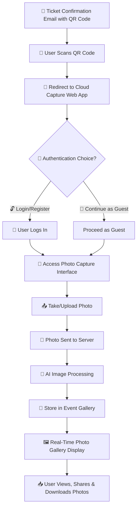

# 🔄 **User Flow Chart**  

## 📡 Cloud ☁️ Capture  
📅 *Feb 9, 2025*  

---

## 📍 **User Flow Process**  

This **User Flow Chart** visualizes the step-by-step journey a user takes when interacting with **Cloud Capture**, from receiving a ticket to engaging with the event photo gallery.  

---

---

## 🎯 **Key Features of the Flow**  

✔️ **Seamless QR Code Access** – No app download required.  
✔️ **AI-Powered Image Processing** – Filters, enhances, and organizes photos.  
✔️ **Real-Time Event Gallery** – Users see uploads instantly.  
✔️ **Guest & Registered User Modes** – Flexibility for attendees.  
✔️ **Social Sharing & Downloads** – Users can relive & share event memories.  

---

## 🚀 **Conclusion**  
This **User Flow Chart** ensures a **frictionless, AI-enhanced event photography experience** for both guests and event hosts. Cloud Capture **streamlines access, organization, and sharing**, making event memories more accessible than ever. 🎉  

---
