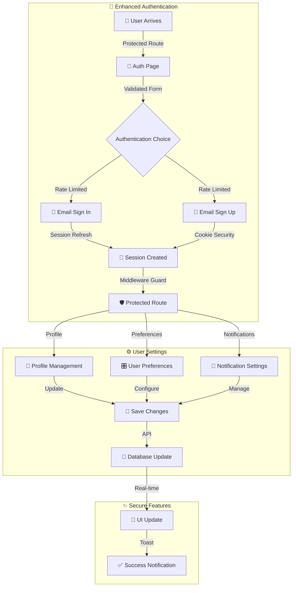

# 🔄 **User Flow Chart**  

## Cloud Capture V.1
📅 *Updated: Feb 21, 2024*  

## 🎯 **Key Components**  

### 🔐 **Enhanced Authentication**
- Rate limiting protection
- Security headers
- Session management
- Cookie security
- Error handling

### ⚙️ **Settings System**
- Profile management
- User preferences
- Notification settings
- Real-time updates
- Form validation

### 📊 **Secure Operations**
- Protected endpoints
- Rate limited APIs
- Session refresh
- Error boundaries

---
