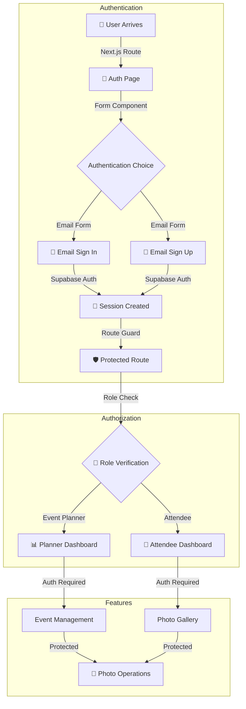

# 🔄 **User Flow Chart**  

## 📡 Cloud Capture
📅 *Feb 16, 2024*  

---

---

## 🎯 **Key Components**  

### 🔐 **Authentication**
- Email Sign In/Up Forms
- Session Management
- Protected Routes
- Loading States

### 👥 **Authorization**
- Role Assignment
- Permission Checks
- Access Control
- Security Rules

### 📊 **Dashboards**
- Role-Specific Views
- Protected Features
- Secure Operations
- Real-time Updates

---
