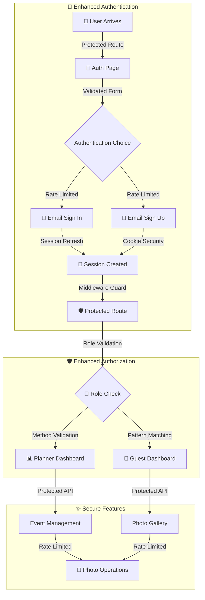

# 🔄 **User Flow Chart**  

## Cloud Capture V.1
📅 *Updated: Feb 17, 2024*  

---

---

## 🎯 **Key Security Components**  

### 🔐 **Enhanced Authentication**
- Rate limiting protection
- Security headers
- Session management
- Cookie security
- Error handling

### 👥 **Robust Authorization**
- Dynamic route matching
- Method validation
- Role-based access
- Protected API routes

### 📊 **Secure Operations**
- Protected endpoints
- Rate limited APIs
- Session refresh
- Error boundaries

---
