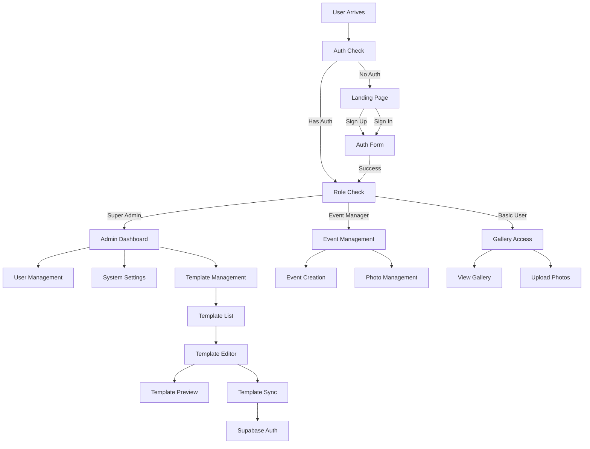
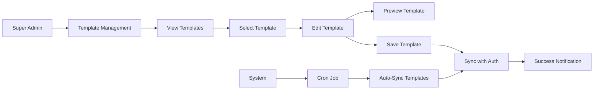
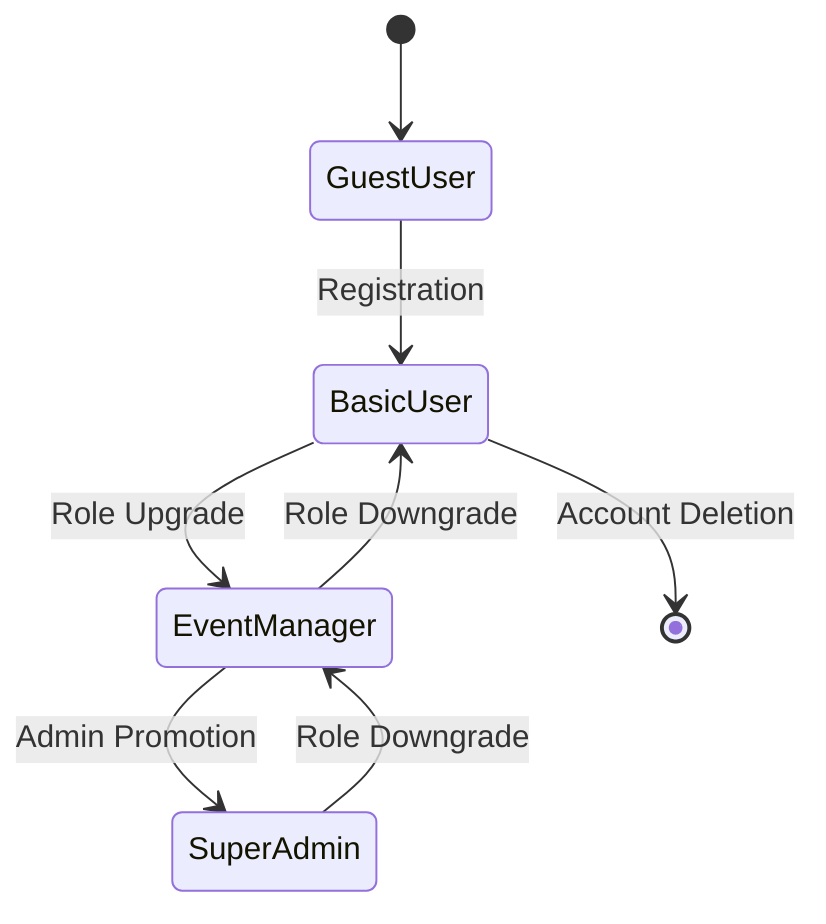

# 🔄 User Flow Chart [Beta v0.1.17]
📅 *Updated: March 15, 2025*

## 📌 Situational Abstract
Following the successful implementation of the Email Template Management System, Super Admin features, and enhanced authentication, Cloud Burst's user flows have been updated to reflect our role-based access control and improved security measures. The platform maintains its streamlined beta approach while providing robust user management and communication capabilities.

```mermaid
flowchart TD
    A[User Arrives] --> B[Auth Check]
    B --> |No Auth| C[Landing Page]
    B --> |Has Auth| D[Role Check]
    
    C --> |Sign Up| E[Auth Form]
    C --> |Sign In| E
    
    E --> |Success| D
    
    D --> |Super Admin| F[Admin Dashboard]
    D --> |Event Manager| G[Event Management]
    D --> |Basic User| H[Gallery Access]
    
    F --> I[User Management]
    F --> J[System Settings]
    F --> T[Template Management]
    
    T --> U[Template List]
    U --> V[Template Editor]
    V --> W[Template Preview]
    V --> X[Template Sync]
    
    G --> K[Event Creation]
    G --> L[Photo Management]
    
    H --> M[View Gallery]
    H --> N[Upload Photos]
    
    X --> Y[Supabase Auth]
```

## 📧 **Email Template Flow**

```mermaid
flowchart LR
    A[Super Admin] --> B[Template Management]
    B --> C[View Templates]
    C --> D[Select Template]
    D --> E[Edit Template]
    E --> F[Preview Template]
    E --> G[Save Template]
    G --> H[Sync with Auth]
    H --> I[Success Notification]
    
    J[System] --> K[Cron Job]
    K --> L[Auto-Sync Templates]
    L --> H
```

## 🎯 **Key Components**  

### 🔐 **Enhanced Authentication**
- Rate limiting protection
- Security headers
- Session management
- Cookie security
- Error handling
- Role verification

### ⚙️ **Settings System**
- Profile management
- User preferences
- Notification settings
- Template preferences
- Real-time updates
- Form validation

### 📊 **Secure Operations**
- Protected endpoints
- Rate limited APIs
- Session refresh
- Error boundaries
- Role-based access
- Template security

### 📧 **Template Management**
- Template database
- Editor interface
- Preview functionality
- Synchronization process
- Variable substitution
- Delivery tracking

## 🔄 **User Role Transitions**

```mermaid
stateDiagram-v2
    [*] --> GuestUser
    GuestUser --> BasicUser: Registration
    BasicUser --> EventManager: Role Upgrade
    EventManager --> SuperAdmin: Admin Promotion
    SuperAdmin --> EventManager: Role Downgrade
    EventManager --> BasicUser: Role Downgrade
    BasicUser --> [*]: Account Deletion
```

---
