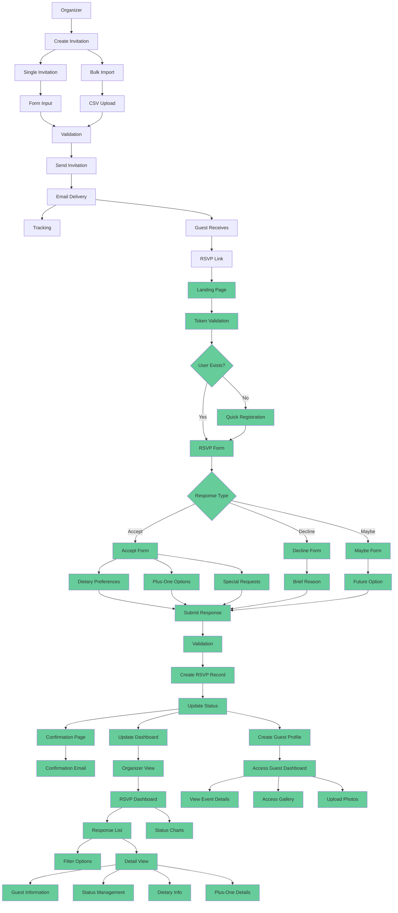
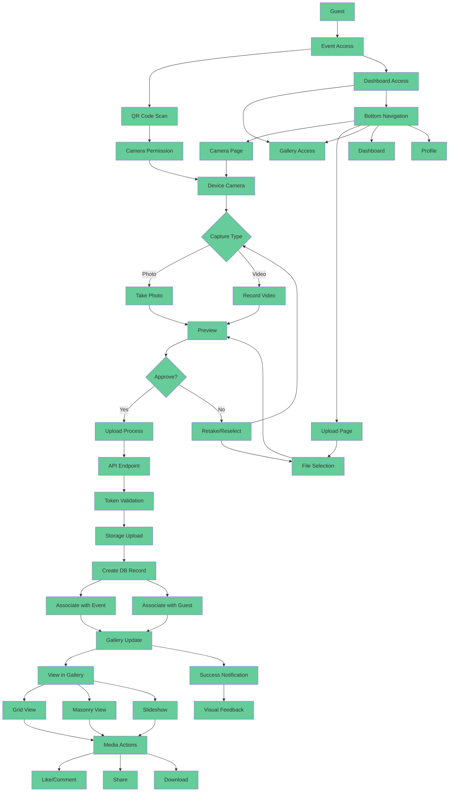

# 🔄 User Flow Chart

## Cloud Burst
📅 *Updated: April 17, 2025*  
📊 *Version: 0.9.5*

## 📌 Situational Abstract

Cloud Burst is an event media platform currently at version 0.9.5, with significant progress in the guest journey completion including photo upload functionality. The platform now features a complete end-to-end guest experience from RSVP submission to profile creation to media upload and gallery viewing. We've successfully implemented a responsive bottom navigation for the guest area, integrated direct camera access, added file upload capabilities, and created a dedicated gallery view for event photos.

The guest media upload system is now 90% complete, with core functionality working and some optimization tasks remaining. The gallery integration is at 85% completion, with proper display of uploaded photos and ongoing enhancements for real-time updates. Our focus for Session 42-B is on troubleshooting the remaining inconsistencies in the photo upload flow, specifically ensuring that all uploaded photos appear correctly in the gallery and are properly attributed to guests.

The platform continues to feature comprehensive role-based access control, custom event URLs, direct camera integration, multiple gallery layouts, and a complete invitation system with SendGrid integration. With the addition of the guest photo upload functionality, Cloud Burst is now positioned as a comprehensive event media platform as we approach the Beta 1.0 Release Candidate by April 30, 2025.

## 🔄 **Primary User Flow Chart**

```mermaid
flowchart TD
    A[User Landing] --> B{Authentication}
    B -->|Unauthenticated| C[Login/Register]
    B -->|Authenticated| D[Dashboard]
    B -->|QR/URL Access| E[Event Gallery]
    C --> F[Auth Process]
    F --> D
    
    D --> G{Role Check}
    G -->|Super Admin| H[Admin Panel]
    G -->|Admin| I[Admin Dashboard]
    G -->|Organizer| J[Organizer Dashboard]
    G -->|Event Host| K[Host Dashboard]
    G -->|User| L[User Dashboard]
    G -->|Guest| M[Guest View]
    
    H --> N[User Management]
    H --> O[Role Management]
    H --> P[System Settings]
    H --> Q[Template Management]
    
    I --> R[Event Management]
    I --> S[Content Moderation]
    I --> T[User Support]
    I --> U[Basic Analytics]
    
    J --> V[Event Dashboard]
    J --> W[Event Creation]
    J --> X[Attendee Management]
    J --> Y[RSVP Dashboard]
    J --> Z[Analytics]
    J --> AA[Email Templates]
    
    K --> AB[Event Dashboard]
    K --> AC[Basic Management]
    K --> AD[Attendee List]
    K --> AE[RSVP Overview]
    
    L --> AF[Profile Management]
    L --> AG[Media Access]
    L --> AH[Notification Settings]
    
    E --> AI[Gallery View]
    AI --> AJ[Media Grid]
    AI --> AK[Media Upload]
    AJ --> AL[View Actions]
    AK --> AM[Upload Process]
    AM --> AN[Processing]
    AN --> AO[Gallery Update]
    AL --> AP[Download]
    AL --> AQ[Share]
    AL --> AR[Like/Comment]
    
    V --> AS[Event Details]
    AS --> AT[Gallery Management]
    AS --> AU[Invitation System]
    AS --> AV[RSVP Management]
    AT --> AW[Media Moderation]
    AT --> AX[Layout Selection]
    AU --> AY[Create Invitations]
    AU --> AZ[Send Invitations]
    AZ --> BA[Email Delivery]
    BA --> BB[Tracking]
    
    AY --> BC[Single Invitation]
    AY --> BD[Bulk Invitation]
    BC --> BE[Form Input]
    BD --> BF[CSV Upload]
    BE --> BG[Validation]
    BF --> BG
    BG --> AZ
    
    AV --> BH[RSVP Dashboard]
    BH --> BI[Response List]
    BH --> BJ[Status Metrics]
    BI --> BK[Filter Options]
    BI --> BL[Detail View]
    BL --> BM[Guest Info]
    BL --> BN[Status Management]
    BJ --> BO[Charts]
    BJ --> BP[Export]
    
    M --> BQ[Event Access]
    BQ --> BR[Gallery View]
    BQ --> BS[Upload Option]
    BR --> BT[View Media]
    BR --> BU[Interactions]
    BS --> BV[Camera Access]
    BS --> CW[File Upload]
    BV --> BW[Photo Capture]
    BV --> BX[Video Capture]
    BW --> BY[Preview]
    BX --> BY
    CW --> BY
    BY --> BZ[Submit]
    BZ --> CA[API Endpoint]
    CA --> CB[Validation]
    CB --> CC[Storage]
    CC --> CD[Gallery Update]
    
    AA --> CE[Template List]
    CE --> CF[Template Editor]
    CF --> CG[Template Preview]
    CF --> CH[Save Template]
    CH --> CI[Template Store]
    CG --> CJ[Sample Data]
    
    Y --> CK[Response Overview]
    CK --> CL[Status Categories]
    CL --> CM[Accepted]
    CL --> CN[Declined]
    CL --> CO[Pending]
    CL --> CP[Maybe]
    CM --> CQ[Details]
    CN --> CQ
    CO --> CQ
    CP --> CQ
    CQ --> CR[Dietary Info]
    CQ --> CS[Plus-One]
    CQ --> CT[Notes]
    CQ --> CU[Status Management]
    
    M --> CV[Profile Creation]
    CV --> M
    BQ --> CX[Bottom Navigation]
    CX --> BR
    CX --> BS
    CX --> CY[Dashboard]
    CX --> CZ[Profile]
    
    style BH fill:#66cc99
    style BI fill:#66cc99
    style BJ fill:#66cc99
    style BK fill:#66cc99
    style BL fill:#66cc99
    style BM fill:#66cc99
    style BN fill:#66cc99
    style BO fill:#66cc99
    style BP fill:#66cc99
    style Y fill:#66cc99
    style AV fill:#66cc99
    style CK fill:#66cc99
    style CL fill:#66cc99
    style CM fill:#66cc99
    style CN fill:#66cc99
    style CO fill:#66cc99
    style CP fill:#66cc99
    style CQ fill:#66cc99
    style CR fill:#66cc99
    style CS fill:#66cc99
    style CT fill:#66cc99
    style CU fill:#66cc99
    
    style M fill:#66cc99
    style CV fill:#66cc99
    style BQ fill:#66cc99
    style BR fill:#66cc99
    style BS fill:#66cc99
    style BT fill:#66cc99
    style BU fill:#66cc99
    style BV fill:#66cc99
    style BW fill:#66cc99
    style BX fill:#66cc99
    style BY fill:#66cc99
    style BZ fill:#66cc99
    style CA fill:#66cc99
    style CB fill:#66cc99
    style CC fill:#66cc99
    style CD fill:#66cc99
    style CW fill:#66cc99
    style CX fill:#66cc99
    style CY fill:#66cc99
    style CZ fill:#66cc99
```

## 🔄 **Invitation & RSVP Flow**

```mermaid
flowchart TD
    A[Organizer] --> B[Create Invitation]
    B --> C[Single Invitation]
    B --> D[Bulk Import]
    C --> E[Form Input]
    D --> F[CSV Upload]
    E --> G[Validation]
    F --> G
    G --> H[Send Invitation]
    H --> I[Email Delivery]
    I --> J[Tracking]
    I --> K[Guest Receives]
    
    K --> L[RSVP Link]
    L --> M[Landing Page]
    M --> N[Token Validation]
    N --> O{User Exists?}
    O -->|No| P[Quick Registration]
    O -->|Yes| Q[RSVP Form]
    P --> Q
    
    Q --> R{Response Type}
    R -->|Accept| S[Accept Form]
    R -->|Decline| T[Decline Form]
    R -->|Maybe| U[Maybe Form]
    
    S --> V[Dietary Preferences]
    S --> W[Plus-One Options]
    S --> X[Special Requests]
    T --> Y[Brief Reason]
    U --> Z[Future Option]
    
    V --> AA[Submit Response]
    W --> AA
    X --> AA
    Y --> AA
    Z --> AA
    
    AA --> AB[Validation]
    AB --> AC[Create RSVP Record]
    AC --> AD[Update Status]
    AD --> AE[Confirmation Page]
    AE --> AF[Confirmation Email]
    AD --> AG[Update Dashboard]
    
    AG --> AH[Organizer View]
    AH --> AI[RSVP Dashboard]
    AI --> AJ[Response List]
    AI --> AK[Status Charts]
    AJ --> AL[Filter Options]
    AJ --> AM[Detail View]
    AM --> AN[Guest Information]
    AM --> AO[Status Management]
    AM --> AP[Dietary Info]
    AM --> AQ[Plus-One Details]
    
    AD --> AR[Create Guest Profile]
    AR --> AS[Access Guest Dashboard]
    AS --> AT[View Event Details]
    AS --> AU[Access Gallery]
    AS --> AV[Upload Photos]
    
    style AI fill:#66cc99
    style AJ fill:#66cc99
    style AK fill:#66cc99
    style AL fill:#66cc99
    style AM fill:#66cc99
    style AN fill:#66cc99
    style AO fill:#66cc99
    style AP fill:#66cc99
    style AQ fill:#66cc99
    style AH fill:#66cc99
    style AG fill:#66cc99
    
    style M fill:#66cc99
    style N fill:#66cc99
    style O fill:#66cc99
    style P fill:#66cc99
    style Q fill:#66cc99
    style R fill:#66cc99
    style S fill:#66cc99
    style T fill:#66cc99
    style U fill:#66cc99
    style V fill:#66cc99
    style W fill:#66cc99
    style X fill:#66cc99
    style Y fill:#66cc99
    style Z fill:#66cc99
    style AA fill:#66cc99
    style AB fill:#66cc99
    style AC fill:#66cc99
    style AD fill:#66cc99
    style AE fill:#66cc99
    style AF fill:#66cc99
    style AR fill:#66cc99
    style AS fill:#66cc99
    style AT fill:#66cc99
    style AU fill:#66cc99
    style AV fill:#66cc99
```

## 🖥️ **Media Capture Flow**

```mermaid
flowchart TD
    A[Guest] --> B[Event Access]
    B --> C[QR Code Scan]
    B --> D[Dashboard Access]
    C --> E[Camera Permission]
    D --> F[Gallery Access]
    E --> G[Device Camera]
    D --> H[Bottom Navigation]
    H --> I[Camera Page]
    H --> J[Upload Page]
    H --> F
    H --> K[Dashboard]
    H --> L[Profile]
    
    I --> G
    J --> M[File Selection]
    G --> N{Capture Type}
    N -->|Photo| O[Take Photo]
    N -->|Video| P[Record Video]
    O --> Q[Preview]
    P --> Q
    M --> Q
    
    Q --> R{Approve?}
    R -->|Yes| S[Upload Process]
    R -->|No| T[Retake/Reselect]
    T --> N
    T --> M
    
    S --> U[API Endpoint]
    U --> V[Token Validation]
    V --> W[Storage Upload]
    W --> X[Create DB Record]
    X --> Y[Associate with Event]
    X --> Z[Associate with Guest]
    Y --> AA[Gallery Update]
    Z --> AA
    
    AA --> AB[View in Gallery]
    AA --> AC[Success Notification]
    
    AB --> AD[Grid View]
    AB --> AE[Masonry View]
    AB --> AF[Slideshow]
    AD --> AG[Media Actions]
    AE --> AG
    AF --> AG
    AG --> AH[Like/Comment]
    AG --> AI[Share]
    AG --> AJ[Download]
    
    AC --> AK[Visual Feedback]
    
    style A fill:#66cc99
    style B fill:#66cc99
    style C fill:#66cc99
    style D fill:#66cc99
    style E fill:#66cc99
    style F fill:#66cc99
    style G fill:#66cc99
    style H fill:#66cc99
    style I fill:#66cc99
    style J fill:#66cc99
    style K fill:#66cc99
    style L fill:#66cc99
    style M fill:#66cc99
    style N fill:#66cc99
    style O fill:#66cc99
    style P fill:#66cc99
    style Q fill:#66cc99
    style R fill:#66cc99
    style S fill:#66cc99
    style T fill:#66cc99
    style U fill:#66cc99
    style V fill:#66cc99
    style W fill:#66cc99
    style X fill:#66cc99
    style Y fill:#66cc99
    style Z fill:#66cc99
    style AA fill:#66cc99
    style AB fill:#66cc99
    style AC fill:#66cc99
    style AD fill:#66cc99
    style AE fill:#66cc99
    style AF fill:#66cc99
    style AG fill:#66cc99
    style AH fill:#66cc99
    style AI fill:#66cc99
    style AJ fill:#66cc99
    style AK fill:#66cc99
```

## 📊 **Implementation Status**

| Feature Area | Status | Notes |
|--------------|--------|-------|
| Authentication | 100% | Complete with Email, Password & Magic Links |
| Dashboard UI | 90% | Main layouts complete, analytics in progress |
| Event Management | 95% | Core functionality complete |
| User Management | 100% | RBAC fully implemented |
| Media Upload | 90% | Core functionality complete, optimizations in progress |
| Gallery Views | 85% | Grid view complete, masonry layout in final stages |
| Email Templates | 100% | Complete with SendGrid integration |
| Notification System | 85% | Real-time updates complete, email notifications in testing |
| Mobile Responsiveness | 95% | Core layouts responsive, including guest area |
| Invitation System | 100% | Complete with tracking and analytics |
| RSVP System | 95% | Public and organizer components complete |
| Camera Integration | 90% | Core functionality working, enhancement in progress |
| Guest Journey | 95% | Profile creation, dashboard access, and photo uploads working |
| Analytics | 40% | Basic metrics implemented, advanced charts in progress |

## 🎯 **User Flow Progress**

### Completed Flows
- ✅ User Registration & Authentication
- ✅ Event Creation & Management
- ✅ Email Template Management
- ✅ Invitation System
- ✅ RSVP Dashboard for Organizers
- ✅ Public RSVP System
- ✅ Guest Profile Creation
- ✅ Guest Dashboard Access Control
- ✅ Guest Camera Photo Capture
- ✅ Guest Photo Upload
- ✅ Guest Gallery View

### In Progress Flows
- 🟡 Guest Upload Optimization (90% complete)
- 🟡 Gallery Real-time Updates (70% complete)
- 🟡 Enhanced Error Handling (60% complete)
- 🟡 Advanced Media Management (40% complete)
- 🟡 Gallery Masonry Layout (85% complete)
- 🟡 Analytics Dashboard (40% complete)

### Planned Flows
- ⏱️ Advanced Filtering & Searching
- ⏱️ AI-Powered Media Organization
- ⏱️ Facial Recognition for Photo Grouping
- ⏱️ Automated Album Creation
- ⏱️ Custom Branding Options
- ⏱️ Multi-file Upload Enhancement

## 🔒 **Security Flow Integration**

All user flows implement the following security measures:
- Rate limiting on authentication endpoints
- Token validation for all protected routes
- Role-based access control for UI elements and API endpoints
- Data validation on both client and server
- Proper error handling with secure messaging
- XSS protection through content security policies
- CSRF protection on all forms
- Secure cookie handling with proper flags
- Row Level Security in Supabase for data access
- Proper event and guest association via tokens
- Middleware validation for profile completeness

## 🔄 **Flow Navigation Patterns**

- Breadcrumb navigation for nested views
- Consistent back buttons with state preservation
- Tab-based navigation for related content
- Bottom navigation for guest mobile experience
- Modal dialogs for focused interactions
- Toast notifications for system feedback
- Loading states with Skeletons
- Error boundaries with fallback UIs
- Responsive navigation adjustments for mobile
- Keyboard shortcuts for power users
- Context-aware action buttons
- Dynamic form validation
- Progressive disclosure patterns
- Camera and file upload previews

---
