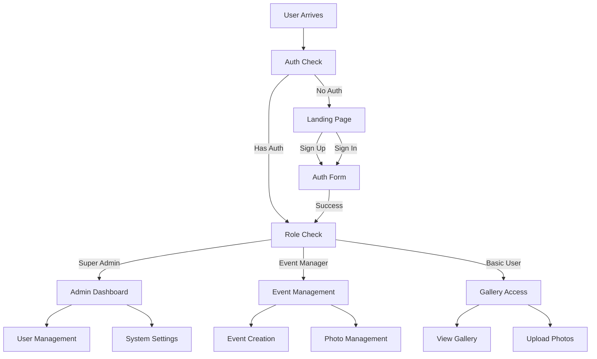

# 🔄 User Flow Chart
📅 *Updated: March 1, 2025*

## 📌 Situational Abstract
Following the successful implementation of Super Admin features and enhanced authentication, Cloud Burst's user flows have been updated to reflect our role-based access control and improved security measures. The platform maintains its streamlined beta approach while providing robust user management.

```mermaid
flowchart TD
    A[User Arrives] --> B[Auth Check]
    B --> |No Auth| C[Landing Page]
    B --> |Has Auth| D[Role Check]
    
    C --> |Sign Up| E[Auth Form]
    C --> |Sign In| E
    
    E --> |Success| D
    
    D --> |Super Admin| F[Admin Dashboard]
    D --> |Event Manager| G[Event Management]
    D --> |Basic User| H[Gallery Access]
    
    F --> I[User Management]
    F --> J[System Settings]
    
    G --> K[Event Creation]
    G --> L[Photo Management]
    
    H --> M[View Gallery]
    H --> N[Upload Photos]
```

[... continue updating with enhanced role-based flows and security measures ...]

## 🎯 **Key Components**  

### 🔐 **Enhanced Authentication**
- Rate limiting protection
- Security headers
- Session management
- Cookie security
- Error handling

### ⚙️ **Settings System**
- Profile management
- User preferences
- Notification settings
- Real-time updates
- Form validation

### 📊 **Secure Operations**
- Protected endpoints
- Rate limited APIs
- Session refresh
- Error boundaries

---
