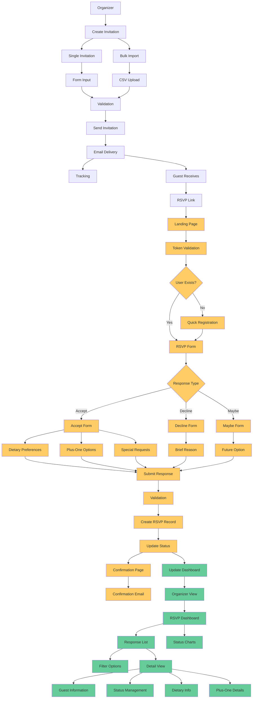
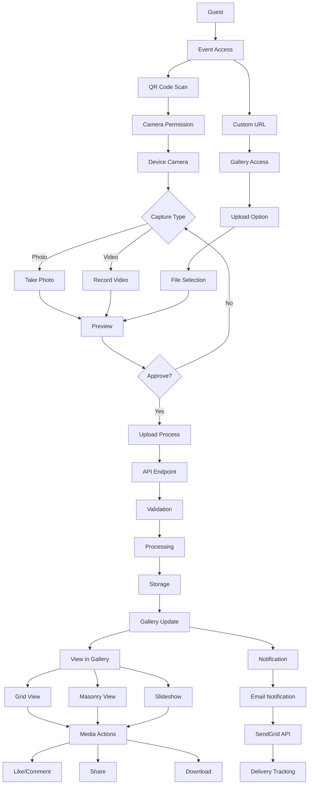

# 🔄 User Flow Chart

## Cloud Burst
📅 *Updated: April 2, 2025*  
📊 *Version: 0.8.5*

## 📌 Situational Abstract

Cloud Burst is an event media platform currently at version 0.8.5, with significant progress in the RSVP system integration. The platform now includes a comprehensive RSVP dashboard within the event management interface, providing organizers with a centralized location to track and manage guest responses. We've successfully implemented tab-based navigation for seamless RSVP management, improved card styling for better visibility in both light and dark modes, and optimized layouts for both desktop and mobile views.

The RSVP system is now 50% complete, with the organizer-facing components fully implemented and integrated into the event dashboard. Our focus for Session 35 is on developing the public-facing aspects of the system, including the invitation landing page, RSVP form, and guest authentication flow. We're also advancing the camera integration for QR code scanning to enhance the on-site check-in experience.

The platform continues to feature comprehensive role-based access control, custom event URLs, direct camera integration, multiple gallery layouts, and a complete invitation system with SendGrid integration. With these enhancements, Cloud Burst is well-positioned to deliver a polished, professional-grade solution for complete event media management.

## 🔄 **Primary User Flow Chart**

```mermaid
flowchart TD
    A[User Landing] --> B{Authentication}
    B -->|Unauthenticated| C[Login/Register]
    B -->|Authenticated| D[Dashboard]
    B -->|QR/URL Access| E[Event Gallery]
    C --> F[Auth Process]
    F --> D
    
    D --> G{Role Check}
    G -->|Super Admin| H[Admin Panel]
    G -->|Admin| I[Admin Dashboard]
    G -->|Organizer| J[Organizer Dashboard]
    G -->|Event Host| K[Host Dashboard]
    G -->|User| L[User Dashboard]
    G -->|Guest| M[Guest View]
    
    H --> N[User Management]
    H --> O[Role Management]
    H --> P[System Settings]
    H --> Q[Template Management]
    
    I --> R[Event Management]
    I --> S[Content Moderation]
    I --> T[User Support]
    I --> U[Basic Analytics]
    
    J --> V[Event Dashboard]
    J --> W[Event Creation]
    J --> X[Attendee Management]
    J --> Y[RSVP Dashboard]
    J --> Z[Analytics]
    J --> AA[Email Templates]
    
    K --> AB[Event Dashboard]
    K --> AC[Basic Management]
    K --> AD[Attendee List]
    K --> AE[RSVP Overview]
    
    L --> AF[Profile Management]
    L --> AG[Media Access]
    L --> AH[Notification Settings]
    
    E --> AI[Gallery View]
    AI --> AJ[Media Grid]
    AI --> AK[Media Upload]
    AJ --> AL[View Actions]
    AK --> AM[Upload Process]
    AM --> AN[Processing]
    AN --> AO[Gallery Update]
    AL --> AP[Download]
    AL --> AQ[Share]
    AL --> AR[Like/Comment]
    
    V --> AS[Event Details]
    AS --> AT[Gallery Management]
    AS --> AU[Invitation System]
    AS --> AV[RSVP Management]
    AT --> AW[Media Moderation]
    AT --> AX[Layout Selection]
    AU --> AY[Create Invitations]
    AU --> AZ[Send Invitations]
    AZ --> BA[Email Delivery]
    BA --> BB[Tracking]
    
    AY --> BC[Single Invitation]
    AY --> BD[Bulk Invitation]
    BC --> BE[Form Input]
    BD --> BF[CSV Upload]
    BE --> BG[Validation]
    BF --> BG
    BG --> AZ
    
    AV --> BH[RSVP Dashboard]
    BH --> BI[Response List]
    BH --> BJ[Status Metrics]
    BI --> BK[Filter Options]
    BI --> BL[Detail View]
    BL --> BM[Guest Info]
    BL --> BN[Status Management]
    BJ --> BO[Charts]
    BJ --> BP[Export]
    
    M --> BQ[Event Access]
    BQ --> BR[Gallery View]
    BQ --> BS[Upload Option]
    BR --> BT[View Media]
    BR --> BU[Interactions]
    BS --> BV[Camera Access]
    BV --> BW[Photo Capture]
    BV --> BX[Video Capture]
    BW --> BY[Preview]
    BX --> BY
    BY --> BZ[Submit]
    BZ --> CA[API Endpoint]
    CA --> CB[Validation]
    CB --> CC[Storage]
    CC --> CD[Gallery Update]
    
    AA --> CE[Template List]
    CE --> CF[Template Editor]
    CF --> CG[Template Preview]
    CF --> CH[Save Template]
    CH --> CI[Template Store]
    CG --> CJ[Sample Data]
    
    Y --> CK[Response Overview]
    CK --> CL[Status Categories]
    CL --> CM[Accepted]
    CL --> CN[Declined]
    CL --> CO[Pending]
    CL --> CP[Maybe]
    CM --> CQ[Details]
    CN --> CQ
    CO --> CQ
    CP --> CQ
    CQ --> CR[Dietary Info]
    CQ --> CS[Plus-One]
    CQ --> CT[Notes]
    CQ --> CU[Status Management]
    
    style BH fill:#66cc99
    style BI fill:#66cc99
    style BJ fill:#66cc99
    style BK fill:#66cc99
    style BL fill:#66cc99
    style BM fill:#66cc99
    style BN fill:#66cc99
    style BO fill:#66cc99
    style BP fill:#66cc99
    style Y fill:#66cc99
    style AV fill:#66cc99
    style CK fill:#66cc99
    style CL fill:#66cc99
    style CM fill:#66cc99
    style CN fill:#66cc99
    style CO fill:#66cc99
    style CP fill:#66cc99
    style CQ fill:#66cc99
    style CR fill:#66cc99
    style CS fill:#66cc99
    style CT fill:#66cc99
    style CU fill:#66cc99
```

## 🔄 **Invitation & RSVP Flow**

```mermaid
flowchart TD
    A[Organizer] --> B[Create Invitation]
    B --> C[Single Invitation]
    B --> D[Bulk Import]
    C --> E[Form Input]
    D --> F[CSV Upload]
    E --> G[Validation]
    F --> G
    G --> H[Send Invitation]
    H --> I[Email Delivery]
    I --> J[Tracking]
    I --> K[Guest Receives]
    
    K --> L[RSVP Link]
    L --> M[Landing Page]
    M --> N[Token Validation]
    N --> O{User Exists?}
    O -->|No| P[Quick Registration]
    O -->|Yes| Q[RSVP Form]
    P --> Q
    
    Q --> R{Response Type}
    R -->|Accept| S[Accept Form]
    R -->|Decline| T[Decline Form]
    R -->|Maybe| U[Maybe Form]
    
    S --> V[Dietary Preferences]
    S --> W[Plus-One Options]
    S --> X[Special Requests]
    T --> Y[Brief Reason]
    U --> Z[Future Option]
    
    V --> AA[Submit Response]
    W --> AA
    X --> AA
    Y --> AA
    Z --> AA
    
    AA --> AB[Validation]
    AB --> AC[Create RSVP Record]
    AC --> AD[Update Status]
    AD --> AE[Confirmation Page]
    AE --> AF[Confirmation Email]
    AD --> AG[Update Dashboard]
    
    AG --> AH[Organizer View]
    AH --> AI[RSVP Dashboard]
    AI --> AJ[Response List]
    AI --> AK[Status Charts]
    AJ --> AL[Filter Options]
    AJ --> AM[Detail View]
    AM --> AN[Guest Information]
    AM --> AO[Status Management]
    AM --> AP[Dietary Info]
    AM --> AQ[Plus-One Details]
    
    style AI fill:#66cc99
    style AJ fill:#66cc99
    style AK fill:#66cc99
    style AL fill:#66cc99
    style AM fill:#66cc99
    style AN fill:#66cc99
    style AO fill:#66cc99
    style AP fill:#66cc99
    style AQ fill:#66cc99
    style AH fill:#66cc99
    style AG fill:#66cc99
    
    style M fill:#ffcc66
    style N fill:#ffcc66
    style O fill:#ffcc66
    style P fill:#ffcc66
    style Q fill:#ffcc66
    style R fill:#ffcc66
    style S fill:#ffcc66
    style T fill:#ffcc66
    style U fill:#ffcc66
    style V fill:#ffcc66
    style W fill:#ffcc66
    style X fill:#ffcc66
    style Y fill:#ffcc66
    style Z fill:#ffcc66
    style AA fill:#ffcc66
    style AB fill:#ffcc66
    style AC fill:#ffcc66
    style AD fill:#ffcc66
    style AE fill:#ffcc66
    style AF fill:#ffcc66
```

## 🖥️ **Media Capture Flow**

```mermaid
flowchart TD
    A[Guest] --> B[Event Access]
    B --> C[QR Code Scan]
    B --> D[Custom URL]
    C --> E[Camera Permission]
    D --> F[Gallery Access]
    E --> G[Device Camera]
    F --> H[Upload Option]
    G --> I{Capture Type}
    H --> J[File Selection]
    I -->|Photo| K[Take Photo]
    I -->|Video| L[Record Video]
    K --> M[Preview]
    L --> M
    J --> M
    
    M --> N{Approve?}
    N -->|Yes| O[Upload Process]
    N -->|No| I
    O --> P[API Endpoint]
    P --> Q[Validation]
    Q --> R[Processing]
    R --> S[Storage]
    S --> T[Gallery Update]
    T --> U[View in Gallery]
    T --> V[Notification]
    
    U --> W[Grid View]
    U --> X[Masonry View]
    U --> Y[Slideshow]
    W --> Z[Media Actions]
    X --> Z
    Y --> Z
    Z --> AA[Like/Comment]
    Z --> AB[Share]
    Z --> AC[Download]
    
    V --> AD[Email Notification]
    AD --> AE[SendGrid API]
    AE --> AF[Delivery Tracking]
```

## 📊 **Implementation Status**

| Feature Area | Status | Notes |
|--------------|--------|-------|
| Authentication | 100% | Complete with Email, Password & Magic Links |
| Dashboard UI | 90% | Main layouts complete, analytics in progress |
| Event Management | 95% | Core functionality complete |
| User Management | 100% | RBAC fully implemented |
| Media Upload | 70% | Core functionality working, optimizations in progress |
| Gallery Views | 40% | Basic grid complete, masonry layout in development |
| Email Templates | 100% | Complete with SendGrid integration |
| Notification System | 85% | Real-time updates complete, email notifications in testing |
| Mobile Responsiveness | 80% | Core layouts responsive, fine-tuning in progress |
| Invitation System | 100% | Complete with tracking and analytics |
| RSVP System | 50% | Dashboard complete, public components in development |
| Camera Integration | 30% | Basic functionality works, QR scanning in development |
| Analytics | 40% | Basic metrics implemented, advanced charts in progress |

## 🎯 **User Flow Progress**

### Completed Flows
- ✅ User Registration & Authentication
- ✅ Event Creation & Management
- ✅ Basic Media Upload
- ✅ Email Template Management
- ✅ Invitation System
- ✅ RSVP Dashboard for Organizers

### In Progress Flows
- 🟡 Public RSVP System (0%)
- 🟡 QR Code Scanning for Event Access (30%)
- 🟡 Advanced Media Management (40%)
- 🟡 Gallery Masonry Layout (40%)
- 🟡 Analytics Dashboard (40%)

### Planned Flows
- ⏱️ Advanced Filtering & Searching
- ⏱️ AI-Powered Media Organization
- ⏱️ Facial Recognition for Photo Grouping
- ⏱️ Automated Album Creation
- ⏱️ Custom Branding Options

## 🔒 **Security Flow Integration**

All user flows implement the following security measures:
- Rate limiting on authentication endpoints
- Token validation for all protected routes
- Role-based access control for UI elements and API endpoints
- Data validation on both client and server
- Proper error handling with secure messaging
- XSS protection through content security policies
- CSRF protection on all forms
- Secure cookie handling with proper flags
- Row Level Security in Supabase for data access

## 🔄 **Flow Navigation Patterns**

- Breadcrumb navigation for nested views
- Consistent back buttons with state preservation
- Tab-based navigation for related content
- Modal dialogs for focused interactions
- Toast notifications for system feedback
- Loading states with Skeletons
- Error boundaries with fallback UIs
- Responsive navigation adjustments for mobile
- Keyboard shortcuts for power users
- Context-aware action buttons
- Dynamic form validation
- Progressive disclosure patterns

---
