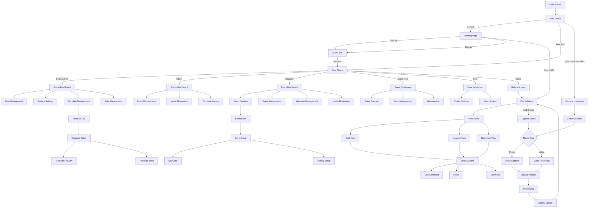
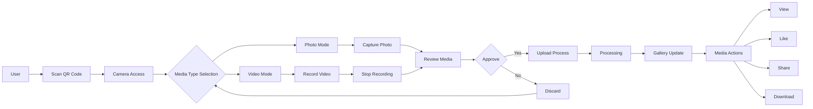
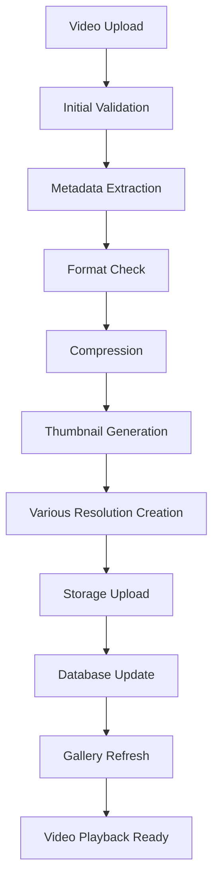

# 🔄 User Flow Chart

## Cloud Burst
📅 *Updated: March 14, 2025*  
📊 *Version: 0.7.8*

## 📌 Situational Abstract
Following the successful implementation of comprehensive video support, Cloud Burst now offers a complete media management solution that handles both photos and videos seamlessly. The platform features direct camera integration through QR code scanning, allowing attendees to capture media directly within the application. With enhanced processing capabilities for videos and optimized gallery displays for mixed media, Cloud Burst provides an intuitive and engaging experience for all users.

The media management system is approximately 90% complete, with recent additions including video capture, processing, and playback functionalities. Current development focuses on optimizing video compression, enhancing playback controls, and implementing advanced sharing options for mixed media galleries.

```mermaid
flowchart TD
    A[User Arrives] --> B[Auth Check]
    B --> |No Auth| C[Landing Page]
    B --> |Has Auth| D[Role Check]
    B --> |QR Code/Event URL| E[Camera Integration]
    
    C --> |Sign Up| F[Auth Form]
    C --> |Sign In| F
    C --> |Event URL| G[Event Gallery]
    
    F --> |Success| D
    
    E --> H[Camera Access]
    H --> I{Media Type}
    I --> |Photo| J[Photo Capture]
    I --> |Video| K[Video Recording]
    
    J --> L[Upload Process]
    K --> L
    L --> M[Processing]
    M --> N[Gallery Update]
    N --> G
    
    D --> |Super Admin| O[Admin Dashboard]
    D --> |Admin| P[Admin Dashboard]
    D --> |Organizer| Q[Event Dashboard]
    D --> |Event Host| R[Event Dashboard]
    D --> |User| S[User Dashboard]
    D --> |Guest| T[Gallery Access]
    
    O --> U[User Management]
    O --> V[System Settings]
    O --> W[Template Management]
    O --> X[Role Management]
    
    P --> Y[Event Management]
    P --> Z[Media Moderation]
    P --> AA[Template Access]
    
    Q --> AB[Event Creation]
    Q --> AC[Event Management]
    Q --> AD[Attendee Management]
    Q --> AE[Media Moderation]
    
    R --> AF[Event Creation]
    R --> AG[Basic Management]
    R --> AH[Attendee List]
    
    S --> AI[Profile Settings]
    S --> AJ[Event Access]
    
    T --> G
    G --> AK[View Media]
    G --> |Auth Check| AL[Capture Media]
    
    W --> AM[Template List]
    AM --> AN[Template Editor]
    AN --> AO[Template Preview]
    AN --> AP[Template Sync]
    
    AB --> AQ[Event Form]
    AQ --> AR[Event Detail]
    AR --> AS[QR Code]
    AR --> AT[Gallery Setup]
    
    AK --> AU[Grid View]
    AK --> AV[Masonry View]
    AK --> AW[Slideshow View]
    
    AU --> AX[Media Actions]
    AV --> AX
    AW --> AX
    
    AX --> AY[Like/Comment]
    AX --> AZ[Share]
    AX --> BA[Download]
    
    AL --> I
```

## 📹 **Media Capture Flow**

```mermaid
flowchart LR
    A[User] --> B[Scan QR Code]
    B --> C[Camera Access]
    C --> D{Media Type Selection}
    D --> E[Photo Mode]
    D --> F[Video Mode]
    
    E --> G[Capture Photo]
    F --> H[Record Video]
    H --> I[Stop Recording]
    
    G --> J[Review Media]
    I --> J
    
    J --> K{Approve}
    K -->|Yes| L[Upload Process]
    K -->|No| M[Discard]
    M --> D
    
    L --> N[Processing]
    N --> O[Gallery Update]
    O --> P[Media Actions]
    
    P --> Q[View]
    P --> R[Like]
    P --> S[Share]
    P --> T[Download]
```

## 📸 **Video Processing Flow**

```mermaid
flowchart TD
    A[Video Upload] --> B[Initial Validation]
    B --> C[Metadata Extraction]
    C --> D[Format Check]
    D --> E[Compression]
    E --> F[Thumbnail Generation]
    F --> G[Various Resolution Creation]
    G --> H[Storage Upload]
    H --> I[Database Update]
    I --> J[Gallery Refresh]
    J --> K[Video Playback Ready]
```

## 🎯 **Key Components**  

### 🔐 **Enhanced Authentication**
- ✅ Rate limiting protection
- ✅ Security headers
- ✅ Session management
- ✅ Cookie security
- ✅ Error handling
- ✅ Role verification
- ✅ Permission-based access
- ✅ Row Level Security

### 📹 **Video Capture System**
- ✅ In-app recording interface
- ✅ Duration controls
- ✅ Quality settings
- ✅ Preview generation
- ✅ Processing indicator
- ✅ Format optimization
- ✅ Error recovery
- 🟡 Advanced editing options (50% complete)

### ⚙️ **Settings System**
- ✅ Profile management
- ✅ User preferences
- ✅ Theme selection (light/dark/system)
- ✅ Language options
- ✅ Media quality preferences
- 🟡 Notification settings (60% complete)
- ✅ Template preferences
- ✅ Real-time updates
- ✅ Form validation

### 📊 **Secure Operations**
- ✅ Protected endpoints
- ✅ Rate limited APIs
- ✅ Session refresh
- ✅ Error boundaries
- ✅ Role-based access
- ✅ Template security
- ✅ Permission hooks
- ✅ Conditional UI rendering

### 🖼️ **Gallery System**
- ✅ Multiple layouts (Grid, Masonry, Slideshow)
- ✅ Mixed media support (photos and videos)
- ✅ Inline video playback
- ✅ Tag-based filtering
- ✅ Media type filtering
- ✅ Responsive design
- 🟡 Download options (70% complete)
- ✅ Upload functionality
- ✅ Progress indicators
- ✅ Error handling
- 🟡 Sharing options (70% complete)

## 🔄 **Implementation Progress**

As we approach our April 1, 2025 launch date, the media management system is approximately 90% complete. Recent implementations include:

### Key Achievements:
- ✅ Comprehensive video capture and playback
- ✅ Direct camera integration via QR code scanning
- ✅ Enhanced gallery layouts for mixed media
- ✅ Optimized video processing pipeline
- ✅ Media type filtering

### Current Focus:
- 🟡 Optimizing video processing (80% complete)
- 🟡 Enhancing playback controls (75% complete)
- 🟡 Implementing advanced sharing options (70% complete)
- 🟡 Finalizing download functionality (70% complete)

### Next Steps:
1. Complete video processing optimization
2. Enhance mobile playback experience
3. Finalize download functionality for all media types
4. Implement advanced sharing options for galleries

---
