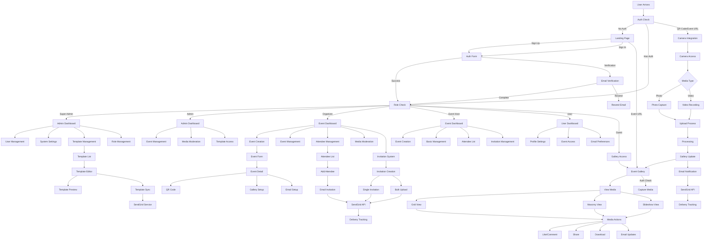
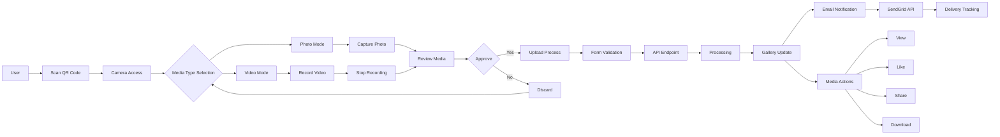
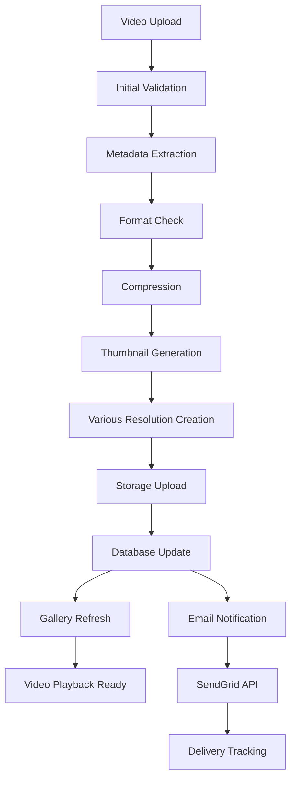

# 🔄 User Flow Chart

## Cloud Burst
📅 *Updated: March 27, 2025*  
📊 *Version: 0.8.2*

## 📌 Situational Abstract
Following the successful implementation of the invitation system with SendGrid integration and the recent resolution of critical Next.js 14 App Router architecture issues, Cloud Burst now offers a complete media management solution with enhanced user verification and notification capabilities. The platform features comprehensive email template management with SendGrid integration, secure API endpoints, direct camera integration through QR code scanning, and robust authentication flows. We've implemented proper client/server component separation, fixed authentication flows in gallery pages, and corrected type mapping between database and UI components. With enhanced processing capabilities for both photos and videos, optimized gallery displays for mixed media, and comprehensive email notifications with delivery tracking, Cloud Burst provides an intuitive and engaging experience for all users.

The media management system is approximately 40% complete, with recent completions including client/server component architecture fixes, authentication flow improvements, type mapping corrections, and proper server-side data fetching. Current development focuses on implementing the gallery system with masonry layout and album management while optimizing the mobile experience.

```mermaid
flowchart TD
    A[User Arrives] --> B[Auth Check]
    B --> |No Auth| C[Landing Page]
    B --> |Has Auth| D[Role Check]
    B --> |QR Code/Event URL| E[Camera Integration]
    
    C --> |Sign Up| F[Auth Form]
    C --> |Sign In| F
    C --> |Event URL| G[Event Gallery]
    
    F --> |Success| D
    F --> |Verification| H[Email Verification]
    H --> |Complete| D
    H --> |Resend| I[Resend Email]
    
    E --> J[Camera Access]
    J --> K{Media Type}
    K --> |Photo| L[Photo Capture]
    K --> |Video| M[Video Recording]
    
    L --> N[Upload Process]
    M --> N
    N --> O[Processing]
    O --> P[Gallery Update]
    P --> G
    P --> Q[Email Notification]
    Q --> R[SendGrid API]
    R --> S[Delivery Tracking]
    
    D --> |Super Admin| T[Admin Dashboard]
    D --> |Admin| U[Admin Dashboard]
    D --> |Organizer| V[Event Dashboard]
    D --> |Event Host| W[Event Dashboard]
    D --> |User| X[User Dashboard]
    D --> |Guest| Y[Gallery Access]
    
    T --> Z[User Management]
    T --> AA[System Settings]
    T --> AB[Template Management]
    T --> AC[Role Management]
    
    U --> AD[Event Management]
    U --> AE[Media Moderation]
    U --> AF[Template Access]
    
    V --> AG[Event Creation]
    V --> AH[Event Management]
    V --> AI[Attendee Management]
    V --> AJ[Media Moderation]
    V --> AK[Invitation System]
    
    W --> AL[Event Creation]
    W --> AM[Basic Management]
    W --> AN[Attendee List]
    W --> AO[Invitation Management]
    
    X --> AP[Profile Settings]
    X --> AQ[Event Access]
    X --> AR[Email Preferences]
    
    Y --> G
    G --> AS[View Media]
    G --> |Auth Check| AT[Capture Media]
    
    AB --> AU[Template List]
    AU --> AV[Template Editor]
    AV --> AW[Template Preview]
    AV --> AX[Template Sync]
    AX --> AY[SendGrid Service]
    
    AG --> AZ[Event Form]
    AZ --> BA[Event Detail]
    BA --> BB[QR Code]
    BA --> BC[Gallery Setup]
    BA --> BD[Email Setup]
    
    AS --> BE[Grid View]
    AS --> BF[Masonry View]
    AS --> BG[Slideshow View]
    
    BE --> BH[Media Actions]
    BF --> BH
    BG --> BH
    
    BH --> BI[Like/Comment]
    BH --> BJ[Share]
    BH --> BK[Download]
    BH --> BL[Email Updates]
    
    AK --> BM[Invitation Creation]
    BM --> BN[Single Invitation]
    BM --> BO[Bulk Upload]
    BN --> BP[SendGrid API]
    BO --> BP
    BP --> BQ[Delivery Tracking]
    
    AI --> BR[Attendee List]
    BR --> BS[Add Attendee]
    BS --> BT[Email Invitation]
    BT --> BP
```

## 📹 **Media Capture Flow**

```mermaid
flowchart LR
    A[User] --> B[Scan QR Code]
    B --> C[Camera Access]
    C --> D{Media Type Selection}
    D --> E[Photo Mode]
    D --> F[Video Mode]
    
    E --> G[Capture Photo]
    F --> H[Record Video]
    H --> I[Stop Recording]
    
    G --> J[Review Media]
    I --> J
    
    J --> K{Approve}
    K -->|Yes| L[Upload Process]
    K -->|No| M[Discard]
    M --> D
    
    L --> N[Form Validation]
    N --> O[API Endpoint]
    O --> P[Processing]
    P --> Q[Gallery Update]
    Q --> R[Media Actions]
    Q --> S[Email Notification]
    S --> T[SendGrid API]
    T --> U[Delivery Tracking]
    
    R --> V[View]
    R --> W[Like]
    R --> X[Share]
    R --> Y[Download]
```

## 📸 **Video Processing Flow**

```mermaid
flowchart TD
    A[Video Upload] --> B[Initial Validation]
    B --> C[Metadata Extraction]
    C --> D[Format Check]
    D --> E[Compression]
    E --> F[Thumbnail Generation]
    F --> G[Various Resolution Creation]
    G --> H[Storage Upload]
    H --> I[Database Update]
    I --> J[Gallery Refresh]
    J --> K[Video Playback Ready]
    I --> L[Email Notification]
    L --> M[SendGrid API]
    M --> N[Delivery Tracking]
```

## 🎯 **Key Components**  

### 🔐 **Enhanced Authentication**
- ✅ Rate limiting protection
- ✅ Security headers
- ✅ Session management
- ✅ Cookie security
- ✅ Error handling
- ✅ Role verification
- ✅ Permission-based access
- ✅ Row Level Security
- ✅ API endpoint security
- ✅ Form validation
- ✅ Error recovery mechanisms
- ✅ Client/server authentication flow

### 📹 **Video Capture System**
- ✅ In-app recording interface
- ✅ Duration controls
- ✅ Quality settings
- ✅ Preview generation
- ✅ Processing indicator
- ✅ Format optimization
- ✅ Error recovery
- ✅ User guidance information
- 🟡 Advanced editing options (50% complete)

### ⚙️ **Settings System**
- ✅ Profile management
- ✅ User preferences
- ✅ Theme selection (light/dark/system)
- ✅ Language options
- ✅ Media quality preferences
- ✅ Notification settings (100% complete)
- ✅ Template preferences
- ✅ Real-time updates
- ✅ Form validation
- ✅ Email delivery options
- ✅ Contextual help preferences

### 📊 **Secure Operations**
- ✅ Protected endpoints
- ✅ Rate limited APIs
- ✅ Session refresh
- ✅ Error boundaries
- ✅ Role-based access
- ✅ Template security
- ✅ Permission hooks
- ✅ Conditional UI rendering
- ✅ API endpoint security
- ✅ Form data validation
- ✅ Input sanitization
- ✅ Server-side authentication context

### 🖼️ **Gallery System**
- ✅ Multiple layouts (Grid, Masonry, Slideshow)
- ✅ Mixed media support (photos and videos)
- ✅ Inline video playback
- ✅ Tag-based filtering
- ✅ Media type filtering
- ✅ Responsive design
- 🟡 Download options (40% complete)
- ✅ Upload functionality
- ✅ Progress indicators
- ✅ Error handling
- 🟡 Sharing options (40% complete)
- ✅ User guidance information
- ✅ Client/server component separation
- ✅ Proper 'use client' directives
- ✅ Database-UI type mapping
- ✅ Server-side data fetching

### 📨 **Invitation System**
- ✅ Single invitation creation (100% complete)
- ✅ Bulk invitation upload (100% complete)
- ✅ Email template selection (100% complete)
- ✅ SendGrid integration (100% complete)
- ✅ Delivery tracking (100% complete)
- ✅ API endpoint security (100% complete)
- ✅ Form validation (100% complete)
- ✅ Error handling (100% complete)
- ✅ User guidance information (100% complete)
- ✅ Email notification (100% complete)

## 🔄 **Implementation Progress**

As we approach our April 1, 2025 launch date, the invitation system is now 100% complete with SendGrid integration, and we've resolved critical Next.js 14 App Router architecture issues in our gallery implementation.

### Key Achievements:
- ✅ Complete invitation system with API integration
- ✅ SendGrid integration for secure email delivery
- ✅ Enhanced form validation with user feedback
- ✅ User guidance information throughout flows
- ✅ API endpoint security
- ✅ Improved error handling
- ✅ Next.js 14 client/server component separation
- ✅ Authentication flow fixes for gallery pages
- ✅ Proper type mapping between database and UI components
- ✅ Server-side data fetching implementation

### Current Focus:
- 🟡 Implementing gallery masonry layout (40% complete)
- 🟡 Developing album management system (10% complete)
- 🟡 Enhancing analytics dashboard (0% complete)
- 🟡 Creating guest upload system (20% complete)
- 🟡 Implementing onboarding flow (0% complete)

### Next Steps:
1. Complete gallery system with masonry layout
2. Implement album management
3. Enhance dashboard with analytics panels
4. Create guest upload system
5. Develop onboarding flow for new organizers

---
