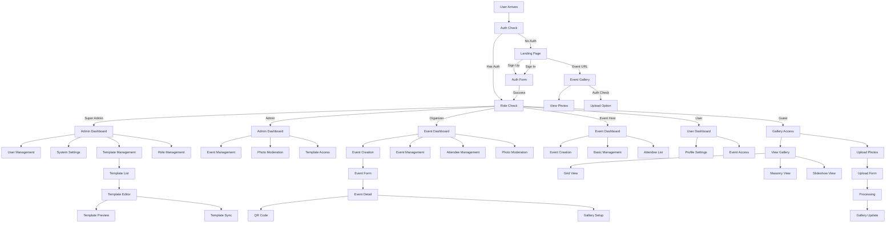
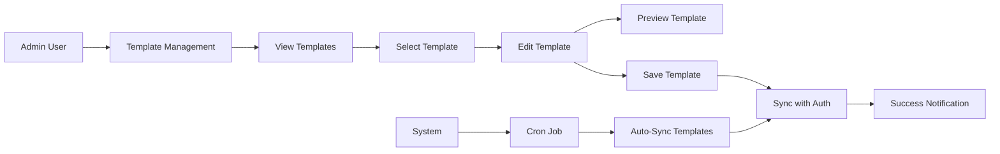
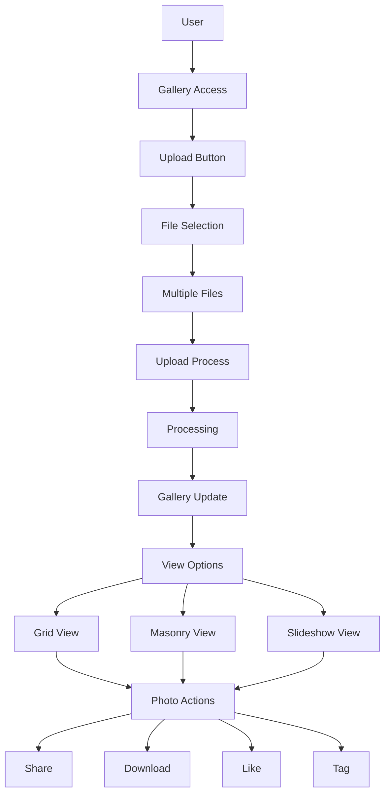
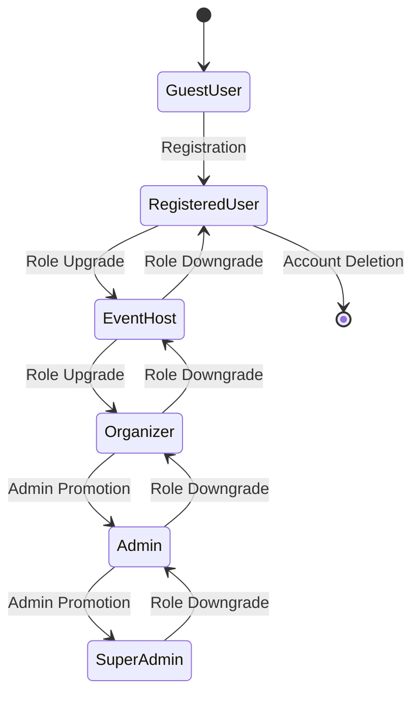

# 🔄 User Flow Chart

## Cloud Burst
📅 *Updated: March 3, 2025*  
📊 *Version: 0.7.0*

## 📌 Situational Abstract
Following the successful implementation of the Email Template Management System, role-based access control, custom event URLs, and enhanced gallery functionality, Cloud Burst's user flows have been updated to reflect our comprehensive permission system and improved security measures. The platform now offers multiple gallery layouts, tag-based filtering, and a more intuitive navigation experience while maintaining our focus on essential features for the April 1, 2025 launch.

The user flow system is approximately 85% complete, with current development focused on finalizing the download functionality, enhancing mobile responsiveness, and implementing the notification system. Recent implementations of role-based UI rendering and permission-based access controls have significantly improved the platform's security and user experience.

```mermaid
flowchart TD
    A[User Arrives] --> B[Auth Check]
    B --> |No Auth| C[Landing Page]
    B --> |Has Auth| D[Role Check]
    
    C --> |Sign Up| E[Auth Form]
    C --> |Sign In| E
    C --> |Event URL| F[Event Gallery]
    
    E --> |Success| D
    
    D --> |Super Admin| G[Admin Dashboard]
    D --> |Admin| H[Admin Dashboard]
    D --> |Organizer| I[Event Dashboard]
    D --> |Event Host| J[Event Dashboard]
    D --> |User| K[User Dashboard]
    D --> |Guest| L[Gallery Access]
    
    G --> M[User Management]
    G --> N[System Settings]
    G --> O[Template Management]
    G --> P[Role Management]
    
    H --> Q[Event Management]
    H --> R[Photo Moderation]
    H --> S[Template Access]
    
    I --> T[Event Creation]
    I --> U[Event Management]
    I --> V[Attendee Management]
    I --> W[Photo Moderation]
    
    J --> X[Event Creation]
    J --> Y[Basic Management]
    J --> Z[Attendee List]
    
    K --> AA[Profile Settings]
    K --> AB[Event Access]
    
    L --> AC[View Gallery]
    L --> AD[Upload Photos]
    
    F --> AE[View Photos]
    F --> |Auth Check| AF[Upload Option]
    
    O --> AG[Template List]
    AG --> AH[Template Editor]
    AH --> AI[Template Preview]
    AH --> AJ[Template Sync]
    
    T --> AK[Event Form]
    AK --> AL[Event Detail]
    AL --> AM[QR Code]
    AL --> AN[Gallery Setup]
    
    AC --> AO[Grid View]
    AC --> AP[Masonry View]
    AC --> AQ[Slideshow View]
    
    AD --> AR[Upload Form]
    AR --> AS[Processing]
    AS --> AT[Gallery Update]
```

## 📧 **Email Template Flow**

```mermaid
flowchart LR
    A[Admin User] --> B[Template Management]
    B --> C[View Templates]
    C --> D[Select Template]
    D --> E[Edit Template]
    E --> F[Preview Template]
    E --> G[Save Template]
    G --> H[Sync with Auth]
    H --> I[Success Notification]
    
    J[System] --> K[Cron Job]
    K --> L[Auto-Sync Templates]
    L --> H
```

## 📸 **Photo Upload Flow**

```mermaid
flowchart TD
    A[User] --> B[Gallery Access]
    B --> C[Upload Button]
    C --> D[File Selection]
    D --> E[Multiple Files]
    E --> F[Upload Process]
    F --> G[Processing]
    G --> H[Gallery Update]
    H --> I[View Options]
    I --> J[Grid View]
    I --> K[Masonry View]
    I --> L[Slideshow View]
    J --> M[Photo Actions]
    K --> M
    L --> M
    M --> N[Share]
    M --> O[Download]
    M --> P[Like]
    M --> Q[Tag]
```

## 🎯 **Key Components**  

### 🔐 **Enhanced Authentication**
- ✅ Rate limiting protection
- ✅ Security headers
- ✅ Session management
- ✅ Cookie security
- ✅ Error handling
- ✅ Role verification
- ✅ Permission-based access
- ✅ Row Level Security

### ⚙️ **Settings System**
- ✅ Profile management
- ✅ User preferences
- ✅ Theme selection (light/dark/system)
- ✅ Language options
- 🟡 Notification settings (60% complete)
- ✅ Template preferences
- ✅ Real-time updates
- ✅ Form validation

### 📊 **Secure Operations**
- ✅ Protected endpoints
- ✅ Rate limited APIs
- ✅ Session refresh
- ✅ Error boundaries
- ✅ Role-based access
- ✅ Template security
- ✅ Permission hooks
- ✅ Conditional UI rendering

### 📧 **Template Management**
- ✅ Template database
- ✅ Editor interface
- ✅ Preview functionality
- ✅ Synchronization process
- ✅ Variable substitution
- 🟡 Delivery tracking (50% complete)
- ✅ Template versioning
- ✅ Role-based access

### 🖼️ **Gallery System**
- ✅ Multiple layouts (Grid, Masonry, Slideshow)
- ✅ Tag-based filtering
- ✅ Responsive design
- 🟡 Download options (60% complete)
- ✅ Upload functionality
- ✅ Progress indicators
- ✅ Error handling
- 🟡 Sharing options (70% complete)

## 🔄 **User Role Transitions**

```mermaid
stateDiagram-v2
    [*] --> GuestUser
    GuestUser --> RegisteredUser: Registration
    RegisteredUser --> EventHost: Role Upgrade
    EventHost --> Organizer: Role Upgrade
    Organizer --> Admin: Admin Promotion
    Admin --> SuperAdmin: Admin Promotion
    SuperAdmin --> Admin: Role Downgrade
    Admin --> Organizer: Role Downgrade
    Organizer --> EventHost: Role Downgrade
    EventHost --> RegisteredUser: Role Downgrade
    RegisteredUser --> [*]: Account Deletion
```

## 🔄 **Implementation Progress**

As we approach our April 1, 2025 launch date, the user flow system is approximately 85% complete. Recent implementations include:

### Key Achievements:
- ✅ Comprehensive role-based access control
- ✅ Permission-based UI rendering
- ✅ Multiple gallery layouts
- ✅ Tag-based filtering
- ✅ Custom event URLs
- ✅ Enhanced mobile responsiveness

### Current Focus:
- 🟡 Completing download functionality (60% complete)
- 🟡 Implementing notification system (40% complete)
- 🟡 Enhancing mobile experience (70% complete)
- 🟡 Finalizing sharing options (70% complete)

### Next Steps:
1. Complete download functionality for gallery images
2. Implement notification system for event updates
3. Enhance mobile responsiveness for complex components
4. Finalize sharing options for gallery items

---
