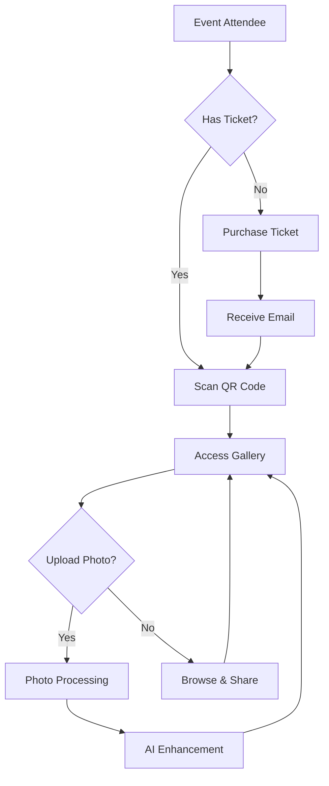
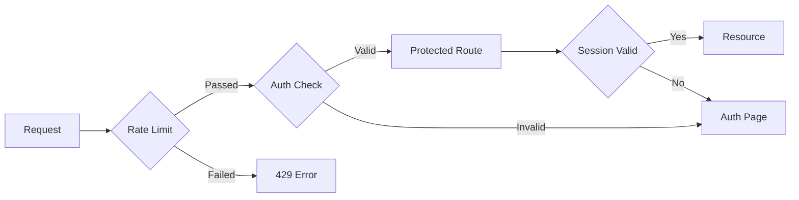
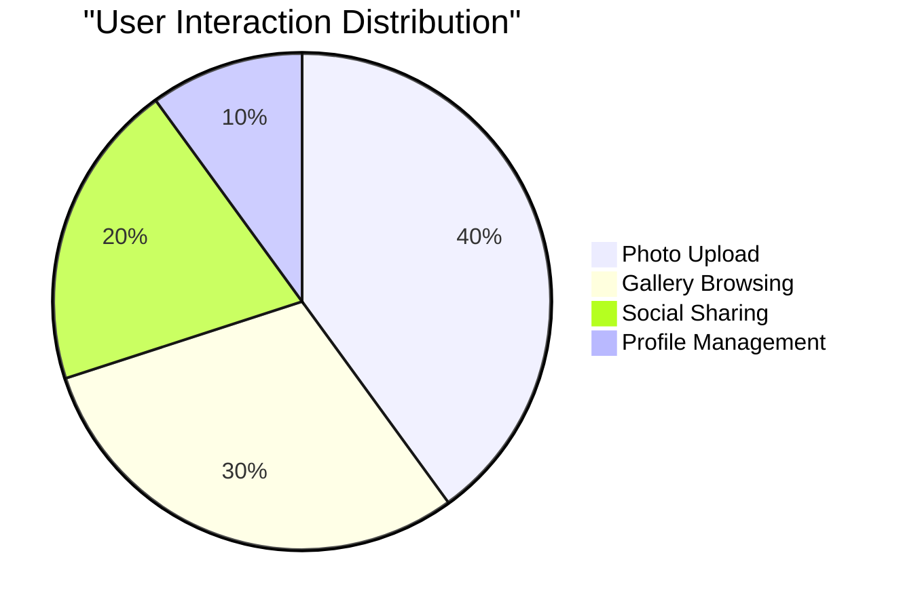
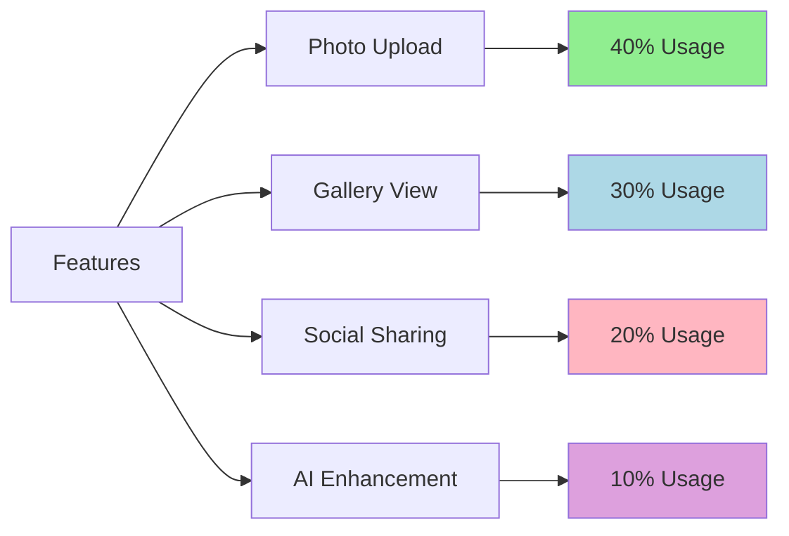

# 📖 **User Flow Overview**  

## Cloud Burst  
📅 *Updated: Feb 27, 2025*  

---

## 🔄 **Core User Flows**

## 🔐 **Security Flow**

## 📊 **User Engagement Metrics**

## 🔒 **Security-Enhanced Flow**  

### 🛡️ **Protected Routes**
- Rate limiting protection
- Method validation
- Dynamic pattern matching
- Session management
- Cookie security

### 🔐 **Authentication Layer**
- Secure session handling
- Cookie cleanup
- Rate limited endpoints
- Error boundaries
- Loading states

## 📝 **Introduction**  
Cloud Burst is an **AI-powered event photography platform** designed to **seamlessly collect, filter, and organize event photos**.  

📌 *This document outlines the complete user journey, from ticket purchase to photo engagement.*  

## 📈 **Feature Usage Distribution**

## 🏷️ **Pre-Event: Ticket Confirmation & QR Code**  

### 📩 **Email Components**
- `<AspectRatio>` for QR code display
- `<Card>` for email template
- `<Button>` for direct access
✔️ Upon purchasing a ticket, users **receive an email** with:
  - Event details
  - Unique QR code
  - Platform instructions

## 🎉 **Event Arrival & Authentication**  

### 📱 **Access Components**
- `<Dialog>` for camera permission
- `<Tabs>` for auth options
- `<Form>` for guest info
✔️ Users can:
  - Scan QR with smartphone
  - Choose auth method
  - Access gallery instantly

## 📸 **Photo Management**  

### 📷 **Upload Components**
- `<DropZone>` for uploads
- `<Progress>` for status
- `<Toast>` for notifications
✔️ Features include:
  - Direct camera access
  - File uploads
  - AI enhancement
  - Real-time processing

## 🖼️ **Gallery Experience**  

### 🎨 **Gallery Components**
- `<ScrollArea>` for gallery
- `<AspectRatio>` for images
- `<Dialog>` for previews
- `<HoverCard>` for details
✔️ Users can:
  - Browse real-time
  - Search by AI tags
  - Like and share
  - Download favorites

## 📩 **Post-Event Access**  

### 📊 **Download Components**
- `<Card>` for options
- `<Button>` for actions
- `<Alert>` for expiry
✔️ Features include:
  - Gallery link email
  - Download options
  - Print ordering
  - Access expiration

## 🎯 **Conclusion**  
Cloud Burst ensures that event attendees can **easily capture, upload, and relive their event experience effortlessly**. By integrating **AI-powered organization and real-time access**, Cloud Burst creates an **engaging and seamless user experience**. 🚀  

---
