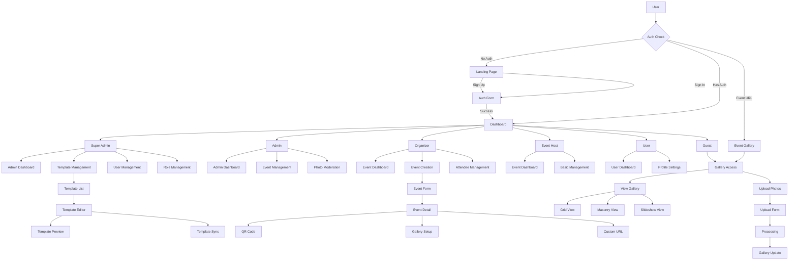
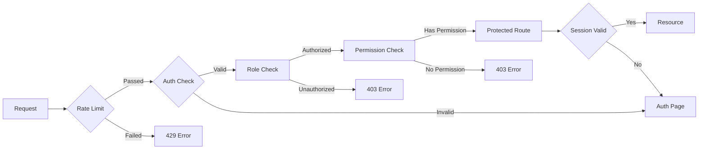
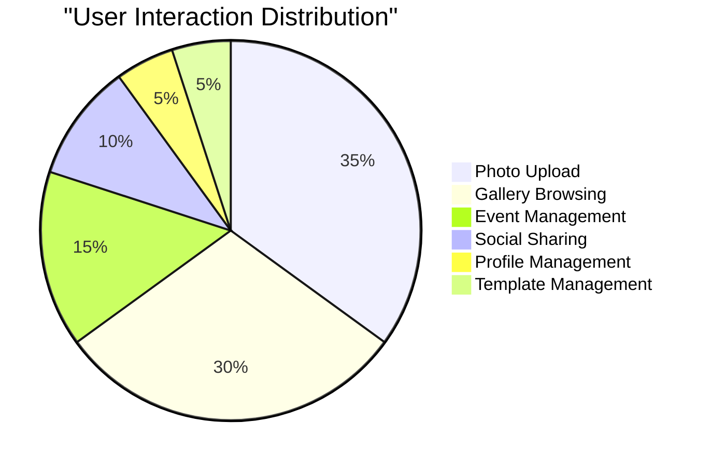
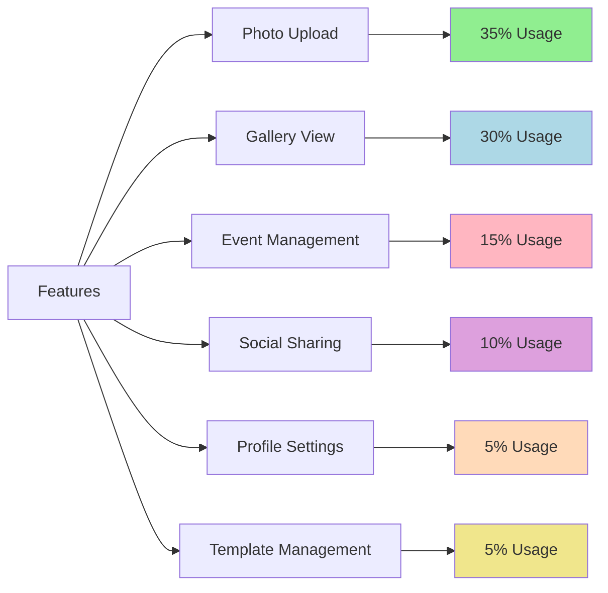

# 📖 **User Flow Overview**  

## Cloud Burst
📅 *Updated: March 3, 2025*  
📊 *Version: 0.7.0*

## 📌 Situational Abstract
Following the successful implementation of the Email Template Management System, role-based access control, custom event URLs, and enhanced gallery functionality, Cloud Burst's user flows have been streamlined and secured. With Zustand for state management and TanStack Query for data fetching, the platform now offers a more robust and performant experience with multiple gallery layouts, tag-based filtering, and intuitive navigation.

The user flow system is approximately 85% complete, with current development focused on finalizing the download functionality, enhancing mobile responsiveness, and implementing the notification system. Recent implementations of role-based UI rendering and permission-based access controls have significantly improved the platform's security and user experience as we approach our April 1, 2025 launch date.

## 🔄 **Core User Flows** [Updated]

```mermaid
flowchart TD
    A[User] --> B{Auth Check}
    B -->|No Auth| C[Landing Page]
    B -->|Has Auth| D[Dashboard]
    B -->|Event URL| E[Event Gallery]
    
    C --> |Sign Up| F[Auth Form]
    C --> |Sign In| F
    F --> |Success| D
    
    D --> G[Super Admin]
    D --> H[Admin]
    D --> I[Organizer]
    D --> J[Event Host]
    D --> K[User]
    D --> L[Guest]
    
    G --> M[Admin Dashboard]
    G --> N[Template Management]
    G --> O[User Management]
    G --> P[Role Management]
    
    H --> Q[Admin Dashboard]
    H --> R[Event Management]
    H --> S[Photo Moderation]
    
    I --> T[Event Dashboard]
    I --> U[Event Creation]
    I --> V[Attendee Management]
    
    J --> W[Event Dashboard]
    J --> X[Basic Management]
    
    K --> Y[User Dashboard]
    K --> Z[Profile Settings]
    
    L --> AA[Gallery Access]
    E --> AA
    
    AA --> AB[View Gallery]
    AA --> AC[Upload Photos]
    
    AB --> AD[Grid View]
    AB --> AE[Masonry View]
    AB --> AF[Slideshow View]
    
    N --> AG[Template List]
    AG --> AH[Template Editor]
    AH --> AI[Template Preview]
    AH --> AJ[Template Sync]
    
    U --> AK[Event Form]
    AK --> AL[Event Detail]
    AL --> AM[QR Code]
    AL --> AN[Gallery Setup]
    AL --> AO[Custom URL]
    
    AC --> AP[Upload Form]
    AP --> AQ[Processing]
    AQ --> AR[Gallery Update]
```

## 🔐 **Security Flow** [Enhanced]

```mermaid
flowchart LR
    A[Request] --> B{Rate Limit}
    B -->|Passed| C{Auth Check}
    B -->|Failed| D[429 Error]
    C -->|Valid| E[Role Check]
    C -->|Invalid| F[Auth Page]
    E -->|Authorized| G[Permission Check]
    E -->|Unauthorized| H[403 Error]
    G -->|Has Permission| I[Protected Route]
    G -->|No Permission| J[403 Error]
    I --> K{Session Valid}
    K -->|Yes| L[Resource]
    K -->|No| F
```

## 📊 **User Engagement Metrics**

```mermaid
pie
    title "User Interaction Distribution"
    "Photo Upload" : 35
    "Gallery Browsing" : 30
    "Event Management" : 15
    "Social Sharing" : 10
    "Profile Management" : 5
    "Template Management" : 5
```

## 🔒 **Security-Enhanced Flow**  

### 🛡️ **Protected Routes**
- ✅ Rate limiting protection
- ✅ Method validation
- ✅ Dynamic pattern matching
- ✅ Session management
- ✅ Cookie security
- ✅ Role-based access control
- ✅ Permission-based access
- ✅ Row Level Security
- ✅ Error boundaries

### 🔐 **Authentication Layer**
- ✅ Secure session handling
- ✅ Cookie cleanup
- ✅ Rate limited endpoints
- ✅ Error boundaries
- ✅ Loading states
- ✅ Role verification
- ✅ Permission hooks
- ✅ Conditional UI rendering
- ✅ Resource ownership verification

## 📝 **Introduction**  
Cloud Burst is an **event photography platform** designed to **seamlessly collect, filter, and organize event photos**. The platform features comprehensive role-based access control, custom event URLs, and multiple gallery layouts to enhance the user experience.

📌 *This document outlines the complete user journey, from event creation to photo engagement.*  

## 📈 **Feature Usage Distribution**

```mermaid
graph LR
    A[Features] --> B[Photo Upload]
    A --> C[Gallery View]
    A --> D[Event Management]
    A --> E[Social Sharing]
    A --> F[Profile Settings]
    A --> G[Template Management]
    
    B --> H[35% Usage]
    C --> I[30% Usage]
    D --> J[15% Usage]
    E --> K[10% Usage]
    F --> L[5% Usage]
    G --> M[5% Usage]

    style H fill:#90EE90
    style I fill:#ADD8E6
    style J fill:#FFB6C1
    style K fill:#DDA0DD
    style L fill:#FFDAB9
    style M fill:#F0E68C
```

## 🏷️ **Pre-Event: Ticket Confirmation & QR Code**  

### 📩 **Email Components**
- `<AspectRatio>` for QR code display
- `<Card>` for email template
- `<Button>` for direct access
- `<TemplatePreview>` for email rendering
- ✅ Custom event URL integration
- ✅ Email template customization

✔️ Upon purchasing a ticket, users **receive an email** with:
  - Event details
  - Unique QR code
  - Platform instructions
  - Custom event URL
  - Branding elements

## 🎉 **Event Arrival & Authentication**  

### 📱 **Access Components**
- `<Dialog>` for camera permission
- `<Tabs>` for auth options
- `<Form>` for guest info
- `<Button>` variants for social login
- `<Alert>` for authentication status
- ✅ Role-based access control
- ✅ Permission-based UI rendering

✔️ Users can:
  - Scan QR with smartphone
  - Use custom event URL
  - Choose auth method
  - Access gallery instantly
  - Set basic preferences

## 📸 **Photo Management**  

### 📷 **Upload Components**
- `<DropZone>` for uploads
- `<Progress>` for status
- `<Toast>` for notifications
- `<Carousel>` for image preview
- `<Skeleton>` for loading states
- ✅ Multiple file selection
- ✅ Drag-and-drop support
- ✅ Format validation
- ✅ Size optimization

✔️ Features include:
  - Direct camera access
  - Multiple file uploads
  - Progress indicators
  - Format validation
  - Error handling
  - Real-time processing

## 🖼️ **Gallery Experience**  

### 🎨 **Gallery Components**
- `<ScrollArea>` for gallery
- `<AspectRatio>` for images
- `<Dialog>` for previews
- `<HoverCard>` for details
- `<Select>` for filter options
- ✅ Multiple gallery layouts (Grid, Masonry, Slideshow)
- ✅ Tag-based filtering
- ✅ Responsive design
- 🟡 Download options (60% complete)

✔️ Users can:
  - Browse real-time
  - Switch between layouts
  - Filter by tags
  - Like and share
  - View full-screen
  - Download favorites (in progress)

## 📧 **Email Template Management**

### 📝 **Template Components**
- `<TemplateList>` for template selection
- `<TemplateEditor>` for HTML editing
- `<TemplatePreview>` for visualization
- `<Button>` for synchronization
- `<Form>` for template settings
- ✅ Template versioning
- ✅ Role-based access
- ✅ Preview with sample data

✔️ Admin users can:
  - Edit email templates
  - Preview with sample data
  - Synchronize with Supabase Auth
  - Manage template variables
  - Track delivery analytics (in progress)
  - Set default templates

## 📩 **Post-Event Access**  

### 📊 **Download Components**
- `<Card>` for options
- `<Button>` for actions
- `<Alert>` for expiry
- `<Calendar>` for expiry countdown
- ✅ Custom event URL for sharing
- 🟡 Bulk download options (50% complete)

✔️ Features include:
  - Gallery link email
  - Custom event URL
  - Download options (in progress)
  - Expiration notices
  - Access countdown
  - Sharing capabilities

## 🔄 **Role-Based User Journeys**

### 👑 **Super Admin Journey**
1. Access admin dashboard
2. Manage users and roles
3. Configure system settings
4. Manage email templates
5. Monitor platform metrics
6. Oversee all events and galleries

### 🔑 **Admin Journey**
1. Access admin dashboard
2. Manage events and photos
3. Moderate content
4. Access email templates
5. View basic analytics
6. Support event organizers

### 📋 **Organizer Journey**
1. Create multiple events
2. Manage event details
3. Customize galleries
4. Manage attendees
5. Moderate photos
6. View event analytics

### 🎭 **Event Host Journey**
1. Create personal events
2. Basic event management
3. Manage attendee list
4. Access event gallery
5. Upload and moderate photos
6. Share event with guests

### 👤 **User Journey**
1. Access personal dashboard
2. Manage profile settings
3. View accessible events
4. Upload photos to galleries
5. Browse and interact with photos
6. Download favorites

### 👥 **Guest Journey**
1. Access event via QR code or URL
2. Optional quick registration
3. View event gallery
4. Upload photos (if permitted)
5. Interact with content
6. Receive post-event access

## 🔄 **Implementation Progress**

As we approach our April 1, 2025 launch date, the user flow system is approximately 85% complete. Recent implementations include:

### Key Achievements:
- ✅ Comprehensive role-based access control
- ✅ Permission-based UI rendering
- ✅ Multiple gallery layouts (Grid, Masonry, Slideshow)
- ✅ Tag-based filtering for better content organization
- ✅ Custom event URLs for better branding and sharing
- ✅ Enhanced mobile responsiveness
- ✅ Improved error handling and recovery

### Current Focus:
- 🟡 Completing download functionality (60% complete)
- 🟡 Implementing notification system (40% complete)
- 🟡 Enhancing mobile experience (70% complete)
- 🟡 Finalizing sharing options (70% complete)
- 🟡 Optimizing performance for large galleries (75% complete)

### Next Steps:
1. Complete download functionality for gallery images
2. Implement notification system for event updates
3. Enhance mobile responsiveness for complex components
4. Finalize sharing options for gallery items
5. Optimize performance for large galleries and uploads

## 🎯 **Conclusion**  
Cloud Burst ensures that event attendees can **easily capture, upload, and relive their event experience effortlessly**. By integrating **role-based access control, custom event URLs, multiple gallery layouts, and tag-based filtering**, Cloud Burst creates an **engaging and seamless user experience** that adapts to different user roles and permissions. As we approach our April 1, 2025 launch date, the platform is well-positioned to deliver a polished, professional-grade solution for event photography management.

---
