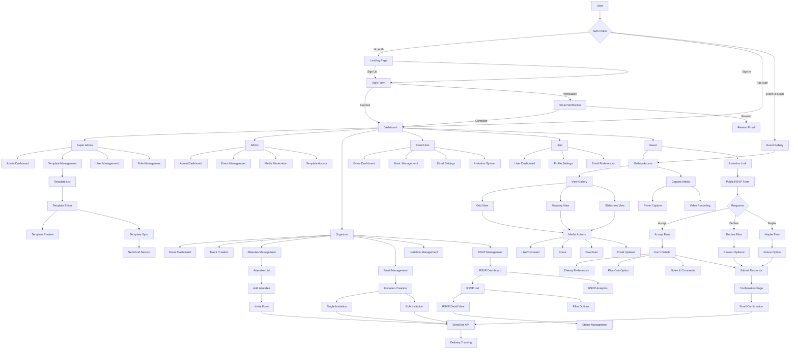
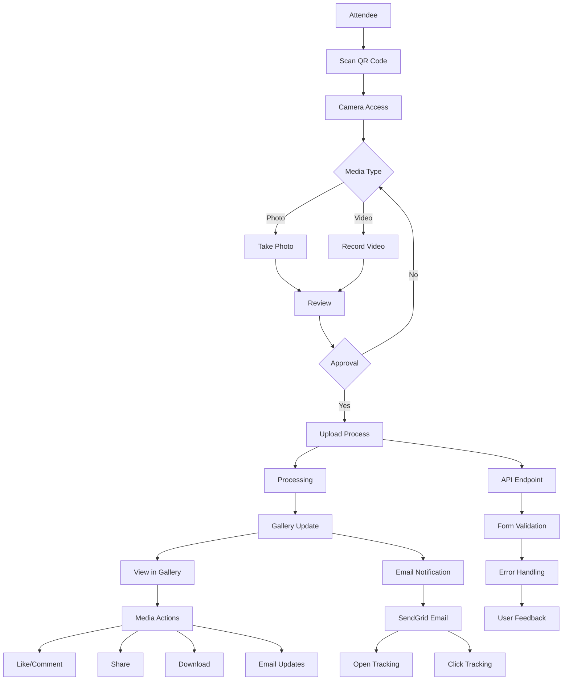
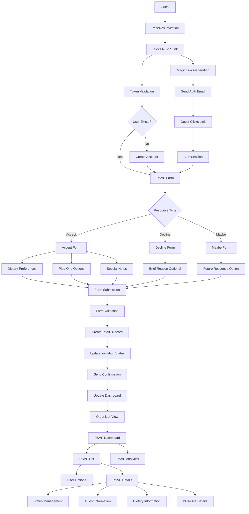
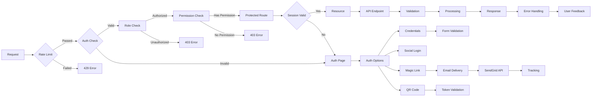
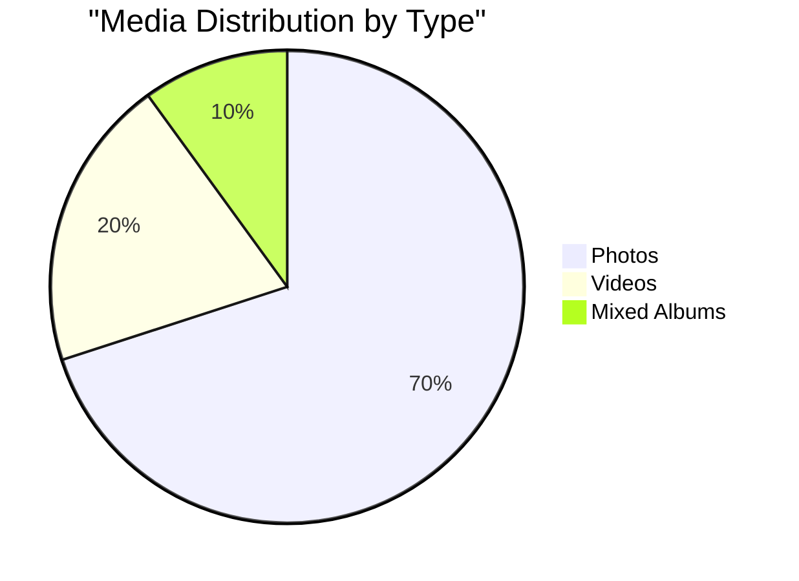
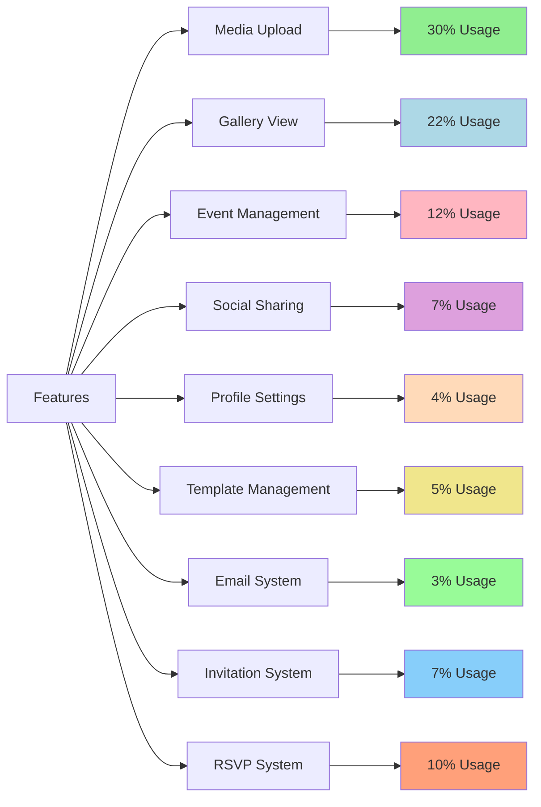

# 📖 **User Flow Overview**  

## Cloud Burst
📅 *Updated: April 2, 2025*  
📊 *Version: 0.8.5*

## 📌 Situational Abstract
Following the successful implementation of the RSVP dashboard integration and UI refinements in version 0.8.5, Cloud Burst now offers a comprehensive media management platform with enhanced user verification, notification capabilities, and integrated RSVP management. The platform features the integration of the RSVP dashboard within the event management interface, tab-based navigation for seamless RSVP management, improved card styling for better visibility in both light and dark modes, and optimized layouts for both desktop and mobile views.

The platform continues to feature a complete email template system with SendGrid integration, secure API endpoints, direct camera integration through QR code scanning, and robust authentication flows. We've maintained proper client/server component separation, fixed authentication flows in gallery pages, corrected type mapping between database and UI components, and enhanced the RSVP management experience with improved TypeScript safety. Users can capture and share both photos and videos seamlessly through QR code check-ins that connect directly to their mobile device camera, while receiving personalized email communications throughout their journey.

The RSVP system is now 50% complete, with the organizer-facing dashboard fully implemented and the public-facing components planned for Session 35. The gallery implementation remains at approximately 40% completion, with our current development focus on implementing the public-facing RSVP system and camera integration for QR code scanning.

## 🔄 **Core User Flows** [Updated]

```mermaid
flowchart TD
    A[User] --> B{Auth Check}
    B -->|No Auth| C[Landing Page]
    B -->|Has Auth| D[Dashboard]
    B -->|Event URL/QR| E[Event Gallery]
    
    C --> |Sign Up| F[Auth Form]
    C --> |Sign In| F
    F --> |Success| D
    F --> |Verification| G[Email Verification]
    G --> |Complete| D
    G--> |Resend| H[Resend Email]
    
    D --> I[Super Admin]
    D --> J[Admin]
    D --> K[Organizer]
    D --> L[Event Host]
    D --> M[User]
    D --> N[Guest]
    
    I --> O[Admin Dashboard]
    I --> P[Template Management]
    I --> Q[User Management]
    I --> R[Role Management]
    
    J --> S[Admin Dashboard]
    J --> T[Event Management]
    J --> U[Media Moderation]
    J --> V[Template Access]
    
    K --> W[Event Dashboard]
    K --> X[Event Creation]
    K --> Y[Attendee Management]
    K --> Z[Email Management]
    K --> AA[Invitation Management]
    K --> BJ[RSVP Management]
    
    L --> AB[Event Dashboard]
    L --> AC[Basic Management]
    L --> AD[Email Settings]
    L --> AE[Invitation System]
    
    M --> AF[User Dashboard]
    M --> AG[Profile Settings]
    M --> AH[Email Preferences]
    
    N --> AI[Gallery Access]
    E --> AI
    N --> BK[Invitation Link]
    
    AI --> AJ[View Gallery]
    AI --> AK[Capture Media]
    
    AK --> AL[Photo Capture]
    AK --> AM[Video Recording]
    
    AJ --> AN[Grid View]
    AJ --> AO[Masonry View]
    AJ --> AP[Slideshow View]
    
    AN --> AQ[Media Actions]
    AO --> AQ
    AP --> AQ
    
    AQ --> AR[Like/Comment]
    AQ --> AS[Share]
    AQ --> AT[Download]
    AQ --> AU[Email Updates]
    
    P --> AV[Template List]
    AV --> AW[Template Editor]
    AW --> AX[Template Preview]
    AW --> AY[Template Sync]
    AY --> AZ[SendGrid Service]
    
    Z --> BA[Invitation Creation]
    BA --> BB[Single Invitation]
    BA --> BC[Bulk Invitation]
    BB --> BD[SendGrid API]
    BC --> BD
    BD --> BE[Delivery Tracking]
    
    Y --> BF[Attendee List]
    BF --> BG[Add Attendee]
    BG --> BH[Invite Form]
    BH --> BD
    
    BJ --> BL[RSVP Dashboard]
    BL --> BM[RSVP List]
    BL --> BN[RSVP Analytics]
    BM --> BO[RSVP Detail View]
    BM --> BP[Filter Options]
    BO --> BQ[Status Management]
    
    BK --> BR[Public RSVP Form]
    BR --> BS{Response}
    BS -->|Accept| BT[Accept Flow]
    BS -->|Decline| BU[Decline Flow]
    BS -->|Maybe| BV[Maybe Flow]
    BT --> BW[Form Details]
    BU --> BX[Reason Optional]
    BV --> BY[Future Option]
    BW --> BZ[Dietary Preferences]
    BW --> CA[Plus-One Option]
    BW --> CB[Notes & Comments]
    BW --> CC[Submit Response]
    BX --> CC
    BY --> CC
    CC --> CD[Confirmation Page]
    CD --> CE[Email Confirmation]
    CE --> BD
```

## 📸 **Media Capture Flow** [Enhanced]

```mermaid
flowchart TD
    A[Attendee] --> B[Scan QR Code]
    B --> C[Camera Access]
    C --> D{Media Type}
    
    D -->|Photo| E[Take Photo]
    D -->|Video| F[Record Video]
    
    E --> G[Review]
    F --> G
    
    G --> H{Approval}
    H -->|Yes| I[Upload Process]
    H -->|No| D
    
    I --> J[Processing]
    J --> K[Gallery Update]
    K --> L[View in Gallery]
    K --> M[Email Notification]
    
    L --> N[Media Actions]
    N --> O[Like/Comment]
    N --> P[Share]
    N --> Q[Download]
    N --> R[Email Updates]
    
    M --> S[SendGrid Email]
    S --> T[Open Tracking]
    S --> U[Click Tracking]
    
    I --> V[API Endpoint]
    V --> W[Form Validation]
    W --> X[Error Handling]
    X --> Y[User Feedback]
```

## 📝 **RSVP Flow** [New]

```mermaid
flowchart TD
    A[Guest] --> B[Receives Invitation]
    B --> C[Clicks RSVP Link]
    C --> D[Token Validation]
    D --> E{User Exists?}
    E -->|No| F[Create Account]
    E -->|Yes| G[RSVP Form]
    F --> G
    
    C --> H[Magic Link Generation]
    H --> I[Send Auth Email]
    I --> J[Guest Clicks Link]
    J --> K[Auth Session]
    K --> G
    
    G --> L{Response Type}
    L -->|Accept| M[Accept Form]
    L -->|Decline| N[Decline Form]
    L -->|Maybe| O[Maybe Form]
    
    M --> P[Dietary Preferences]
    M --> Q[Plus-One Options]
    M --> R[Special Notes]
    
    N --> S[Brief Reason Optional]
    
    O --> T[Future Response Option]
    
    P --> U[Form Submission]
    Q --> U
    R --> U
    S --> U
    T --> U
    
    U --> V[Form Validation]
    V --> W[Create RSVP Record]
    W --> X[Update Invitation Status]
    X --> Y[Send Confirmation]
    Y --> Z[Update Dashboard]
    Z --> AA[Organizer View]
    
    AA --> AB[RSVP Dashboard]
    AB --> AC[RSVP List]
    AB --> AD[RSVP Analytics]
    AC --> AE[Filter Options]
    AC --> AF[RSVP Details]
    AF --> AG[Status Management]
    AF --> AH[Guest Information]
    AF --> AI[Dietary Information]
    AF --> AJ[Plus-One Details]
```

## 🔐 **Security Flow** [Enhanced]

```mermaid
flowchart LR
    A[Request] --> B{Rate Limit}
    B -->|Passed| C{Auth Check}
    B -->|Failed| D[429 Error]
    C -->|Valid| E[Role Check]
    C -->|Invalid| F[Auth Page]
    E -->|Authorized| G[Permission Check]
    E -->|Unauthorized| H[403 Error]
    G -->|Has Permission| I[Protected Route]
    G -->|No Permission| J[403 Error]
    I --> K{Session Valid}
    K -->|Yes| L[Resource]
    K -->|No| F
    L --> M[API Endpoint]
    M --> N[Validation]
    N --> O[Processing]
    O --> P[Response]
    P --> Q[Error Handling]
    Q --> R[User Feedback]
    
    F --> S[Auth Options]
    S --> T[Credentials]
    S --> U[Social Login]
    S --> V[Magic Link]
    S --> W[QR Code]
    
    T --> X[Form Validation]
    V --> Y[Email Delivery]
    Y --> Z[SendGrid API]
    Z --> AA[Tracking]
    W --> AB[Token Validation]
```

## 📊 **Media Type Distribution**

```mermaid
pie
    title "Media Distribution by Type"
    "Photos" : 70
    "Videos" : 20
    "Mixed Albums" : 10
```

## 🔒 **Security-Enhanced Flow**  

### 🛡️ **Protected Routes**
- ✅ Rate limiting protection
- ✅ Method validation
- ✅ Dynamic pattern matching
- ✅ Session management
- ✅ Cookie security
- ✅ Role-based access control
- ✅ Permission-based access
- ✅ Row Level Security
- ✅ Error boundaries
- ✅ Email verification
- ✅ Template security
- ✅ API endpoint security
- ✅ Form validation

### 🔐 **Authentication Layer**
- ✅ Secure session handling
- ✅ Cookie cleanup
- ✅ Rate limited endpoints
- ✅ Error boundaries
- ✅ Loading states
- ✅ Role verification
- ✅ Permission hooks
- ✅ Conditional UI rendering
- ✅ Resource ownership verification
- ✅ Email verification flow
- ✅ Template-based notifications
- ✅ SendGrid integration
- ✅ API security
- ✅ Client/server component authentication

## 📝 **Introduction**  
Cloud Burst is an **event media platform** designed to **seamlessly collect, filter, and organize event photos and videos**. The platform features comprehensive role-based access control, custom event URLs, and multiple gallery layouts to enhance the user experience.

📌 *This document outlines the complete user journey, from event creation to media engagement.*  

## 📈 **Feature Usage Distribution**

```mermaid
graph LR
    A[Features] --> B[Media Upload]
    A --> C[Gallery View]
    A --> D[Event Management]
    A --> E[Social Sharing]
    A --> F[Profile Settings]
    A --> G[Template Management]
    A --> H[Email System]
    A --> I[Invitation System]
    A --> J[RSVP System]
    
    B --> K[30% Usage]
    C --> L[22% Usage]
    D --> M[12% Usage]
    E --> N[7% Usage]
    F --> O[4% Usage]
    G --> P[5% Usage]
    H --> Q[3% Usage]
    I --> R[7% Usage]
    J --> S[10% Usage]

    style K fill:#90EE90
    style L fill:#ADD8E6
    style M fill:#FFB6C1
    style N fill:#DDA0DD
    style O fill:#FFDAB9
    style P fill:#F0E68C
    style Q fill:#98FB98
    style R fill:#87CEFA
    style S fill:#FFA07A
```

## 🏷️ **Pre-Event: Ticket Confirmation & QR Code**  

### 📩 **Email Components**
- `<AspectRatio>` for QR code display
- `<Card>` for email template
- `<Button>` for direct access
- `<TemplatePreview>` for email rendering
- ✅ Custom event URL integration
- ✅ Email template customization
- ✅ SendGrid delivery
- ✅ Email tracking

✔️ Upon purchasing a ticket, users **receive an email** with:
  - Event details
  - Unique QR code for camera integration
  - Platform instructions
  - Custom event URL
  - Branding elements
  - Access guidance

## 🎉 **Event Arrival & Camera Integration**  

### 📱 **Access Components**
- `<Dialog>` for camera permission
- `<Tabs>` for auth options
- `<Form>` for guest info
- `<Button>` variants for social login
- `<Alert>` for authentication status
- `<CameraIntegration>` for direct device access
- `<MediaSelector>` for photo/video toggle
- ✅ Role-based access control
- ✅ Permission-based UI rendering
- ✅ Form validation
- ✅ Error handling
- ✅ API security

✔️ Users can:
  - Scan QR with smartphone
  - Use custom event URL
  - Grant camera access
  - Toggle between photo/video modes
  - Capture media directly within app
  - Set basic preferences
  - Receive guidance information

## 📸 **Media Management**  

### 📷 **Capture Components**
- `<CameraView>` for live preview
- `<MediaControls>` for photo/video toggle
- `<RecordButton>` for video capture
- `<CaptureButton>` for photos
- `<DropZone>` for manual uploads
- `<Progress>` for status
- `<Toast>` for notifications
- `<Carousel>` for media preview
- `<Skeleton>` for loading states
- `<Alert>` for guidance information
- ✅ Multiple file selection
- ✅ Direct camera integration
- ✅ Video recording with duration limits
- ✅ Drag-and-drop support
- ✅ Format validation
- ✅ Size optimization
- ✅ API endpoint integration
- ✅ Form validation feedback

✔️ Features include:
  - Direct camera integration
  - Video recording capabilities
  - Multiple file uploads
  - Progress indicators
  - Format validation
  - Error handling
  - Real-time processing
  - User guidance information

## 🖼️ **Gallery Experience**  

### 🎨 **Gallery Components**
- `<ScrollArea>` for gallery
- `<AspectRatio>` for images
- `<Dialog>` for previews
- `<VideoPlayer>` for video content
- `<MediaCard>` for unified display
- `<HoverCard>` for details
- `<Select>` for filter options
- ✅ Multiple gallery layouts (Grid, Masonry, Slideshow)
- ✅ Tag-based filtering
- ✅ Media type filtering
- ✅ Responsive design
- ✅ Video playback controls
- 🟡 Download options (40% complete)
- ✅ User guidance tooltips
- ✅ Client/server component separation
- ✅ Proper 'use client' directives
- ✅ Server-side data fetching

✔️ Users can:
  - Browse real-time
  - Switch between layouts
  - Filter by tags or media type
  - Like and share
  - View full-screen
  - Play videos inline
  - Download favorites (in progress)
  - Receive contextual guidance

## 📧 **Email Template Management**

### 📝 **Template Components**
- `<TemplateList>` for template selection
- `<TemplateEditor>` for HTML editing
- `<TemplatePreview>` for visualization
- `<Button>` for synchronization
- `<Form>` for template settings
- ✅ Template versioning
- ✅ Role-based access
- ✅ Preview with sample data
- ✅ SendGrid integration
- ✅ Email tracking

✔️ Admin users can:
  - Edit email templates
  - Preview with sample data
  - Synchronize with SendGrid
  - Manage template variables
  - Track delivery analytics
  - Set default templates
  - Test delivery

## 📨 **Invitation System**

### 📩 **Invitation Components**
- `<InvitationForm>` for creation
- `<BatchUpload>` for bulk invites
- `<EmailPreview>` for templates
- `<QRCode>` for generation
- `<StatusTracker>` for monitoring
- `<Alert>` for guidance information
- ✅ Single and bulk invitation options
- ✅ Email template selection
- ✅ SendGrid integration
- ✅ Delivery tracking
- ✅ API security
- ✅ Form validation
- ✅ Error handling
- ✅ User feedback mechanisms

✔️ Organizers can:
  - Create individual invitations
  - Import bulk attendee lists
  - Select email templates
  - Preview before sending
  - Track delivery status
  - Monitor RSVPs
  - View analytics
  - Resend invitations
  - Receive guidance information

## 📝 **RSVP System**

### 🎟️ **RSVP Components**
- `<RsvpDashboard>` for overview
- `<RsvpList>` for response listing
- `<RsvpAnalytics>` for metrics
- `<RsvpDetails>` for individual view
- `<RsvpForm>` for response collection
- `<Tabs>` for organizing content
- `<Card>` for RSVP summary
- `<Badge>` for status indicators
- `<Progress>` for response rates
- ✅ RSVP dashboard integration
- ✅ Tab-based navigation
- ✅ RSVP status tracking
- ✅ Response filtering
- ✅ Responsive design
- 🟡 Public invitation landing page (0% complete)
- 🟡 RSVP form component (0% complete)
- 🟡 Guest authentication (0% complete)

✔️ Organizers can:
  - View RSVP dashboard
  - Track response rates
  - Filter by status
  - View individual RSVPs
  - Access dietary preferences
  - Manage plus-ones
  - Export guest lists
  - Update status manually
  - View analytics

👥 **Planned for Guests**:
  - Receive personalized invitation
  - Click secure link to RSVP
  - Authenticate via magic link
  - Submit response (accept/decline/maybe)
  - Add dietary preferences
  - Include plus-one details
  - Leave notes for organizer
  - Receive confirmation email

## 📩 **Post-Event Access**  

### 📊 **Download Components**
- `<Card>` for options
- `<Button>` for actions
- `<Alert>` for expiry
- `<Calendar>` for expiry countdown
- ✅ Custom event URL for sharing
- 🟡 Bulk download options (40% complete)
- ✅ Follow-up email templates
- ✅ SendGrid integration

✔️ Features include:
  - Gallery link email
  - Custom event URL
  - Download options (in progress)
  - Expiration notices
  - Access countdown
  - Sharing capabilities
  - Email tracking

## 🔄 **Role-Based User Journeys**

### 👑 **Super Admin Journey**
1. Access admin dashboard
2. Manage users and roles
3. Configure system settings
4. Manage email templates
5. Monitor platform metrics
6. Oversee all events and galleries

### 🔑 **Admin Journey**
1. Access admin dashboard
2. Manage events and photos
3. Moderate content
4. Access email templates
5. View basic analytics
6. Support event organizers

### 📋 **Organizer Journey**
1. Create multiple events
2. Manage event details
3. Customize galleries
4. Manage attendees
5. Send invitations
6. Create and manage email templates
7. Moderate photos
8. View event analytics
9. Track and manage RSVPs
10. Analyze response rates

### 🎭 **Event Host Journey**
1. Create personal events
2. Basic event management
3. Manage attendee list
4. Send invitations
5. Access event gallery
6. Upload and moderate photos
7. Share event with guests
8. View basic RSVP metrics

### 👤 **User Journey**
1. Access personal dashboard
2. Manage profile settings
3. View accessible events
4. Upload photos to galleries
5. Browse and interact with photos
6. Download favorites
7. Manage email preferences
8. Respond to RSVPs

### 👥 **Guest Journey**
1. Receive invitation email
2. Click RSVP link
3. Submit RSVP response
4. Provide dietary preferences
5. Add plus-one details if applicable
6. Access event via QR code or URL
7. Optional quick registration
8. View event gallery
9. Upload photos (if permitted)
10. Interact with content
11. Receive post-event access
12. Get follow-up communications

## 🔄 **Implementation Progress**

As we approach our April 15, 2025 Beta 0.9.0 RC1 date, we've successfully integrated the RSVP dashboard within the event management interface and are now focused on completing the public-facing aspects of the Guest Onboarding & RSVP Flow.

### Key Achievements:
- ✅ Integrated RSVP dashboard within event details page
- ✅ Fixed TypeScript errors in RSVP components
- ✅ Enhanced tab navigation for seamless RSVP management
- ✅ Improved card styling for better visibility in both light and dark modes
- ✅ Added proper color coding for status indicators
- ✅ Optimized layouts for both desktop and mobile views
- ✅ Enhanced error handling in RSVP components
- ✅ Fixed layout issues in event details view
- ✅ Complete invitation system with SendGrid integration
- ✅ Next.js 14 client/server component separation

### Current Focus (Session 35):
- 🟡 Building public invitation landing page (0% complete)
- 🟡 Creating RSVP form component with validation (0% complete)
- 🟡 Implementing magic link authentication for guests (0% complete)
- 🟡 Creating camera access hook for media capture (0% complete)
- 🟡 Implementing photo capture UI for mobile (0% complete)
- 🟡 Building token validation for scanned QR codes (30% complete)
- 🟡 Implementing gallery masonry layout (40% complete)
- 🟡 Developing album management system (10% complete)

### Next Steps:
1. Complete public-facing RSVP system
2. Implement magic link authentication for guests
3. Advance camera integration
4. Enhance email notifications
5. Complete gallery system with masonry layout
6. Implement album management
7. Create testing suite for RSVP flow

## 🎯 **Conclusion**  
Cloud Burst ensures that event attendees can **easily capture, upload, and relive their event experience effortlessly** through both photos and videos. By integrating **role-based access control, direct camera integration, custom event URLs, multiple gallery layouts, comprehensive invitation system, and RSVP management**, Cloud Burst creates an **engaging and seamless user experience** that adapts to different user roles and media preferences. With the successful integration of the RSVP dashboard and ongoing work on the public RSVP system, the platform is now more robust and better positioned to deliver a polished, professional-grade solution for complete event media management as we approach our April 15, 2025 Beta 0.9.0 RC1 date.

---
