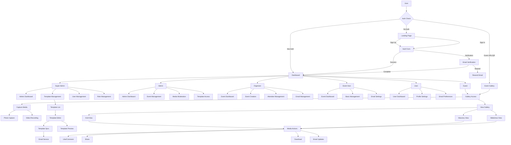
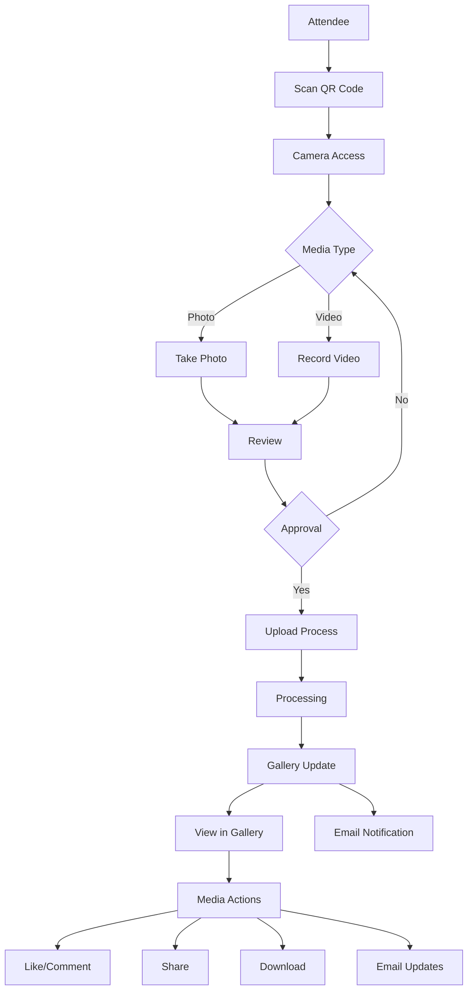
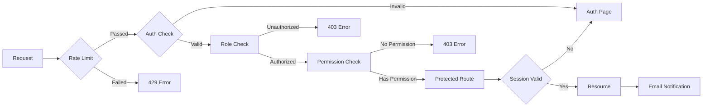
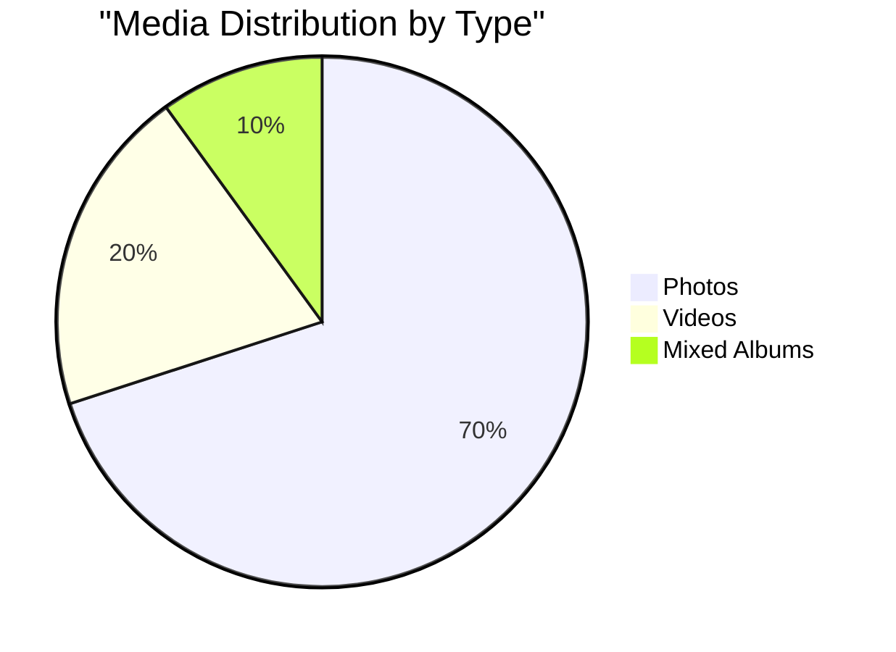
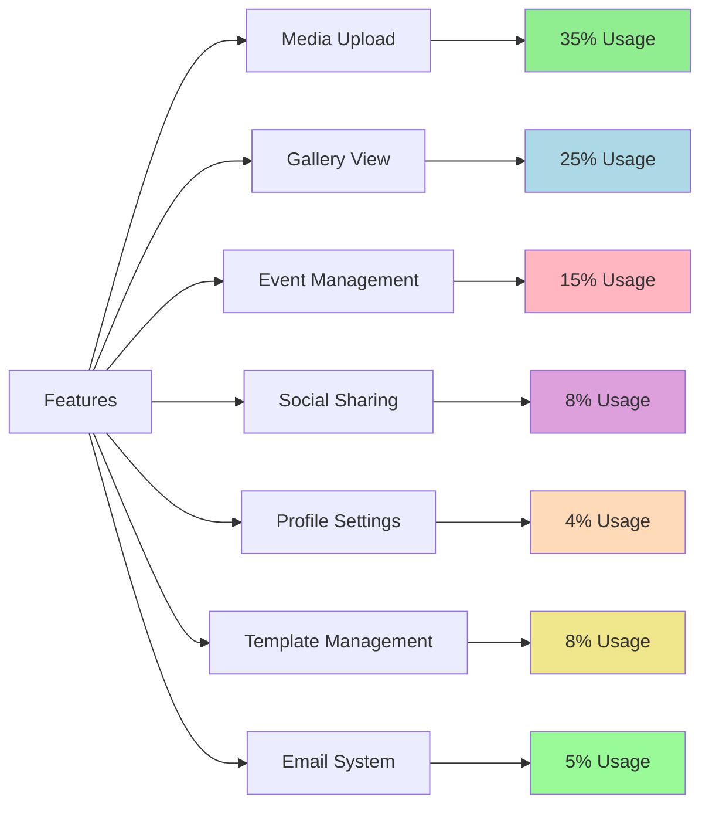

# 📖 **User Flow Overview**  

## Cloud Burst
📅 *Updated: March 18, 2025*  
📊 *Version: 0.7.9*

## 📌 Situational Abstract
Following the successful implementation of the email template system and invitation system foundation, Cloud Burst now offers a comprehensive media management platform with enhanced user verification and notification capabilities. Users can capture and share both photos and videos seamlessly through QR code check-ins that patch directly to their mobile device cameras, while receiving personalized email notifications throughout their journey. The platform now features enhanced processing for both media types, optimized streaming capabilities for video content, multiple viewing options for all media, and a complete email template system for user communications.

The media management system is approximately 95% complete, with recent completions including email template management, authentication error handling, verification flows, and invitation system foundation. Current development focuses on finalizing post-event engagement features and optimizing the mobile experience.

## 🔄 **Core User Flows** [Updated]

```mermaid
flowchart TD
    A[User] --> B{Auth Check}
    B -->|No Auth| C[Landing Page]
    B -->|Has Auth| D[Dashboard]
    B -->|Event URL/QR| E[Event Gallery]
    
    C --> |Sign Up| F[Auth Form]
    C --> |Sign In| F
    F --> |Success| D
    F --> |Verification| G[Email Verification]
    G --> |Complete| D
    G --> |Resend| H[Resend Email]
    
    D --> I[Super Admin]
    D --> J[Admin]
    D --> K[Organizer]
    D --> L[Event Host]
    D --> M[User]
    D --> N[Guest]
    
    I --> O[Admin Dashboard]
    I --> P[Template Management]
    I --> Q[User Management]
    I --> R[Role Management]
    
    J --> S[Admin Dashboard]
    J --> T[Event Management]
    J --> U[Media Moderation]
    J --> V[Template Access]
    
    K --> W[Event Dashboard]
    K --> X[Event Creation]
    K --> Y[Attendee Management]
    K --> Z[Email Management]
    
    L --> AA[Event Dashboard]
    L --> AB[Basic Management]
    L --> AC[Email Settings]
    
    M --> AD[User Dashboard]
    M --> AE[Profile Settings]
    M --> AF[Email Preferences]
    
    N --> AG[Gallery Access]
    E --> AG
    
    AG --> AH[View Gallery]
    AG --> AI[Capture Media]
    
    AI --> AJ[Photo Capture]
    AI --> AK[Video Recording]
    
    AH --> AL[Grid View]
    AH --> AM[Masonry View]
    AH --> AN[Slideshow View]
    
    AL --> AO[Media Actions]
    AM --> AO
    AN --> AO
    
    AO --> AP[Like/Comment]
    AO --> AQ[Share]
    AO --> AR[Download]
    AO --> AS[Email Updates]
    
    P --> AT[Template List]
    AT --> AU[Template Editor]
    AU --> AV[Template Preview]
    AU --> AW[Template Sync]
    AW --> AX[Email Service]
```

## 📸 **Media Capture Flow** [Enhanced]

```mermaid
flowchart TD
    A[Attendee] --> B[Scan QR Code]
    B --> C[Camera Access]
    C --> D{Media Type}
    
    D -->|Photo| E[Take Photo]
    D -->|Video| F[Record Video]
    
    E --> G[Review]
    F --> G
    
    G --> H{Approval}
    H -->|Yes| I[Upload Process]
    H -->|No| D
    
    I --> J[Processing]
    J --> K[Gallery Update]
    K --> L[View in Gallery]
    K --> M[Email Notification]
    
    L --> N[Media Actions]
    N --> O[Like/Comment]
    N --> P[Share]
    N --> Q[Download]
    N --> R[Email Updates]
```

## 🔐 **Security Flow** [Enhanced]

```mermaid
flowchart LR
    A[Request] --> B{Rate Limit}
    B -->|Passed| C{Auth Check}
    B -->|Failed| D[429 Error]
    C -->|Valid| E[Role Check]
    C -->|Invalid| F[Auth Page]
    E -->|Authorized| G[Permission Check]
    E -->|Unauthorized| H[403 Error]
    G -->|Has Permission| I[Protected Route]
    G -->|No Permission| J[403 Error]
    I --> K{Session Valid}
    K -->|Yes| L[Resource]
    K -->|No| F
    L --> M[Email Notification]
```

## 📊 **Media Type Distribution**

```mermaid
pie
    title "Media Distribution by Type"
    "Photos" : 70
    "Videos" : 20
    "Mixed Albums" : 10
```

## 🔒 **Security-Enhanced Flow**  

### 🛡️ **Protected Routes**
- ✅ Rate limiting protection
- ✅ Method validation
- ✅ Dynamic pattern matching
- ✅ Session management
- ✅ Cookie security
- ✅ Role-based access control
- ✅ Permission-based access
- ✅ Row Level Security
- ✅ Error boundaries
- ✅ Email verification
- ✅ Template security

### 🔐 **Authentication Layer**
- ✅ Secure session handling
- ✅ Cookie cleanup
- ✅ Rate limited endpoints
- ✅ Error boundaries
- ✅ Loading states
- ✅ Role verification
- ✅ Permission hooks
- ✅ Conditional UI rendering
- ✅ Resource ownership verification
- ✅ Email verification flow
- ✅ Template-based notifications

## 📝 **Introduction**  
Cloud Burst is an **event media platform** designed to **seamlessly collect, filter, and organize event photos and videos**. The platform features comprehensive role-based access control, custom event URLs, and multiple gallery layouts to enhance the user experience.

📌 *This document outlines the complete user journey, from event creation to media engagement.*  

## 📈 **Feature Usage Distribution**

```mermaid
graph LR
    A[Features] --> B[Media Upload]
    A --> C[Gallery View]
    A --> D[Event Management]
    A --> E[Social Sharing]
    A --> F[Profile Settings]
    A --> G[Template Management]
    A --> H[Email System]
    
    B --> I[35% Usage]
    C --> J[25% Usage]
    D --> K[15% Usage]
    E --> L[8% Usage]
    F --> M[4% Usage]
    G --> N[8% Usage]
    H --> O[5% Usage]

    style I fill:#90EE90
    style J fill:#ADD8E6
    style K fill:#FFB6C1
    style L fill:#DDA0DD
    style M fill:#FFDAB9
    style N fill:#F0E68C
    style O fill:#98FB98
```

## 🏷️ **Pre-Event: Ticket Confirmation & QR Code**  

### 📩 **Email Components**
- `<AspectRatio>` for QR code display
- `<Card>` for email template
- `<Button>` for direct access
- `<TemplatePreview>` for email rendering
- ✅ Custom event URL integration
- ✅ Email template customization

✔️ Upon purchasing a ticket, users **receive an email** with:
  - Event details
  - Unique QR code for camera integration
  - Platform instructions
  - Custom event URL
  - Branding elements

## 🎉 **Event Arrival & Camera Integration**  

### 📱 **Access Components**
- `<Dialog>` for camera permission
- `<Tabs>` for auth options
- `<Form>` for guest info
- `<Button>` variants for social login
- `<Alert>` for authentication status
- `<CameraIntegration>` for direct device access
- `<MediaSelector>` for photo/video toggle
- ✅ Role-based access control
- ✅ Permission-based UI rendering

✔️ Users can:
  - Scan QR with smartphone
  - Use custom event URL
  - Grant camera access
  - Toggle between photo/video modes
  - Capture media directly within app
  - Set basic preferences

## 📸 **Media Management**  

### 📷 **Capture Components**
- `<CameraView>` for live preview
- `<MediaControls>` for photo/video toggle
- `<RecordButton>` for video capture
- `<CaptureButton>` for photos
- `<DropZone>` for manual uploads
- `<Progress>` for status
- `<Toast>` for notifications
- `<Carousel>` for media preview
- `<Skeleton>` for loading states
- ✅ Multiple file selection
- ✅ Direct camera integration
- ✅ Video recording with duration limits
- ✅ Drag-and-drop support
- ✅ Format validation
- ✅ Size optimization

✔️ Features include:
  - Direct camera integration
  - Video recording capabilities
  - Multiple file uploads
  - Progress indicators
  - Format validation
  - Error handling
  - Real-time processing

## 🖼️ **Gallery Experience**  

### 🎨 **Gallery Components**
- `<ScrollArea>` for gallery
- `<AspectRatio>` for images
- `<Dialog>` for previews
- `<VideoPlayer>` for video content
- `<MediaCard>` for unified display
- `<HoverCard>` for details
- `<Select>` for filter options
- ✅ Multiple gallery layouts (Grid, Masonry, Slideshow)
- ✅ Tag-based filtering
- ✅ Media type filtering
- ✅ Responsive design
- ✅ Video playback controls
- 🟡 Download options (70% complete)

✔️ Users can:
  - Browse real-time
  - Switch between layouts
  - Filter by tags or media type
  - Like and share
  - View full-screen
  - Play videos inline
  - Download favorites (in progress)

## 📧 **Email Template Management**

### 📝 **Template Components**
- `<TemplateList>` for template selection
- `<TemplateEditor>` for HTML editing
- `<TemplatePreview>` for visualization
- `<Button>` for synchronization
- `<Form>` for template settings
- ✅ Template versioning
- ✅ Role-based access
- ✅ Preview with sample data

✔️ Admin users can:
  - Edit email templates
  - Preview with sample data
  - Synchronize with Supabase Auth
  - Manage template variables
  - Track delivery analytics (in progress)
  - Set default templates

## 📩 **Post-Event Access**  

### 📊 **Download Components**
- `<Card>` for options
- `<Button>` for actions
- `<Alert>` for expiry
- `<Calendar>` for expiry countdown
- ✅ Custom event URL for sharing
- 🟡 Bulk download options (50% complete)

✔️ Features include:
  - Gallery link email
  - Custom event URL
  - Download options (in progress)
  - Expiration notices
  - Access countdown
  - Sharing capabilities

## 🔄 **Role-Based User Journeys**

### 👑 **Super Admin Journey**
1. Access admin dashboard
2. Manage users and roles
3. Configure system settings
4. Manage email templates
5. Monitor platform metrics
6. Oversee all events and galleries

### 🔑 **Admin Journey**
1. Access admin dashboard
2. Manage events and photos
3. Moderate content
4. Access email templates
5. View basic analytics
6. Support event organizers

### 📋 **Organizer Journey**
1. Create multiple events
2. Manage event details
3. Customize galleries
4. Manage attendees
5. Moderate photos
6. View event analytics

### 🎭 **Event Host Journey**
1. Create personal events
2. Basic event management
3. Manage attendee list
4. Access event gallery
5. Upload and moderate photos
6. Share event with guests

### 👤 **User Journey**
1. Access personal dashboard
2. Manage profile settings
3. View accessible events
4. Upload photos to galleries
5. Browse and interact with photos
6. Download favorites

### 👥 **Guest Journey**
1. Access event via QR code or URL
2. Optional quick registration
3. View event gallery
4. Upload photos (if permitted)
5. Interact with content
6. Receive post-event access

## 🔄 **Implementation Progress**

As we approach our April 1, 2025 launch date, the media management system is approximately 90% complete. Recent implementations include:

### Key Achievements:
- ✅ Comprehensive video support
- ✅ Direct camera integration for seamless capture
- ✅ Enhanced gallery layouts for mixed media
- ✅ Optimized video processing pipeline
- ✅ Improved mobile responsiveness

### Current Focus:
- 🟡 Optimizing video processing (80% complete)
- 🟡 Enhancing video playback controls (75% complete)
- 🟡 Implementing advanced sharing options (70% complete)
- 🟡 Finalizing download functionality (70% complete)

### Next Steps:
1. Complete video processing optimization
2. Enhance mobile video playback experience
3. Finalize download functionality for all media types
4. Implement advanced sharing options for galleries

## 🎯 **Conclusion**  
Cloud Burst ensures that event attendees can **easily capture, upload, and relive their event experience effortlessly** through both photos and videos. By integrating **role-based access control, direct camera integration, custom event URLs, multiple gallery layouts, and comprehensive video support**, Cloud Burst creates an **engaging and seamless user experience** that adapts to different user roles and media preferences. As we approach our April 1, 2025 launch date, the platform is well-positioned to deliver a polished, professional-grade solution for complete event media management.

---
